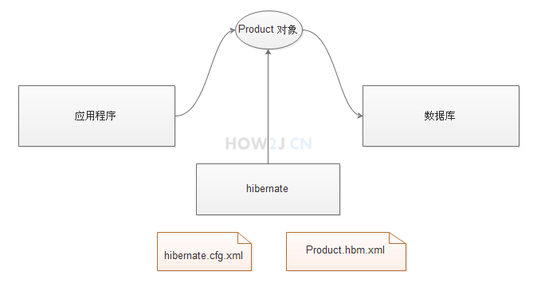
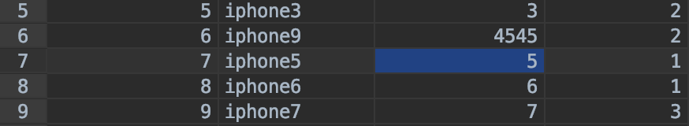

# 1 基础

​		使用JDBC做数据库相关功能开发会做很多重复性的工作，比如创建连接，关闭连接，把字段逐一映射到属性中。 Hibernate把这一切都封装起来了，使得数据库访问变得轻松而简单，代码也更加容易维护。

​		**必读：** 基于框架的程序要成功运行，对于JAR包的版本，配置文件的正确性有着苛刻的要求，任何一个地方出错了，都会导致框架程序运行失败。 如果你是第一次学习本框架，务必严格按照教程的指导，完全模仿操作

​		MySql的Hibernate表，可以看到表结构。	

## 1.1 pojo的xml配置

在包com.how2java.pojo下 新建一个配置文件Product.hbm.xml， 用于映射Product类对应数据库中的product_表。
**注:** 文件名 Product.hbm.xml **P**一定要大写，要和类保持一致

---

表示**类Product**对应**表product_**

> <class name="Product" table="product_">

表示**属性id**,映射表里的**字段id**，<generator class="native"> 意味着id的自增长方式采用数据库的本地方式，如果是连接oracle数据库，可以[指定sequnce作为id自增长方式](https://how2j.cn/k/spring-hibernate/spring-hibernate-oracle/106.html#step251)

> <id name="id" column="id">
> 	<generator class="native">
> 	</generator>
> </id>

这里配置的时候，只写了属性name,没有通过column="name" 显式的指定字段，那么字段的名字也是name. 

> <property name="name" />

```xml
<?xml version="1.0"?>
<!DOCTYPE hibernate-mapping PUBLIC
        "-//Hibernate/Hibernate Mapping DTD 3.0//EN"
        "http://www.hibernate.org/dtd/hibernate-mapping-3.0.dtd">
<hibernate-mapping package="com.how2java.pojo">
    <class name="Product" table="product_">
        <id name="id" column="id">
            <generator class="native">
            </generator>
        </id>
        <property name="name" />
        <property name="price" />
    </class>
     
</hibernate-mapping>
```

## 1.2 配置 hibernate.cfg.xml

在**src目录**下创建 hibernate.cfg.xml
配置访问数据库要用到的驱动，url，账号密码等等
其他配置及含义： 

---

这表示使用MYSQL方言。 什么方言呢？ 因为在代码层面，开发人员不用关心底层到底用Oracle还是Mysql，写的代码都是一样的。 可是Oracle和Mysql所用的sql语句的语法是有所区别的，那么这件事就交给Hibernate来做了。这个时候就需要告诉Hibernate底层用的是什么数据库，它才知道应该用什么样的“方言” 去对话。

>  <property name="dialect">org.hibernate.dialect.MySQLDialect</property>

这是Hibernate事务管理方式，即每个线程一个事务

> <property name="current_session_context_class">thread</property>

这表示是否在控制台显示执行的sql语句 

> <property name="show_sql">true</property>

这表示是否会自动更新数据库的表结构，有这句话，其实是不需要[创建表](https://how2j.cn/k/hibernate/hibernate-tutorial/31.html#step64)的，因为Hibernate会自动去创建表结构

> <property name="hbm2ddl.auto">update</property>

 这表示Hibernate会去识别Product这个实体类

> <mapping resource="com/how2java/pojo/Product.hbm.xml" />

```xml
<?xml version='1.0' encoding='utf-8'?>
<!DOCTYPE hibernate-configuration PUBLIC
       "-//Hibernate/Hibernate Configuration DTD 3.0//EN"
"http://www.hibernate.org/dtd/hibernate-configuration-3.0.dtd">
<hibernate-configuration>
    <session-factory>
        <!-- Database connection settings -->
        <property name="connection.driver_class">com.mysql.jdbc.Driver</property>
        <property name="connection.url">jdbc:mysql://localhost:3306/test?characterEncoding=UTF-8</property>
        <property name="connection.username">root</property>
        <property name="connection.password">admin</property>
        <!-- SQL dialect -->
        <property name="dialect">org.hibernate.dialect.MySQLDialect</property>
        <property name="current_session_context_class">thread</property>
        <property name="show_sql">true</property>
        <property name="hbm2ddl.auto">update</property>
        <mapping resource="com/how2java/pojo/Product.hbm.xml" />
    </session-factory>
</hibernate-configuration>
```

## 1.3 测试类TestHibernate流程

创建一个Product对象，并通过hibernate把这个对象，插入到数据库中。hibernate的基本步骤是：

1. 获取SessionFactory
2. 通过SessionFactory 获取一个Session
3. 在Session基础上开启一个事务
4. 通过调用Session的save方法把对象保存到数据库
5. 提交事务
6. 关闭Session
7. 关闭SessionFactory

---

应用程序通过Hibernate把 一个 Product对象插入到数据库的product_表中
**hibernate.cfg.xml** 配置文件提供链接数据库的基本信息
账号 密码 驱动 数据库ip 端口
**Product.hbm.xml** 提供对象与表的映射关系
对应哪个表？ 什么属性，对应什么字段



## 1.4 增删改查

==基础模板==

```java
package com.how2java.test;

import org.hibernate.Session;
import org.hibernate.SessionFactory;
import org.hibernate.cfg.Configuration;

import com.how2java.pojo.Product;
//增
public class TestHibernate1 {
	public static void main(String[] args) {
		SessionFactory sf = new Configuration().configure().buildSessionFactory();
		Session s = sf.openSession();
		//开始事务
		s.beginTransaction();
		//创建一个对象，设置属性
		Product p = new Product();
		p.setName("iphone7");
		p.setPrice(7000);
		System.out.println("此时p是顺时状态");
		s.save(p);
		System.out.println("此时p是持久状态");
		//提交事务
		s.getTransaction().commit();
		//关闭session工厂，关闭session
		s.close();
		System.out.println("此时p是脱管状态");
		sf.close();
	}
}
```

```java
//查
Product p =(Product) s.get(Product.class, 6);
System.out.println("id=6的产品名称是: "+p.getName());
System.out.println("id=6的产品价格是: "+p.getPrice());
System.out.println(p.toString());

//改
System.out.println(p.getName());
p.setName("iphone-modified");
s.update(p);

//删
//删除id=6的
s.delete(p);
```


## 1.5 三种查询

#### Hibernate Query Language

1. 首先根据hql创建一个Query对象
2. 设置参数(和基1的PreparedStatement不一样，Query是基0的)
3. 通过Query对象的list()方法即返回查询的结果了。

注： 使用hql的时候，用的是类名Product,而不是表名product_
注： 使用hql的时候，不需要在前面加 select *

#### Criteria 查询数据

1. 通过session的createCriteria创建一个Criteria 对象
2. Criteria.add 增加约束。 在本例中增加一个对name的模糊查询(like)
3. 调用list()方法返回查询结果的集合
  

除此之外，Criteria 还可以很方便的进行进行分页查询和获取总数

#### Mysql

使用Session的createSQLQuery方法执行标准SQL语句

标准SQL返回各种各样的结果，比如多表查询，分组统计结果等等。 不能保证结果能够装进一个Product对象中，所以返回的集合里的每一个元素是一个对象数组。 然后再通过下标把这个对象数组中的数据取出来。

# 2 关系

## 2.1 多对一

> 一个Product对应一个Category，一个Category对应多个Product，所以Product和Category是==多对一==的关系。



==Category.hbm.xml==

```xml
<?xml version="1.0"?>
 
<!DOCTYPE hibernate-mapping PUBLIC
        "-//Hibernate/Hibernate Mapping DTD 3.0//EN"
        "http://www.hibernate.org/dtd/hibernate-mapping-3.0.dtd">
<hibernate-mapping package="com.how2java.pojo">
    <class name="Category" table="category_">
        <id name="id" column="id">
            <generator class="native">
            </generator>
        </id>
        <property name="name" />
    </class>
</hibernate-mapping>
```

==Product.java== **新增代码**

```java
Category category;
public Category getCategory() {
  return category;
}
public void setCategory(Category category) {
  this.category = category;
}
```

==Product.hbm.xml== **新增标签**

> <many-to-one name="category" class="Category" column="cid" />

```xml
<?xml version="1.0"?>
<!DOCTYPE hibernate-mapping PUBLIC
        "-//Hibernate/Hibernate Mapping DTD 3.0//EN"
        "http://www.hibernate.org/dtd/hibernate-mapping-3.0.dtd">
<hibernate-mapping package="com.how2java.pojo">
    <class name="Product" table="product_">
        <id name="id" column="id">
            <generator class="native">
            </generator>
        </id>
 
        <property name="name" />
        <property name="price" />
        <many-to-one name="category" class="Category" column="cid" />
    </class>
</hibernate-mapping>
```

==hibernate.cfg.xml== **新增标签**

> <mapping resource="com/how2java/pojo/Category.hbm.xml" />

```xml
<?xml version='1.0' encoding='utf-8'?>
<!DOCTYPE hibernate-configuration PUBLIC
       "-//Hibernate/Hibernate Configuration DTD 3.0//EN"
"http://www.hibernate.org/dtd/hibernate-configuration-3.0.dtd">
<hibernate-configuration>
    <session-factory>
        <!-- Database connection settings -->
        <property name="connection.driver_class">com.mysql.jdbc.Driver</property>
        <property name="connection.url">jdbc:mysql://localhost:3306/test?characterEncoding=GBK</property>
        <property name="connection.username">root</property>
        <property name="connection.password">admin</property>
        <!-- SQL dialect -->
        <property name="dialect">org.hibernate.dialect.MySQLDialect</property>
        <property name="current_session_context_class">thread</property>
        <property name="show_sql">true</property>
        <property name="hbm2ddl.auto">update</property>
        <mapping resource="com/how2java/pojo/Product.hbm.xml" />
        <mapping resource="com/how2java/pojo/Category.hbm.xml" />
    </session-factory>
</hibernate-configuration>
```


## 2.2 一对多

> 一个Product对应一个Category，一个Category对应多个Product，所以Category和Product是**一对多**的关系

==Category.java== **增加一个Set集合**

```java
Set<Product> products;
public Set<Product> getProducts() {
	return products;
}
public void setProducts(Set<Product> products) {
	this.products = products;
}
```

==Category.hbm.xml== **增加one-to-many映射**

><set name="products" lazy="false">
>     <key column="cid" not-null="false" />
>     <one-to-many class="Product" />
></set>

**<set** 用于设置一对多([多对多](https://how2j.cn/k/hibernate/hibernate-many-to-many/42.html)也是他)关系，也可以用list，设置稍复杂点，这里使用简单的set来入门。
**name="products"** 对应 Category类中的products属性
**lazy="false"** 表示不使用延迟加载。关于延迟加载，请参考[关系的延迟加载](https://how2j.cn/k/hibernate/hibernate-lazyload/45.html)
**<key column="cid" not-null="false" />** 表示外键是cid，可以为空
**<one-to-many class="Product" />** 表示一对多所对应的类是Product

```xml
<?xml version="1.0"?>
<!DOCTYPE hibernate-mapping PUBLIC
        "-//Hibernate/Hibernate Mapping DTD 3.0//EN"
        "http://www.hibernate.org/dtd/hibernate-mapping-3.0.dtd">
<hibernate-mapping package="com.how2java.pojo">
    <class name="Category" table="category_">
        <id name="id" column="id">
            <generator class="native">
            </generator>
        </id>
        <property name="name" />
 
        <set name="products" lazy="false">
            <key column="cid" not-null="false" />
            <one-to-many class="Product" />
        </set>     
    </class>
</hibernate-mapping>
```

## 2.3 多对多

> 一种Product可以被多个User购买，一个User可以购买多种Product，所以Product和User之间的关系是**多对多** many-to-many，要实现多对多关系，必须有一张**中间表** user_product 用于维护 User和Product之间的关系

==User.java== **新增pojo**

```java
package com.how2java.pojo;
 
import java.util.Set;
 
public class User {
 
    int id;
    String name;
    Set<Product> products;
    public int getId() {
        return id;
    }
    public void setId(int id) {
        this.id = id;
    }
    public String getName() {
        return name;
    }
    public void setName(String name) {
        this.name = name;
    }
    public Set<Product> getProducts() {
        return products;
    }
    public void setProducts(Set<Product> products) {
        this.products = products;
    }
}
```

==User.hbm.xml== **新增配置文件**

```xml
<?xml version="1.0"?>
<!DOCTYPE hibernate-mapping PUBLIC
        "-//Hibernate/Hibernate Mapping DTD 3.0//EN"
        "http://www.hibernate.org/dtd/hibernate-mapping-3.0.dtd">
<hibernate-mapping package="com.how2java.pojo">
    <class name="User" table="user_">
        <id name="id" column="id">
            <generator class="native">
            </generator>
        </id>
        <property name="name" />
 
        <set name="products" table="user_product" lazy="false">
            <key column="uid" />
            <many-to-many column="pid" class="Product" />
        </set>       
    </class>
</hibernate-mapping>
```

==Product.java== **新增下代码**

```java
Set<User> users;
public Set<User> getUsers() {
	return users;
}
public void setUsers(Set<User> users) {
	this.users = users;
}
```

==TestHibernate3.java== **新增部分代码**

```java
//增加3个用户
Set<User> users = new HashSet();
for (int i = 0; i < 3; i++) {
  User u =new User();
  u.setName("user"+i);
  users.add(u);
  s.save(u);
}

//产品1被用户1,2,3购买
Product p1 = (Product) s.get(Product.class, 1);
p1.setUsers(users);
s.save(p1);
```

# 3 延迟加载

## 3.1 属性延迟加载

属性延迟加载:
当使用**load**的方式来获取对象的时候，只有访问了这个对象的属性，hibernate才会到数据库中进行查询。否则不会访问数据库

```java
Product p = (Product)s.load(Product.class, 1);
```

## 3.2 关系延迟加载

执行1行的时候，只会查询Category表的信息，不会查询product_ 表
只有在执行3行，通过Category取Products的时候，才会进行对product_ 表的查询

**true:** 开启延迟加载
**false:** 关闭延迟加载

```xml
<set name="products" lazy="true">
  <key column="cid" not-null="false" />
  <one-to-many class="Product" />
</set>
```

```java
Category c = (Category) s.get(Category.class, 1);
System.out.println("log1");
System.out.println(c.getProducts());
System.out.println("log1");
```

# 4 缓存

# 5 级联

没有配置级联，删除分类，其对应的产品不会被删除。 
恰当配置级联，删除分类，其对应的产品都会被删除。

包括上一步说的删除用得级联，级联有4种类型：

- all：所有操作都执行级联操作；

- none：所有操作都不执行级联操作；

- delete：删除时执行级联操作；

- save-update：保存和更新时执行级联操作；

级联通常用在==one-many==和==many-to-many==上，几乎不用在many-one上。

