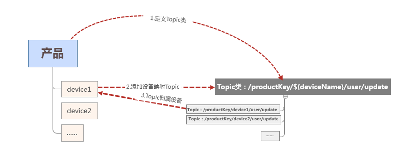
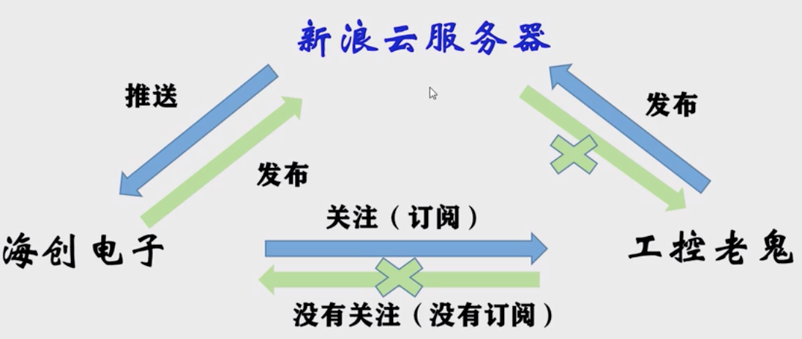

MQTT协议是为大量计算能力有限，且工作在低带宽、不可靠的网络的远程传感器和控制设备通讯而设计的协议，它具有以下主要的几项特性：

1. 使用发布/订阅消息模式，提供一对多的消息发布，解除应用程序耦合；
2. 对负载内容屏蔽的消息传输；
3. 使用 TCP/IP 提供网络连接；
4. 有三种消息发布服务质量：
**至多一次** 消息发布完全依赖底层 TCP/IP 网络。会发生消息丢失或重复。这一级别可用于如下情况，环境传感器数据，丢失一次读记录无所谓，因为不久后还会有第二次发送.
**至少一次** 确保消息到达，但消息重复可能会发生。
**只有一次** 确保消息到达一次。这一级别可用于如下情况，在计费系统中，消息重复或丢失会导致不正确的结果。
5. 小型传输，开销很小（固定长度的头部是 2 字节），协议交换最小化，以降低网络流量；
6. 使用 Last Will 和 Testament 特性通知有关各方客户端异常中断的机制
                  

## 云服务器

阿里云 腾讯云 移动OneNet云

## 名词解释

[阿里云文档](https://help.aliyun.com/document_detail/30526.html?spm=a2c4g.11186623.6.548.712650b36AafTj)

 **产品 :**设备的集合，通常指一组具有相同功能的设备。物联网平台为每个产品颁发全局唯一的ProductKey。每个产品下最多可以包含50万个设备。

**设备 :**归属于某个产品下的具体设备。物联网平台为设备颁发产品内唯一的证书DeviceName。设备可以直接连接物联网平台，也可以作为子设备通过网关连接物联网平台。

**topic 和topic类：**物联网平台中，服务端和设备端通过Topic来实现消息通信，类似于两个微博用户间的服务器。Topic是针对设备的概念，Topic类是针对产品的概念。产品的Topic类会自动映射到产品下的所有设备中，生成用于消息通信的具体设备Topic。

```
例如，产品的自定义Topic类/${YourProductKey}/${YourDeviceName}/user/update是具体Topic/${YourProductKey}/device1/user/update和/${YourProductKey}/device2/user/update的集合。
```



**发布：post**

**订阅：set**



## connect控制报文

[海创电子工作室_connect](https://www.bilibili.com/video/BV1YJ411S7Xy)

固定报头+可变报头+有效载荷

**固定报头：**必须存在，描述报文信息，有什么报文，报文登记，**2字节**


**可变报头：**不一定存在，看什么样子报文

**包含：** 协议名（protocol name） + 协议级别（protocol level） + 连接标志（connect flags） + 保持连接(keep alive)


**有效载荷部分：**这是内容，通信信息存放处，有时存放客户ID
**注：**详情见MQTT协议

包含：客户端标识符（client identifier） + 用户名（user name） + 密码（password）


创建阿里云物联网平台的三要素json

[对载荷进行加密](https://encode.chahuo.com)


## 订阅主题和订阅确认

作用：	subscribe报文 **客户端向服务端订阅**

1、服务端发送publish报文给客户端
2、subscribe报文指定了最大的QoS等级。

QoS：服务质量——指一个网络能够利用各种基础技术，为指定的[网络通信](https://baike.baidu.com/item/网络通信)提供更好的服务能力，是网络的一种安全机制， 是用来解决网络延迟和阻塞等问题的一种技术。QoS的保证对于容量有限的网络来说是十分重要的，特别是对于流多媒体应用，例如VoIP和IPTV等，因为这些应用常常需要固定的[传输率](https://baike.baidu.com/item/传输率/10811244)，对延时也比较敏感。

QoS0：最多分发一次——最常用
QoS1：至少分发一次
QoS2：只分发一次

## 取消订阅和取消订阅确认

## 发布消息和发布确认

