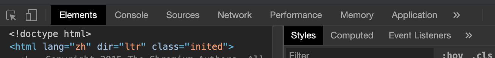
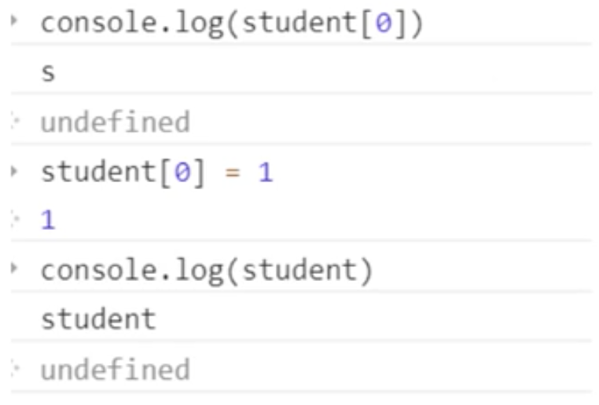
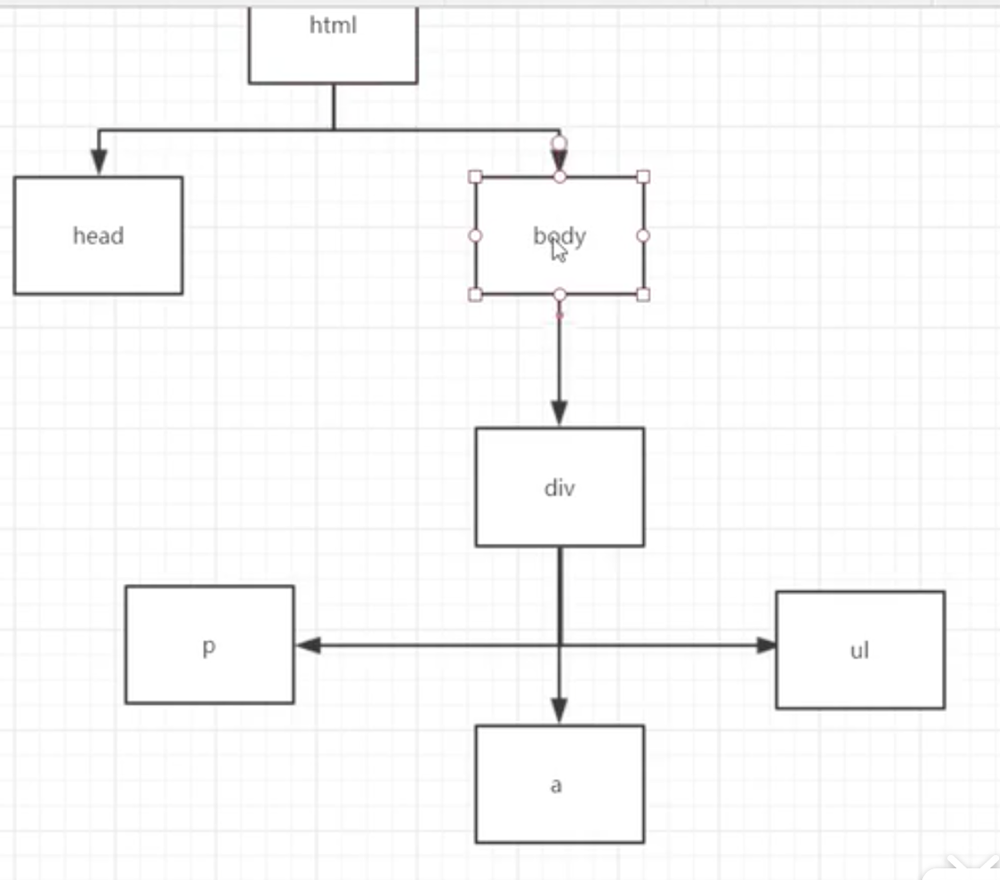
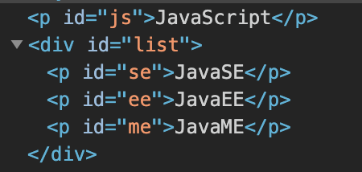
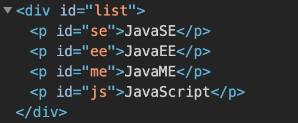
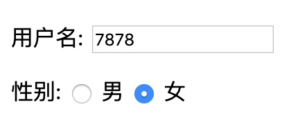
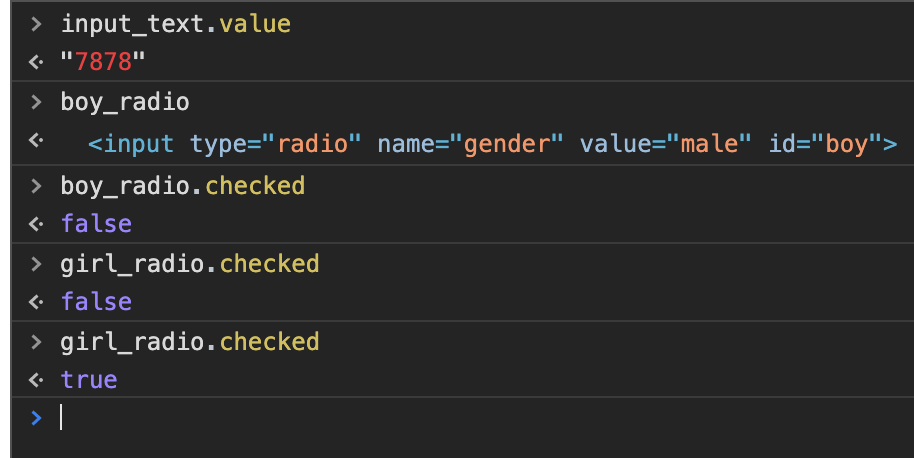
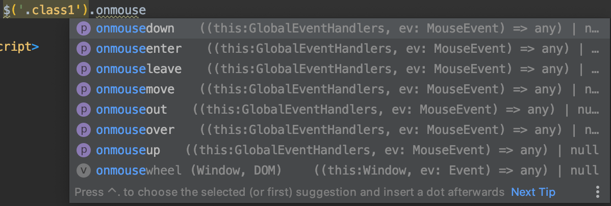
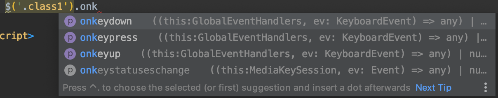
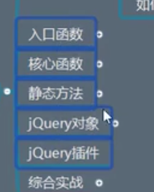

#1. 什么是JavaScript

## 1.1 概述

JS是世界上最流行的脚本语言

必须精通JS

## 1.2 历史

[JavaScript起源故事](https://blog.csdn.net/kese7952/article/details/79357868)

==ECMAScript== 是JavaScript的一个标准，最新版本已经到ES6

#2. 快速入门

## 2.1引入JavaScript

1. 内部标签

```html
<script>
	//……
</script>
```

2. 外部引入

<u>abc.js</u>

<u>test.html</u>

```html
<script src="abc.js">
</script>
```

## 2.2基本语法入门

```html
<!--  JavaScript严格区分大小写  -->
<script>
  //1、定义变量 变量类型 变量名 = 变量值;
  //没有变量类型区分
  var score = 1;
  
  //2、输出方式
  //输出到控制台
  console.log(score);
  //输出到弹窗
  alert(score);  
  
  //3、条件控制
  if(score >=60 && score<70){
    alert("及格");
  }else if(score >=70 && score<85){
    alert("差");  
  }else if(score >=85 && score<=100){
    alert("优");  
  }else{
    alert("其他");
  }
</script>
```

浏览器调试须知(必备)



## 2.3数据类型

数值、文本、图像、音频、视频……

==number==

js不区分小数和整数

```js
123				//整数
123.1			//浮点数
1.123e10	//科学记数法
-99				//负数
NaN				//Not a number
Infinity	//表示无限大
```

==字符串==

```js
'abc'
"abc"
```

==布尔值==

```js
true
false
```

==逻辑运算符==

```js
&&	//逻辑与
||	//逻辑或
!		//逻辑非
```

==比较运算符==

```js
=			//赋值
==		//等于(类型不同，值一样亦可)
===		//绝对等于(优先使用)
```

**特：**

- NaN === NaN，NaN与所有值都不相等
- 只能通过 **isNaN(NaN)** 来判断
- 浮点数问题

```js
Math.abs(1/3-(1-2/3)) < 1e-6
```

==null和undefined==

- null 空
- undefined 未定义

==数组==

```js
  var arr = [1,2,3,"hello",null,true]
```

取数组下标，如果越界，会显示 **undefined**

==对象==

```js
var Person = {
  name: "HaoQi",
  age: 30,
  tags: ["java","c++","workout","skiing"]
}
```

```js
< Person.tags
> (4) ["java", "c++", "workout", "skiing"]
< Person.age
> 30
```

==let和var区别==

var全局变量，如果定义在块内，外面使用，可以变量自动提升；

let局部变量，块级作用域变量，适合for语句，没有变量提升与暂时性死区，不能重复定义。

## 2.4严格检查模式

前提Idea支持ES6语法，

"use strict;"	严格检查模式，预防JavaScript的随意性导致产生问题

必须写在==JavaScript第一行==

```html
<script>
  //ES6 严格检查模式
  "use strict";
  //全局变量 ×
  //var i = 1;
  //let i = 1;
</script>
```

# 3.数据类型

## 3.1字符串

1. 字符串用单引号或双引号包裹
2. 注意转义字符 ==\\==

```js
\'
\n
\t
\u4e2d	\\ uxxxx Unicode 中文字符
\x41		\\ ASCII编码
```

3. 多行字符串编写 ==\`==

```js
//tab上 esc下
var msg = `hello
world
你好
呀!
`
```

4. 模板字符串

```js
let name = "haoqi";
let msg = `你好呀，${name}`;
```

5. 字符串长度

```js
str.length
```

6. 字符串的可变性，不可变



7. 大小写转换

```js
//注意，这里是方法，不是属性
student.toUpperCase()
student.toLowerCase()
```

8. 查找字符

```js
student.indexOf('t')
```

9. 子串

```js
//左闭右开
student.substring(1)	//从第一个到最后
student.substring(1,3)//[1,3)
```

## 3.2数组

==数组==可以包含任意类型的数据

```js
var Arr = [1,2,3,4,5,6];		//通过下标取值和赋值
Arr[0] = 0;
```

1. Arr.length
2. Arr.indexOf(2)
   Arr.indexOf("2")
3. Arr.slice(0, 3)——左开右闭
   没有修改数组，只是返回新的数组
4. Arr.push()   Arr.pop()

```js
Arr.push()		//压入尾部
Arr.pop()			//弹出尾部
```

5. Arr.unshift()   Arr.shift()

```js
Arr.unshift()		//压入头部
Arr.shift()			//弹出头部
```

6. Arr.sort()
7. Arr.reverse()
8. Arr.concat([1, 2, 3])
   没有修改数组，只是返回新的数组
9. Arr.join('-')

```js
<Arr = [1,3,5];
<Arr.join('-')
>"1-3-5"
```

10. 多维数组

```js
Arr = [[1,2],[3,4],["0","1"];
```

## 3.3对象

后台去看他的方法，类似于c++ map

## 3.4流程控制

1. 特殊1

```js
var age = [0,1,2,3,4,5,6];
for(var num in age){
  console.log(num);
}
```

2. 特殊2

```js
var age = [0,1,2,3,4,5,6];
//函数,类似于隐式函数，链式编程
age.forEach(function(value){
	console.log(value)    
})
```

## 3.5Map和Set

```js
var map = new Map([['tom',100],['jerry',90],['haha',80]]);
var name = map.get('jerry');
console.log(name);
map.delete("tom");
console.log(map);
```

```js
var set = new Set([3,1,1,1,1]);
set.add(2);
set.delete(1);
console.log(set);
```

## 3.6iterator

> ES6 新特性

**注:** 使用iterator来遍历 map和set

遍历Map

```js
//通过for of / for in 下标
var map = new Map([['ofm',100],['jerry',90],['haha',80]]);
for(var m of map){
  console.log(m);
}
```

遍历Set

```js
var set = new Set([3,1,5,9,7]);
for(var s of set){
  console.log(s);
}
```

# 4.函数及变相对象

## 4.1函数定义及变量作用域

## 4.2方法

==Java类的写法==

```js
var kuangshen = {
  name: '秦疆',
  birth: '1997',
  //方法
  age: function(){
    //今年 - 出生年
    var now = new Date().getFullYear();
    return now - this.birth;
  }
}

//--------test---------
kuangshen.name
kuangshen.age()
```

==C++写法==

```js
function getAge(){
    //今年 - 出生年
    var now = new Date().getFullYear();
    return now - this.birth;
}
var kuangshen = {
  name: '秦疆',
  birth: 1997,
  //方法
  age:getAge
}
//--------test---------
kuangshen.age()
//getAge() ==> NaN 是window的对象

```

==apply方法==

> 在js中可以控制this指向

```js
function getAge(){
    //今年 - 出生年
    var now = new Date().getFullYear();
    return now - this.birth;
}
var kuangshen = {
  name: '秦疆',
  birth: 1997,
  //方法
  age:getAge
}

getAge.apply(kuangshen, []); //this 指向了 kuangshen 参数为空
//getAge.apply(kuangshen, ); //ok
//getAge.apply(kuangshen, {}); //ok
```

## 4.3闭包(难点)

## 4.4箭头函数(新特性)

## 4.5创建对象

## 4.6class继承

## 4.7原型链继承

# 5.对象

## 5.1内部对象

==标准对象==

```js
typeof 123
"number"
typeof '123'
"string"
typeof true
"boolean"
typeof NaN
"number"
typeof []
"object"
typeof {}
"object"
typeof Math.floor
"function"
typeof undefined
"undefined"
```

## 5.2Date

普通

```js
var now = new Date();
now.getFullYear();
now.getMonth(); //0~11
now.getDate();
now.getDay();
now.getHours();
now.getMinutes();
now.getSeconds();

now.getTime();  //时间戳 世界统一 从1970年开始数
```

转换

```js
now.getTime();  //时间戳 世界统一 从1970年开始数
now = new Date(1590554807190);
console.log(now);//时间戳转Date
console.log(now.toLocaleString);
console.log(now.toLocaleString());
console.log(now.toGMTString());
```

## 5.3JSON

早期，所有数据传输习惯使用XML

- JSON(JavaScript Object Notation)是一种轻量级数据交换格式
- 简洁和清晰的层次结构使得JSON成为理想的数据交换语言
- 易于阅读和编写，同时易于机器解析和生成，有效的提高网络传输效率

在JavaScript一切皆为对象，任何支持对象都可以用JSON来表示

- 对象	[]
- 数组    {}
- 键值对  key: value

```js
var Person = {
  name: "HaoQi", age: 30, gender: "Male"
}
var jsonPerson = JSON.stringify(Person);
console.log(Person);
console.log(jsonPerson);
var obj =JSON.parse('{"name": "HaoQi", "age": 30, "gender": "Male"}');
console.log(obj);
```

JSON和js对象区别

```js
var obj = {a: 'hello', b: 'hellob'};
var json = "{'a': 'hello', 'b': 'hellob'}";
```

## 5.4Ajax

- 原生js写法	xhr 异步请求
- jQuery封装好的 方法 $("#name").ajax("")
- axios请求


# 6.面向对象编程

JavaScript、Java、C#等等面向对象语言，JavaScript有些区别。

- 类：模板
- 对象：具体的实例

在JavaScript需要改变一些思维方式。

==原型：==

```js
var Student = {
  name: "haoqi",
  age: 30,
  run: function () {
  	console.log(this.name + " run……");
	}
};
var xiaoming = {
	name : "xiaoming"
};
//小明原型是: Student
xiaoming.__proto__ = (Student);
console.log(xiaoming.run());
```

```js
//旧有的创造对象方法
function Student(name) {
  this.name = name;
};
//给Student新增一个方法
Student.prototype.hello = function () {
  alert("hello")
}
```

==class:==

class关键字，是在ES6引入的，类的方法创造

1. 定义一个类，包含属性和方法

```js
//====ES6之后====
//定义一个学生的类
class Student{
  constructor(name) {
    this.name = name;
  }

  hello(){
    alert('hello');
  }
}
var xiaoming = new Student("xiaoming");
```

2. 继承

```js
class Student{
  constructor(name) {
    this.name = name;
  }
  hello(){
  	alert('hello');
  }
}
class PrimaryStudent extends Student{
  constructor(name,grade) {
    super(name);
    this.grade = grade;
	}
	myGrade(){
		alert("我是一名小学生");
	}
}
var xiaoming = new Student("xiaoming");
var xiaohong = new PrimaryStudent("xiaohong",1);
```

3. 原型链

 __ proto__:

# 7.操作Bom元素

==Bom==

浏览器对象模型

==window==

window代表浏览器窗口

==navigator==

navigator封装了浏览器的信息

==screen==

代表屏幕尺寸

==location==

location代表当前页面URL信息

```js
host:"www.baid.com"
href:"https://www.baidu.com"
protocol:"https:"
reload:f reload()	//刷新页面
// 设置新的地址
location.assign("https://blog.kuangstudy.com/")
```

==document==

```js
document.title
"百度一下，你就知道"
//标签变了
document.title = "kuangshenshuo"
"百度一下，你就知道"
```

document代表当前页面，HTML DOM文档树

获取具体的文档树节点

```js
<dl id = "app">
  <dt>Java</dt>
<dd>JavaSE</dd>
<dd>JavaEE</dd>
</dl>
<script>
  var dl = document.getElementById("app");
</script>
```

获取cookie

```js
document.cookie
"_uuid=2FD1CEA4-551D-84BF-DAC8-8AD4820846F699718infoc; buvid3=E0F946C8-62D9-492B-8D82-04735F0BB150155827infoc; sid=b3zr8k4m; LIVE_BUVID=AUTO7215753835038155; CURRENT_FNVAL=16; stardustvideo=1; rpdid=|(um~RJJ|JJl0J'ul~lJ)Jll); laboratory=1-1; im_notify_type_495112=0; DedeUserID=495112; DedeUserID__ckMd5=bd964dc766f5d294; bili_jct=f61cc30f5a62794d2be943140503cdc7; Hm_lvt_8a6e55dbd2870f0f5bc9194cddf32a02=1585932197; bsource=seo_baidu; CURRENT_QUALITY=64; bp_t_offset_495112=393648398524017820; bp_video_offset_495112=394000822060279224; PVID=4"
```

注意：劫持cookie，可以获得你在网站的登陆状态

设置httpOnly避免这种情况

==history==

history代表浏览器的历史记录

```js
history.back();		//后退
history.forward();//前进
```

# 8.操作Dom元素

==Dom==

Dom就是文件对象模型

==核心==

浏览器网页就是一个Dom树形结构

- 更新：更新Dom节点
- 遍历Dom节点：得到Dom节点
- 删除：删除一个Dom节点
- 添加：插入一个Dom节点

要操作一个Dom节点，就必须要先获得这个Dom节点




## 8.1获得Dom节点

```js
<div id="father">
    <h1>标题一</h1>
    <p id="p1">p1</p>
    <p class="p2">p2</p>
</div>

<script>
  //对应css的选择器
  var h1 = document.getElementsByTagName("h1");       //以下四个要记住，常用
  var p1 = document.getElementById("p1");
  var p2 = document.getElementsByClassName("p2");
  var father = document.getElementById("father");
  var childrens = document.children;
  //father.firstChild
  //father.lastChild
  //father.nextSibling
</script>
```

## 8.2更新Dom

IDEA的html文件

```js
<div id="id1">

  </div>
<script>
  var id1 = document.getElementById("id1");
</script>
```

console控制台输入

```js
id1.innerText = "123";
id1.innerText = "456";
id1.innerHTML = "<b>123</b>";
//不解析
id1.innerText = "<b>123</b>";
id1.style.color = "red";
id1.style.fontSize = '30px'

```


## 8.3删除Dom

删除节点步骤: 先获取父节点，在通过父节点删除自己

```js
<div id="father">
    <h1>标题一</h1>
    <p id="p1">p1</p>
    <p class="p2">p2</p>
</div>

<script>
    var self = document.getElementById("p1");
    var father = p1.parentElement;
    father.removeChild(p1);
    //删除是在动态变化的
    //father.removeChild(father.children[0]);
    //father.removeChild(father.children[2]);
</script>
```

注意：删除是在动态变化的，删除下标一定要注意不要越界

## 8.4插入Dom

我们获得某个Dom节点，假设这个Dom节点是空的，我们通过innerHTML就可以增加一个元素了，但当Dom节点已经存在元素，就不能这么做了。否则会产生覆盖。

==追加节点==

```js
<p id="js">JavaScript</p>
<div id="list">
  <p id="se">JavaSE</p>
  <p id="ee">JavaEE</p>
  <p id="me">JavaME</p>
</div>
<script>
  document.getElementById("js");
	document.getElementById("list");
	list.appendChild(js);	//追加到后面，发生图1到图2变化
</script>
```





==创建新标签，并插入==

```js
var newP = document.createElement("p");
newP.id = "newP";
newP.innerText = "hello, KuangShen";
list.appendChild(newP);
```

# 9.操作表单

表单是什么， form ， DOM树

<text>	<select>	<radio> 	<checkbox>  <password>

表单的目的：提交信息

获得要提交信息

```js
<form action="post">
  <p>
  <span>用户名:</span>
  <input type="text" id="username">
    </p>
  <!--多选框的值，就是定义好的value-->
    <p>
    <span>性别:</span>
  <input type="radio" name = "gender" value="male" id="boy"> 男
  <input type="radio" name = "gender" value="female" id="girl"> 女
  </p>
</form>
<script>
  var input_text = document.getElementById("username");
  var boy_radio = document.getElementById("boy");
  var girl_radio = document.getElementById("girl");

  //得到输入框的值
  input_text.value;
  //修改输入框的值
  //input_text.value = 789;

  //对于单选框、多选框等固定值
  boy_radio.checked;  //查看返回结果，是否为true，如果为true，则被选中
  girl_radio.checked;
</script>
```






# 10.jQuery

jQuery：JavaScript中的工具类库，里面存在大量JavaScript函数

## 10.1初识jQuery

```js
<!--  jQuery公式
$(selector).action()
  -->
  <a href="" id="test-jQuery">点我</a>
<script>
    document.getElementById('id');
//选择器就是css选择器
$('#test-jQuery').click(function () {
  alert("success");
});
</script>
```

## 10.2选择器

```js
<script>
    //原生js，选择器少，麻烦不好记
    //标签
    document.getElementsByTagName();
    //id
    document.getElementById();
    //类
    document.getElementsByClassName();

    //jQuery css 中的选择器他全部都能用
    $('p').click();     //标签选择器
    $('#id1').click();     //id选择器
    $('.class1').click();     //class选择器
</script>
```

[jQuery API中文文档](https://jquery.cuishifeng.cn/)

## 10.3事件

- 鼠标事件
- 键盘事件
- 其他事件





## 10.4操作Dom

==节点文本操作==

```js
<ul id="test-ul">
  <li class="js">JavaScript</li>
	<li name="python">Python</li>
</ul>
<script>
  $('#test-ul li[name=python]').text();	//获得值
  $('#test-ul li[name=python]').text("Panasonic"); //修改值
  $('#test-ul li[class=js]').html();
  $('#test-ul li[class=js]').html("June");
</script>
```

==css的操作==

```js
  $('#test-ul li[name=python]').css("color","red");
```

==元素的显示和隐藏：本质 display: none==

```js
  $('#test-ul li[name=python]').show();
  $('#test-ul li[name=python]').hide();
  $('#test-ul li[name=python]').toggle();
```

==娱乐测试==

```js
$(window).width();
$(window).height();
```

==未来ajax()==

```js
$('#from').ajax();
$.ajax({ url: "test.html", context: document.body, success: function(){
    $(this).addClass("done");
}});
```

