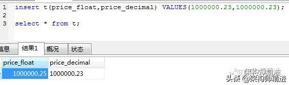
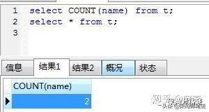
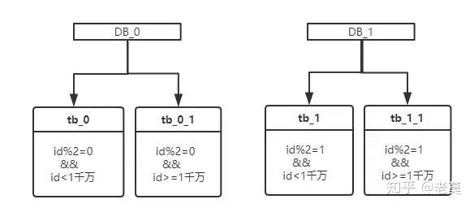
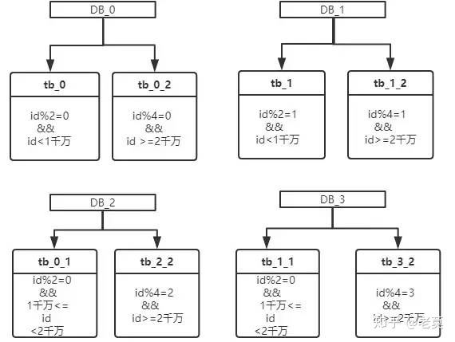
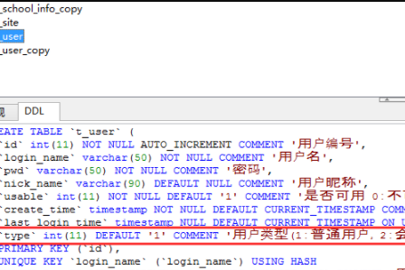
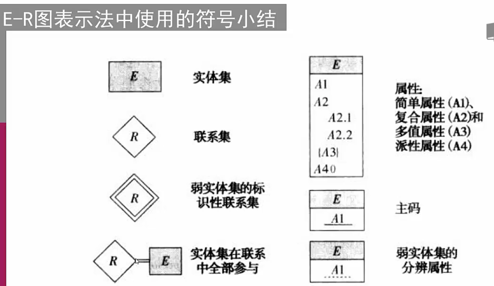
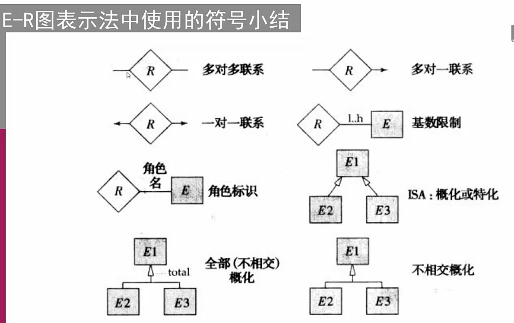
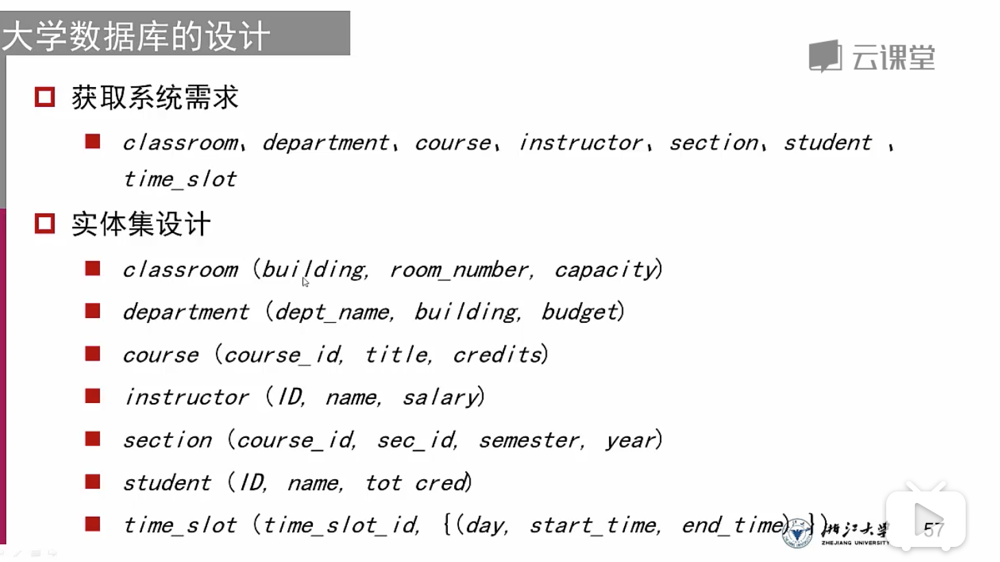
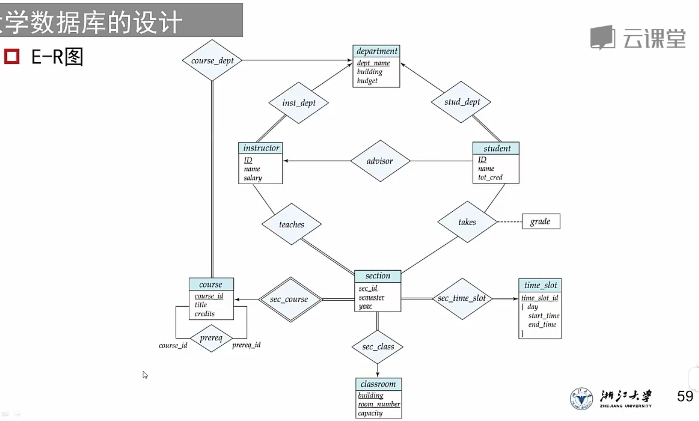

# mysql概念

数据库：多个数据表
数据表：数据的矩阵
列：一个字段
行：一条记录
冗余：存储两倍数据，提高安全性，降低性能
主键：唯一
外键：关联两个表
复合键：将多个字段转为索引键，复合索引
索引：可快速访问数据库表特定信息，类似于书籍目录

MYSQL支持数据类型
整数：INTEGER、SMALLINT、DECIMAL和NUMERIC
近似数：FLOAT DOUBLE REAL

mysql 关系型数据库，持久化。
mysql 索引作用：快速检索。

**NoSql 非关系性数据库，特别适合超大规模和高并发**

# mysql语法

## 简介

一、SQL基础查询
1、select语句
格式：select字段from表名；

2、where 用于限制查询的结果

3、查询条件> < >= <= = !=

4、与 或（AND，OR）

5、在 不在（IN，NOT IN）

6、在[a,b] (between val1 and val2) （判断时间范围）

7、空 非空(NULL,NOT NULL)

8、全部 任一（ALL，ANY）
不能单独使用，必须与关系运算符配合

9、排重DISTINCT
用在字段之前


二、排序
1、使用 ORDER BY 语句
格式：select 字段 from 表名 where 条件 ORDER BY 字段；

2、设置升序降序（ASC，DESC）
格式：select 字段 from 表名 where 条件 ORDER BY 字段 ASC|DESC

3、多项排序
格式：select 字段 from 表名 where 条件 ORDER BY 字段 ASC|DESC，字段ASC|DESC

三、聚合函数
注意：在使用比较运算符时NULL为最大值，在排序时也会受影响
把 select 语句的查询结果汇聚成一个结果，这样的函数叫聚合函数
1、MAX/MIN
获取最大值和最小值，可以是任何数据类型，但只能获取一个字段

2、AVG/SUM
获取平均值、总和
nvl(salary,0)

3、COUNT
统计记录的数量

4、FIRST()返回指定字段的第一个记录的值

5、ROUND() 函数（四舍五入规则）

6、MID() 函数

用于从文本字段中提取字符。
语法：SELECT MID(column_name,start[,length]) FROM table_name

7、LEN() 函数

LEN 函数返回文本字段中值的长度。

四、分组
1、GROUP BY
格式：select 组函数 from 表 group by 字段

2、HAVING 组判断条件
它的真假决定一组数据是否返回

五、查询语句的执行顺序
1、格式：select sum(salary) from 表名 where bool order by group by
　　a、from 表名，先确定数据的来源
　　b、where 确定表中的哪些数据有效
　　c、group by 字段名，确定分组的依据
　　d、having 确定组数据是否返回
　　e、order by 对组数据进行排序

六、关联查询
1、多表查询
select 字段 from 表1，表2 where;
2、多表查询时有相同字段怎么办
  1、表名.字段名
　　2、表名如果太长，可以给表起别名 （from 表 别名）
3、笛卡尔积
　　a、8条数据
　　b、9条数据
在多表查询时，一定要设置where 条件，否则将得到笛卡尔积


七、连接查询
当使用多表进行关联查询时，根据设置的条件会得到不同的结果
1、内连接查询：左右两边能匹配上的
select last_name ,name from s_emp,s_dept where dept_id=s_dept.id
2、外连接：左右两边不能匹配的数据
select last_name ,name from s_emp left|right|full outer join s_dept on dept_id=s_dept.id
3、左外连接
匹配成功的数据+左表不能匹配的数据
4、右外连接
匹配成功的数据+右表不能匹配的数据
5、全外连接
匹配成功的数据+左右表不能匹配的数据

## statement方法操作数据库

普通java代码，CategoryDAO专门用于把Category实例与Category表进行ORM映射

```java
 public void add(Category category) {

        String sql = "insert into category values(null,?)";
        try (Connection c = DBUtil.getConnection(); PreparedStatement ps = c.prepareStatement(sql);) {
            ps.setString(1, category.name);
            ps.execute();
            ResultSet rs = ps.getGeneratedKeys();
            if (rs.next()) {
                int id = rs.getInt(1);
                category.id = id;
            }
        } catch (SQLException e) {
            e.printStackTrace();
        }
    }
```


## 创建表，创建数据库

```mysql
create database if not exists nowcoder;
create table if not exists nowcoder_tbl 
(
	nowcoder_id int unsigned auto_increment,
    nowcoder_title varchar(100) not null,
    nowcoder_author varchar(40) not null,
    submission_date date,
    primary key (nowcoder_id)
)ENGINE=InnoDB default charset=utf8;

```

## 插入记录，不用写主键

```mysql
insert into nowcoder_tbl
(nowcoder_title,nowcoder_author,submission_date)
values
("学习PHP","牛客教程",NOW());
```

## 选择记录

```mysql
select * from nowcoder_tbl;
select nowcoder_title from nowcoder_tbl;
```


## 修改字段（可多字段修改）

```mysql
update nowcoder_tbl set nowcoder_author = 'w3c' where nowcoder_id = 2;
```

## 删除记录

```mysql
delete from nowcoder_tbl where nowcoder_id = 3;
select * from nowcoder_tbl where nowcoder_id = 3;
```

## 合并字段

合并不重复

```mysql
select nowcoder_author from nowcoder_tbl
union
select nowcoder_author from nowcoder_ttl
order by nowcoder_author;
```

合并允许重复

```mysql
select nowcoder_author from nowcoder_tbl
union all
select nowcoder_author from nowcoder_ttl
order by nowcoder_author;
```

按某个字段排序，默认升序 asc，降序desc

```mysql
select * from nowcoder_tbl order by nowcoder_author;
select * from nowcoder_tbl order by nowcoder_author desc;
```

先决代码

```mysql
SET NAMES utf8;
SET FOREIGN_KEY_CHECKS = 0;
-- ----------------------------
--  Table structure for `employee_tbl`
-- ----------------------------
DROP TABLE IF EXISTS `employee_tbl`;
CREATE TABLE `employee_tbl` (
  `id` int(11) NOT NULL,
  `name` char(10) NOT NULL DEFAULT '',
  `date` datetime NOT NULL,
  `singin` tinyint(4) NOT NULL DEFAULT '0' COMMENT '登录次数',
  PRIMARY KEY (`id`)
) ENGINE=InnoDB DEFAULT CHARSET=utf8;

-- ----------------------------
--  Records of `employee_tbl`
-- ----------------------------
BEGIN;
INSERT INTO `employee_tbl` VALUES ('1', '小明', '2016-04-22 15:25:33', '1'), ('2', '小王', '2016-04-20 15:25:47', '3'), ('3', '小丽', '2016-04-19 15:26:02', '2'), ('4', '小王', '2016-04-07 15:26:14', '4'), ('5', '小明', '2016-04-11 15:26:40', '4'), ('6', '小明', '2016-04-04 15:26:54', '2');
COMMIT;

SET FOREIGN_KEY_CHECKS = 1;
```

## 统计字段数量

```mysql
SELECT name, COUNT(*) FROM employee_tbl GROUP BY name;
```

```mysql
mysql> SELECT name, SUM(singin) as singin_count FROM  employee_tbl GROUP BY name WITH ROLLUP;
+--------+--------------+
| name   | singin_count |
+--------+--------------+
| 小丽   |            2 |
| 小明   |            7 |
| 小王   |            7 |
| NULL   |           16 |
+--------+--------------+
4 rows in set (0.01 sec)
```

```mysql
mysql> SELECT coalesce(name, '总数'), SUM(singin) as singin_count FROM  employee_tbl GROUP BY name WITH ROLLUP;
+--------------------------+--------------+
| coalesce(name, '总数')   | singin_count |
+--------------------------+--------------+
| 小丽                     |            2 |
| 小明                     |            7 |
| 小王                     |            7 |
| 总数                     |           16 |
+--------------------------+--------------+
4 rows in set (0.00 sec)
```

## 链接

INNER JOIN（内连接,或等值连接）：获取两个表中字段匹配关系的记录。
LEFT JOIN（左连接）：获取左表所有记录，即使右表没有对应匹配的记录。 
RIGHT JOIN（右连接）： 与 LEFT JOIN 相反，用于获取右表所有记录，即使左表没有对应匹配的记录。 

```mysql
SET NAMES utf8;
SET FOREIGN_KEY_CHECKS = 0;
DROP TABLE IF EXISTS `nowcoder_tbl`;
CREATE TABLE `nowcoder_tbl` (
  `nowcoder_id` int(11) NOT NULL AUTO_INCREMENT,
  `nowcoder_title` varchar(100) NOT NULL,
  `nowcoder_author` varchar(40) NOT NULL,
  `submission_date` date DEFAULT NULL,
  PRIMARY KEY (`nowcoder_id`)
) ENGINE=InnoDB DEFAULT CHARSET=utf8;
BEGIN;
INSERT INTO `nowcoder_tbl` VALUES ('1', '学习 PHP', '牛客教程', '2017-04-12'), ('2', '学习 MySQL', '牛客教程', '2017-04-12'), ('3', '学习 Java', 'NOWCODER.COM', '2015-05-01'), ('4', '学习 Python', 'NOWCODER.COM', '2016-03-06'), ('5', '学习 C', 'FK', '2017-04-05');
COMMIT;
DROP TABLE IF EXISTS `tcount_tbl`;
CREATE TABLE `tcount_tbl` (
  `nowcoder_author` varchar(255) NOT NULL DEFAULT '',
  `nowcoder_count` int(11) NOT NULL DEFAULT '0'
) ENGINE=InnoDB DEFAULT CHARSET=utf8;
BEGIN;
INSERT INTO `tcount_tbl` VALUES ('牛客教程', '10'), ('NOWCODER.COM ', '20'), ('Google', '22');
COMMIT;
SET FOREIGN_KEY_CHECKS = 1;
```

```mysql
mysql> select * from tcount_tbl;
+-----------------+----------------+
| nowcoder_author | nowcoder_count |
+-----------------+----------------+
| 牛客教程        |             10 |
| NOWCODER.COM    |             20 |
| Google          |             22 |
+-----------------+----------------+
3 rows in set (0.00 sec)

mysql> select * from nowcoder_tbl;
+-------------+----------------+-----------------+-----------------+
| nowcoder_id | nowcoder_title | nowcoder_author | submission_date |
+-------------+----------------+-----------------+-----------------+
|           1 | 学习 PHP       | 牛客教程        | 2017-04-12      |
|           2 | 学习 MySQL     | 牛客教程        | 2017-04-12      |
|           3 | 学习 Java      | NOWCODER.COM    | 2015-05-01      |
|           4 | 学习 Python    | NOWCODER.COM    | 2016-03-06      |
|           5 | 学习 C         | FK              | 2017-04-05      |
+-------------+----------------+-----------------+-----------------+
5 rows in set (0.00 sec)
```


```mysql
mysql> SELECT a.nowcoder_id, a.nowcoder_author, b.nowcoder_count FROM nowcoder_tbl a INNER JOIN tcount_tbl b ON a.nowcoder_author = b.nowcoder_author;
+-------------+-----------------+----------------+
| nowcoder_id | nowcoder_author | nowcoder_count |
+-------------+-----------------+----------------+
|           1 | 牛客教程        |             10 |
|           2 | 牛客教程        |             10 |
|           3 | NOWCODER.COM    |             20 |
|           4 | NOWCODER.COM    |             20 |
+-------------+-----------------+----------------+
4 rows in set (0.00 sec)
```


```mysql
mysql> SELECT a.nowcoder_id, a.nowcoder_author, b.nowcoder_count FROM nowcoder_tbl a,tcount_tbl b where a.nowcoder_author=b.nowcoder_author;
+-------------+-----------------+----------------+
| nowcoder_id | nowcoder_author | nowcoder_count |
+-------------+-----------------+----------------+
|           1 | 牛客教程        |             10 |
|           2 | 牛客教程        |             10 |
|           3 | NOWCODER.COM    |             20 |
|           4 | NOWCODER.COM    |             20 |
+-------------+-----------------+----------------+
4 rows in set (0.00 sec)
```


```mysql
mysql> SELECT a.nowcoder_id, a.nowcoder_author, b.nowcoder_count FROM nowcoder_tbl a LEFT JOIN tcount_tbl b ON a.nowcoder_author = b.nowcoder_author;
+-------------+-----------------+----------------+
| nowcoder_id | nowcoder_author | nowcoder_count |
+-------------+-----------------+----------------+
|           1 | 牛客教程        |             10 |
|           2 | 牛客教程        |             10 |
|           3 | NOWCODER.COM    |             20 |
|           4 | NOWCODER.COM    |             20 |
|           5 | FK              |           NULL |
+-------------+-----------------+----------------+
5 rows in set (0.00 sec)
```

## 复制表：

```mysql
mysql> insert into clone_tbl
    -> (nowcoder_id, nowcoder_title, nowcoder_author, submission_date)
    -> select
    -> nowcoder_id, nowcoder_title, nowcoder_author, submission_date
    -> from nowcoder_tbl;
Query OK, 5 rows affected (0.01 sec)
Records: 5  Duplicates: 0  Warnings: 0
```

## 正则表达式

<table> <thead> <tr> <th align="left">模式</th> <th align="left">描述</th> </tr> </thead> <tbody><tr> <td align="left">^</td> <td align="left">匹配输入字符串的开始位置。如果设置了 RegExp 对象的 Multiline 属性，^ 也匹配 '\n' 或 '\r' 之后的位置。</td> </tr> <tr> <td align="left">$</td> <td align="left">匹配输入字符串的结束位置。如果设置了RegExp 对象的 Multiline 属性，$ 也匹配 '\n' 或 '\r' 之前的位置。</td> </tr> <tr> <td align="left">.</td> <td align="left">匹配除 "\n" 之外的任何单个字符。要匹配包括 '\n' 在内的任何字符，请使用象 '[.\n]' 的模式。</td> </tr> <tr> <td align="left">[...]</td> <td align="left">字符集合。匹配所包含的任意一个字符。例如， '[abc]' 可以匹配 "plain" 中的 'a'。</td> </tr> <tr> <td align="left">[^...]</td> <td align="left">负值字符集合。匹配未包含的任意字符。例如， '[^abc]' 可以匹配 "plain" 中的'p'。</td> </tr> <tr> <td align="left">p1|p2|p3</td> <td align="left">匹配 p1 或 p2 或 p3。例如，'z|food' 能匹配 "z" 或 "food"。'(z|f)ood' 则匹配 "zood" 或 "food"。</td> </tr> <tr> <td align="left">*</td> <td align="left">匹配前面的子表达式零次或多次。例如，zo* 能匹配 "z" 以及 "zoo"。* 等价于{0,}。</td> </tr> <tr> <td align="left">+</td> <td align="left">匹配前面的子表达式一次或多次。例如，'zo+' 能匹配 "zo" 以及 "zoo"，但不能匹配 "z"。+ 等价于 {1,}。</td> </tr> <tr> <td align="left">{n}</td> <td align="left">n 是一个非负整数。匹配确定的 n 次。例如，'o{2}' 不能匹配 "Bob" 中的 'o'，但是能匹配 "food" 中的两个 o。</td> </tr> <tr> <td align="left">{n,m}</td> <td align="left">m 和 n 均为非负整数，其中n &lt;= m。最少匹配 n 次且最多匹配 m 次。</td> </tr> </tbody></table>

%使用

1.String sql = “select * from s_class”;
sql += " where name like ‘%"+studentClass.getName().toString()+"%’";
select * from s_class where name like ‘%软件%’
2.%是表示多个字符
   eg：%123% 可以是：0123 00123 001235（总之中间有123就行）
3._是表示一个字符，任何一个
   eg： _123 可以是：0123 1123 （ 在 _的位置只能替换一个字符）

%在sql语句中表示通配符，在模糊查询中用到，比如查找以张开头的所有人，like 张%

# 什么是事务

## 一隔持原ACID

事务是处理操作量大，复杂度高的数据。比如，在人员管理系统中，你删除一个人员，你既删除人员的基本资料，也要删除和该人员相关的信息，如信箱，文章等等，这样，这些数据库操作语句就构成一个事务

- 在 MySQL 中只有使用了 Innodb 数据库引擎的数据库或表才支持事务。
- 事务处理可以用来维护数据库的完整性，保证成批的 SQL 语句要么全部执行，要么全部不执行。
- 事务用来管理 insert,update,delete 语句。
- 四个必要条件：原子性、一致性、隔离性和持久性。

## 事务隔离级别

读未提交（Read Uncommitted）

读提交（Read Committed）

可重复读（Repeated Read）

串行化（Serializable）

## 事务实现

1、用 BEGIN, ROLLBACK, COMMIT来实现
**BEGIN** 开始一个事务
**ROLLBACK** 事务回滚
**COMMIT** 事务确认

2、直接用 SET 来改变 MySQL 的自动提交模式:
**SET AUTOCOMMIT=0** 禁止自动提交
**SET AUTOCOMMIT=1** 开启自动提交

```mysql
mysql> create table testalter_tbl
(
	i int,
	c char(1)
);
Query OK, 0 rows affected (0.05 sec)

mysql> show columns from testalter_tbl;
+-------+---------+------+-----+---------+-------+
| Field | Type    | Null | Key | Default | Extra |
+-------+---------+------+-----+---------+-------+
| i     | int(11) | YES  |     | NULL    |       |
| c     | char(1) | YES  |     | NULL    |       |
+-------+---------+------+-----+---------+-------+
2 rows in set (0.00 sec)
```

```mysql
# 删除字段i
ALTER TABLE testalter_tbl  DROP i;
# 增加字段i 类型INT
ALTER TABLE testalter_tbl ADD i INT;
# 修改c的数据类型
ALTER TABLE testalter_tbl MODIFY c CHAR(10);
# 将字段i改为j，类型BIGINT
mysql> ALTER TABLE testalter_tbl CHANGE i j BIGINT;
# 将字段j改为j，类型INT
mysql> ALTER TABLE testalter_tbl CHANGE j j INT;
```

```mysql
mysql> ALTER TABLE testalter_tbl ALTER i SET DEFAULT 1000;
mysql> SHOW COLUMNS FROM testalter_tbl;
+-------+---------+------+-----+---------+-------+
| Field | Type    | Null | Key | Default | Extra |
+-------+---------+------+-----+---------+-------+
| c     | char(1) | YES  |     | NULL    |       |
| i     | int(11) | YES  |     | 1000    |       |
+-------+---------+------+-----+---------+-------+
2 rows in set (0.00 sec)
```

```mysql
mysql> ALTER TABLE testalter_tbl ENGINE = MYISAM;
mysql>  SHOW TABLE STATUS LIKE 'testalter_tbl'\G
*************************** 1. row ****************
           Name: testalter_tbl
           Type: MyISAM
     Row_format: Fixed
           Rows: 0
 Avg_row_length: 0
    Data_length: 0
Max_data_length: 25769803775
   Index_length: 1024
      Data_free: 0
 Auto_increment: NULL
    Create_time: 2007-06-03 08:04:36
    Update_time: 2007-06-03 08:04:36
     Check_time: NULL
 Create_options:
        Comment:
1 row in set (0.00 sec)
```

```mysql
mysql> ALTER TABLE testalter_tbl RENAME TO alter_tbl;
```

# 索引

## 索引的语法：四种

```mysql
ALTER TABLE tbl_name ADD PRIMARY KEY (column_list): 该语句添加一个主键，这意味着索引值必须是唯一的，且不能为NULL。 
ALTER TABLE tbl_name ADD UNIQUE index_name (column_list): 这条语句创建索引的值必须是唯一的（除了NULL外，NULL可能会出现多次）。 
ALTER TABLE tbl_name ADD INDEX index_name (column_list):  添加普通索引，索引值可出现多次。 
ALTER TABLE tbl_name ADD FULLTEXT index_name (column_list): 该语句指定了索引为 FULLTEXT ，用于全文索引。 有些最少记录，最短字段最长字段限制。
```

```mysql
ALTER TABLE testalter_tbl ADD INDEX (c);
ALTER TABLE testalter_tbl DROP INDEX c;
```

## 索引本质：	

数据结构  

数据 
存储  硬盘
​持久化  物理磁盘IO 
CPU 内存 硬盘 卷(page)

## 索引方式：

**1 hash** 

hash 散列哈希算法
时间复杂度O(1)

缺点：
1 不支持范围查询
2 hash不支持排序

2 **树**
左中右 小中大
缺点：如果id自增持续从右下角添加，导致第二幅图情况


平衡二叉树，比如红黑树  

B+树：由2-3树而来
与B树相比，叶子节点有双向链表指针，根节点不存数据只存索引。

# 常用sql的引擎

## MYISAM

默认Mysql插件式存储引擎，
select insert为主
update delete少量
对事务的完整性/并发性要求不高情况
update时，锁表，阻塞式

web/数据仓库
B+树

## InnoDB

对事务要求高
支持行锁
保证事务完整提交

计费系统，财务系统，对数据准确性要求高
B+树

## memory

数据存储在内存ram中，速度极快，但是不可持久化
过于大的表，不可存
通常用于更新不频繁小表

# Mysql问答题

## 0:MariaDB的主从同步

从节点新建一个用户，创建一个线程，专门和主节点同步，不要用原有的用户或root降低工作效率。

## 1:为什么要一定要设置主键?

其实这个不是一定的，有些场景下，小系统或者没什么用的表，不设置主键也没关系，mysql最好是用自增主键，主要是以下两个原因：果定义了主键，那么InnoDB会选择主键作为聚集索引、如果没有显式定义主键，则innodb 会选择第一个不包含有NULL值的唯一索引作为主键索引、如果也没有这样的唯一索引，则innodb 会选择内置6字节长的ROWID作为隐含的聚集索引。所以，反正都要生成一个主键，那你还不如自己指定一个主键，提高查询效率！

聚集索引，主键顺序和物理存储顺序相同

## 2:主键是用自增还是UUID?

最好是用自增主键，主要是以下两个原因：

　　1. 如果表使用自增主键，那么每次插入新的记录，记录就会顺序添加到当前索引节点的后续位置，当一页写满，就会自动开辟一个新的页。
　　2. 如果使用非自增主键（如uuid），由于每次插入主键的值近似于随机，因此每次新纪录都要被插到索引页的随机某个位置，此时MySQL为了将新记录插到合适位置而移动数据，甚至目标页面可能已经被回写到磁盘上而从缓存中清掉，此时又要从磁盘上读回来，这增加了很多开销，同时频繁的移动、分页操作造成索引碎片，得到了不够紧凑的索引结构，后续不得不通过OPTIMIZE TABLE来重建表并优化填充页面。

不过，也不是所有的场景下都得使用自增主键，可能场景下，主键必须自己生成，不在乎那些性能的开销。那也没有问题。

## 3:自增主机用完了怎么办?

在mysql中，Int整型的范围（-2147483648~2147483648），约20亿！因此不用考虑自增ID达到最大值这个问题。而且数据达到千万级的时候就应该考虑分库分表了。

## 4:主键为什么不推荐有业务含义?

最好是主键是无意义的自增ID，然后另外创建一个业务主键ID，

因为任何有业务含义的列都有改变的可能性,主键一旦带上了业务含义，那么主键就有可能发生变更。主键一旦发生变更，该数据在磁盘上的存储位置就会发生变更，有可能会引发页分裂，产生空间碎片。

还有就是，带有业务含义的主键，不一定是顺序自增的。那么就会导致数据的插入顺序，并不能保证后面插入数据的主键一定比前面的数据大。如果出现了，后面插入数据的主键比前面的小，就有可能引发页分裂，产生空间碎片。

## 5:货币字段用什么类型?

货币字段一般都用 Decimal类型，
float和double是以二进制存储的，数据大的时候，可能存在误差。看下面这个图就明白了：




## 6:时间字段用什么类型?

这个看具体情况和实际场景，timestamp ，datatime ，bigint 都行！

timestamp，该类型是四个字节的整数，它能表示的时间范围为1970-01-01 08:00:01到2038-01-19 11:14:07。2038年以后的时间，是无法用timestamp类型存储的。
但是它有一个优势，timestamp类型是带有时区信息的。一旦你系统中的时区发生改变，例如你修改了时区，该字段的值会自动变更。这个特性用来做一些国际化大项目，跨时区的应用时，特别注意！

datetime，占用8个字节，它存储的时间范围为1000-01-01 00:00:00 ~ 9999-12-31 23:59:59。显然，存储时间范围更大。但是它坑的地方在于，它存储的是时间绝对值，不带有时区信息。如果你改变数据库的时区，该项的值不会自己发生变更！

bigint，也是8个字节，自己维护一个时间戳，查询效率高，不过数据写入，显示都需要做转换。这种存储方式的具有 Timestamp 类型的所具有一些优点，并且使用它的进行日期排序以及对比等操作的效率会更高，跨系统也很方便，毕竟只是存放的数值。缺点也很明显，就是数据的可读性太差了，你无法直观的看到具体时间。

## 7:为什么不直接存储图片、音频、视频等大容量内容?

我们在实际应用中，都是文件形式存储的。mysql中，只存文件的存放路径。虽然mysql中blob类型可以用来存放大容量文件，但是，我们在生产中，基本不用！
主要有如下几个原因：

　　1. Mysql内存临时表不支持TEXT、BLOB这样的大数据类型，如果查询中包含这样的数据，查询效率会非常慢。

　　2. 数据库特别大，内存占用高，维护也比较麻烦。

　　3. binlog太大，如果是主从同步的架构，会导致主从同步效率问题！

因此，不推荐使用blob等类型！

## 8:表中有大字段X(例如：text类型)，且字段X不会经常更新，以读为主，那么是拆成子表好？还是放一起好?

其实各有利弊，拆开带来的问题：连接消耗；不拆可能带来的问题：查询性能，所以要看你的实际情况，如果表数据量比较大，最好还是拆开为好。这样查询速度更快。

## 9:字段为什么要定义为NOT NULL?

一般情况，都会设置一个默认值，不会出现字段里面有null，又有空的情况。主要有以下几个原因：

1. 索引性能不好，Mysql难以优化引用可空列查询，它会使索引、索引统计和值更加复杂。可空列需要更多的存储空间，还需要mysql内部进行特殊处理。可空列被索引后，每条记录都需要一个额外的字节，还能导致MYisam 中固定大小的索引变成可变大小的索引。

2. 如果某列存在null的情况，可能导致count() 等函数执行不对的情况。看一下2个图就明白了：




3. sql 语句写着也麻烦，既要判断是否为空，又要判断是否为null等。

## 10:where执行顺序是怎样的

where 条件从左往右执行的，在数据量小的时候不用考虑，但数据量多的时候要考虑条件的先后顺序，此时应遵守一个原则：排除越多的条件放在第一个。

## 11:应该在这些列上创建索引

在经常需要搜索的列上，可以加快搜索的速度；在作为主键的列上，强制该列的唯一性和组织表中数据的排列结构；在经常用在连接的列上，这些列主要是一些外键，可以加快连接的速度；在经常需要根据范围进行搜索的列上创建索引，因为索引已经排序，其指定的范围是连续的；在经常需要排序的列上创建索引，因为索引已经排序，这样查询可以利用索引的排序，加快排序查询时间；在经常使用在WHERE子句中的列上面创建索引，加快条件的判断速度。

## 12:mysql联合索引

联合索引是两个或更多个列上的索引。对于联合索引:Mysql从左到右的使用索引中的字段，一个查询可以只使用索引中的一部分，但只能是最左侧部分。例如索引是key index (a,b,c). 可以支持a 、 a,b 、 a,b,c 3种组合进行查找，但不支持 b,c进行查找 .当最左侧字段是常量引用时，索引就十分有效。
利用索引中的附加列，您可以缩小搜索的范围，但使用一个具有两列的索引 不同于使用两个单独的索引。复合索引的结构与电话簿类似，人名由姓和名构成，电话簿首先按姓氏对进行排序，然后按名字对有相同姓氏的人进行排序。如果您知 道姓，电话簿将非常有用；如果您知道姓和名，电话簿则更为有用，但如果您只知道名不姓，电话簿将没有用处。

## 13:什么是最左前缀原则

最左前缀原则指的是，如果查询的时候查询条件精确匹配索引的左边连续一列或几列，则此列就可以被用到。如下：

```mysql
select * from user where name=xx and city=xx ; ／／可以命中索引
select * from user where name=xx ; // 可以命中索引
select * from user where city=xx ; // 无法命中索引
```

这里需要注意的是，查询的时候如果两个条件都用上了，但是顺序不同，如 city= xx and name ＝xx，那么现在的查询引擎会自动优化为匹配联合索引的顺序，这样是能够命中索引的。

由于最左前缀原则，在创建联合索引时，索引字段的顺序需要考虑字段值去重之后的个数，较多的放前面。ORDER BY子句也遵循此规则。

## 14:什么情况下应不建或少建索引

表记录太少
经常插入、删除、修改的表
数据重复且分布平均的表字段，假如一个表有10万行记录，有一个字段A只有T和F两种值，且每个值的分布概率大约为50%，那么对这种表A字段建索引一般不会提高数据库的查询速度。
经常和主字段一块查询但主字段索引值比较多的表字段

## 15:问了下MySQL数据库cpu飙升到100%的话他怎么处理

\1. 列出所有进程 show processlist 观察所有进程 多秒没有状态变化的(干掉)

\2. 查看慢查询，找出执行时间长的sql；explain分析sql是否走索引，sql优化；

\3. 检查其他子系统是否正常，是否缓存失效引起，需要查看buffer命中率；

## 16、mysql中表锁和行锁的区别

Mysql有很多这种锁机制，比如行锁，表锁等，读锁，写锁等，都是在做操作之前先上锁；这些锁统称为悲观锁(Pessimistic Lock)

**行锁**

特点：锁的粒度小，发生锁冲突的概率低、处理并发的能力强；开销大、加锁慢、会出现死锁

加锁的方式：自动加锁。对于UPDATE、DELETE和INSERT语句，InnoDB会自动给涉及数据集加排他锁；对于普通SELECT语句，InnoDB不会加任何锁。

**表锁**

特点：开销小、加锁快、无死锁；锁粒度大，发生锁冲突的概率高，高并发下性能低

加锁的方式：自动加锁。查询操作（SELECT），会自动给涉及的所有表加读锁，更新操作（UPDATE、DELETE、INSERT），会自动给涉及的表加写锁。

## 17、mysql主键索引和普通索引之间的区别是什么

**普通索引**

普通索引是最基本的索引类型，而且它没有唯一性之类的限制。普通索引可以通过以下几种方式创建：

创建索引，例如

**CREATEINDEX**<索引的名字>**ON**tablename (列的列表);

修改表，例如

**ALTERTABLE**tablename**ADDINDEX**[索引的名字] (列的列表);

创建表的时候指定索引，例如

**CREATETABLE**tablename ( [...],**INDEX**[索引的名字] (列的列表) );

**主键索引**

主键是一种唯一性索引，但它必须指定为“PRIMARY KEY”。

主键一般在创建表的时候指定，例如

**CREATETABLE**tablename ( [...],**PRIMARYKEY**(列的列表) );

但是，我们也可以通过修改表的方式加入主键，例如“ALTER TABLE tablename ADD PRIMARY KEY (列的列表); ”。每个表只能有一个主键。

**区别**

普通索引是最基本的索引类型，没有任何限制，值可以为空，仅加速查询。普通索引是可以重复的，一个表中可以有多个普通索引。

主键索引是一种特殊的唯一索引，一个表只能有一个主键，不允许有空值；索引列的所有值都只能出现一次，即必须唯一。简单来说：主键索引是加速查询 + 列值唯一（不可以有null）+ 表中只有一个。

## 18、SQL JOIN 中 on 与 where 的区别

- **left join** : 左连接，返回左表中所有的记录以及右表中连接字段相等的记录。
- **right join** : 右连接，返回右表中所有的记录以及左表中连接字段相等的记录。
- **inner join** : 内连接，又叫等值连接，只返回两个表中连接字段相等的行。
- **full join** : 外连接，返回两个表中的行：left join + right join。
- **cross join** : 结果是笛卡尔积，就是第一个表的行数乘以第二个表的行数。

**关键字 on**
数据库在通过连接两张或多张表来返回记录时，都会生成一张中间的临时表，然后再将这张临时表返回给用户。
在使用 **left jion** 时，**on** 和 **where** 条件的区别如下：

- 1、 **on** 条件是在生成临时表时使用的条件，它不管 **on** 中的条件是否为真，都会返回左边表中的记录。
- 2、**where** 条件是在临时表生成好后，再对临时表进行过滤的条件。这时已经没有 **left join** 的含义（必须返回左边表的记录）了，条件不为真的就全部过滤掉。

假设有两张表：
**表1：tab2**
idsize110220330
**表2：tab2**
sizename10AAA20BBB20CCC
两条 SQL:
select * form tab1 left join tab2 on (tab1.size = tab2.size) where tab2.name='AAA'
select * form tab1 left join tab2 on (tab1.size = tab2.size and tab2.name='AAA')

第一条SQL的过程：
1、中间表
on条件:
tab1.size = tab2.sizetab1.idtab1.sizetab2.sizetab2.name11010AAA22020BBB22020CCC330(null)(null)
2、再对中间表过滤
where 条件：
tab2.name='AAA'tab1.idtab1.sizetab2.sizetab2.name11010AAA
第二条SQL的过程：
1、中间表
on条件:
tab1.size = tab2.size and tab2.name='AAA'
(条件不为真也会返回左表中的记录)tab1.idtab1.sizetab2.sizetab2.name11010AAA220(null)(null)330(null)(null)
其实以上结果的关键原因就是 **left join、right join、full join** 的特殊性，不管 **on** 上的条件是否为真都会返回 **left** 或 **right** 表中的记录，**full** 则具有 **left** 和 **right** 的特性的并集。 而 **inner jion**没这个特殊性，则条件放在 **on** 中和 **where** 中，返回的结果集是相同的。

## 19、优化 MYSQL 数据库的方法

(1) 选取最适用的字段属性，尽可能减少定义字段长度，尽量把字段设置 NOT NULL, 例如’省份，性别’, 最好设置为 ENUM

(2) 使用连接（JOIN）来代替子查询:

(3) 使用联合 (UNION) 来代替手动创建的临时表

(4) 事务处理:

(5) 锁定表，优化事务处理:

(6) 使用外键，优化锁定表

(7) 建立索引

(8) 优化 sql 语句

## 20、适用MySQL 5.0以上版本:

1.一个汉字占多少长度与编码有关: UTF-8:一个汉字=3个字节 GBK:一个汉字=2个字节

## 21、php读取文件内容的几种方法和函数?

打开文件，然后读取。Fopen() fread()

打开读取一次完成 file_get_contents()

## 22、不同表的关系 多对多 一对多 多对一

## 23、数据库优化操作

1 SQL高级方面，比如group by, having，左连接，子查询（带in），行转列等高级用法。
2 建表方面，你可以考虑下，你项目是用三范式还是反范式，理由是什么？
3 尤其是优化，你可以准备下如何通过执行计划查看SQL语句改进点的方式，或者其它能改善SQL性能的方式（比如建索引等）。
4 如果你感觉有能力，还可以准备些MySQL集群，MyCAT分库分表的技能。比如通过LVS+Keepalived实现MySQL负载均衡，MyCAT的配置方式。同样，如果可以，也看些相关的底层代码。

## InnoDB和MyISAM区别

InnoDB: 性能佳，不支持事务处理
frm: 创建表的结构
ibd: 表的内容和索引，
	B+树最下层 **主键：记录** 和 **字段：主键**
	实际最下层是记录

MyISAM: 支持事务功能
frm: 创建表的结构
MYD: user2表的内容
MYI: 表的索引 **主键：地址** 和 **字段：地址**索引本质：	数据结构 数据
					  存储		硬盘
					  持久化    物理磁盘IO CPU 内存 硬盘 卷(page)

## 分库和分表

**hash一致性原理** 假设四台服务器，得到四个hash值，映射到一个hash环，用户1/2/3/4/5的hash值顺时针找到对应服务器值。

hash一致性：单调性、分散性、平衡性

**1、分库分表的原因**
1、随着单库中的数据量越来越大，相应的，查询所需要的时间也越来越多，相当于数据的处理遇到了瓶颈
2、单库发生意外的时候，需要修复的是所有的数据，而多库中的一个库发生意外的时候，只需要修复一个库（当然，也可以用物理分区的方式处理这种问题）

**策略** 
垂直切分，两个表个分到一些字段，联合后得到整表，解决跨页问题，提升速度
水平切分
	大小分（用hash一致性问题解决）
	按模值分，扩容时候需要数据迁移，或者扩展方案来解决，每次达到阈值时候

​	





常用MyCat、ShardingJdbc


## mysql数据重复怎么办

https://www.jianshu.com/p/ffa26a62a791

1双主键模式 2添加unique索引 3可重复提交数据 4过滤重复 5删除重复

处理重复数据：
你可以在 MySQL 数据表中设置指定的字段为**PRIMARY KEY（主键）**或者 **UNIQUE（唯一）**索引来保证数据的唯一性。让我们尝试一个实例：下表中无索引及主键，所以该表允许出现多条重复记。

## SQL优化的一些思路？

1 SQL高级方面，比如group by, having，左连接，子查询（带in），行转列等高级用法。
2 建表方面，你可以考虑下，你项目是用三范式还是反范式，理由是什么？
3 尤其是优化，你可以准备下如何通过执行计划查看SQL语句改进点的方式，或者其它能改善SQL性能的方式（比如建索引等）。
4 如果你感觉有能力，还可以准备些MySQL集群，MyCAT分库分表的技能。比如通过LVS+Keepalived实现MySQL负载均衡，MyCAT的配置方式。同样，如果可以，也看些相关的底层代码。

## 物理删除和逻辑删除

逻辑删除其实是修改操作，所谓的逻辑删除其实并不是真正的删除，而是在表中将对应的是否删除标识（is_delete）或者说是状态字段（status）
update 表名 set is_delete = 1 where id = 1;

物理删除就是真正的从数据库中做删除
delete from 表名 where 条件;


## mysql自动增加的字段怎么设置初始值

sql语句 default 值


## 表索引根据什么条件创建？

where后边频繁出现字段创建索引，如果值太少不要创建，比如一半0一半1

优缺点：检索速度提升，唯一性，加速表和表连接，分组和排序子句数据检索时间
			  占物理空间，CRUD索引也要动态维护，速度下降

## 怎么备份数据库？

backup database 【数据库名称】 to disk='【备份路径及文件名称.bak】'

PATH 地址没加双引号 注意！！！

## 设置主键

主键两个特征：1 唯一 2 不为空
设置主键

```mysql
alter table category add constraint pk_category_id primary key (id);
```

自增字段

```mysql
alter table category change id id int auto_increment;
```

以下是增加外键约束的SQL(增加数据一致性)

```mysql
alter table record add constraint fk_record_category foreign key (cid) references category(id)
```

## 安装MySql

https://blog.csdn.net/qq_37832848/article/details/82902522

how2j

[老夫整理的1000行MySQL学习笔记传授有缘人](https://zhuanlan.zhihu.com/p/71232689)

[mysql关于用户密码的设置](https://blog.csdn.net/weixin_34007020/article/details/92152252)

## MySql中Cascade Delete问题

级联删除：就是主键记录删除时，相关的有外键的表里的记录，也删除。

上面三个帖子解释的比较清楚。

另外CASCADE模式需要MYSQL引擎支持：Engine必须是InnoDB。

https://dev.mysql.com/doc/refman/5.7/en/delete.html

https://stackoverflow.com/questions/2914936/mysql-foreign-key-constraints-cascade-delete

http://www.mysqltutorial.org/mysql-on-delete-cascade/

# mysql表链接

题目】
下面是某公司每天的营业额，表名为“日销”。“日期”这一列的数据类型是日期类型（date）。


请找出所有比前一天（昨天）营业额更高的数据。（前一天的意思，如果“当天”是1月，“昨天”（前一天）就是1号）

例如需要返回一下结果：


【解题思路】

1.交叉联结

首先我们来复习一下之前课程《从零学会sql》里讲过的交叉联结（corss join）的概念。

使用交叉联结会将两个表中所有的数据两两组合。如下图，是对表“text”自身进行交叉联结的结果：


直接使用交叉联结的业务需求比较少见，往往需要结合具体条件，对数据进行有目的的提取，本题需要结合的条件就是“前一天”。

2.本题的日销表交叉联结的结果（部分）如下。这个交叉联结的结果表，可以看作左边三列是表a，右边三列是表b。


红色框中的每一行数据，左边是“当天”数据，右边是“前一天”的数据。比如第一个红色框中左边是“当天”数据（2号），右边是“前一天”的数据（1号）。

题目要求，销售额条件是：“当天” > “昨天”（前一天）。所以，对于上面的表，我们只需要找到表a中销售额（当天）大于b中销售额（昨天）的数据。

3.另一个需要着重去考虑的，就是如何找到 “昨天”（前一天），这里为大家介绍两个时间计算的函数：
daffdate(日期1, 日期2)：
得到的结果是日期1与日期2相差的天数。
如果日期1比日期2大，结果为正；如果日期1比日期2小，结果为负。

例如：日期1（2019-01-02），日期2（2019-01-01），两个日期在函数里互换位置，就是下面的结果


另一个关于时间计算的函数是：
timestampdiff(时间类型, 日期1, 日期2)
这个函数和上面diffdate的正、负号规则刚好相反。
日期1大于日期2，结果为负，日期1小于日期2，结果为正。

在“时间类型”的参数位置，通过添加“day”, “hour”, “second”等关键词，来规定计算天数差、小时数差、还是分钟数差。示例如下图：


【解题步骤】
1.将日销表进行交叉联结


2.选出上图红框中的“a.日期比b.日期大一天”

可以使用“diffdate(a.日期, b.日期) = 1”或者“timestampdiff(day, a.日期, b.日期) = -1”，以此为基准，提取表中的数据，这里先用diffdate进行操作。

代码部分：

```mysql
select *
from 日销 as a cross join 日销 as b 
     on datediff(a.日期, b.日期) = 1;
```

得到结果：


3.找出a中销售额大于b中销售额的数据

where a.销售额（万元） > b.销售额（万元）

得到结果：


4.删掉多余数据

题目只需要找销售额大于前一天的ID、日期、销售额，不需要上表那么多数据。所以只需要提取中上表的ID、日期、销售额（万元）列。
结合一开始提到的两个处理时间的方法，最终答案及结果如下：

```mysql
select a.ID, a.日期, a.销售额（万元）
from 日销 as a cross join 日销 as b 
     on datediff(a.日期, b.日期) = 1
where a.销售额（万元） > b.销售额（万元）;
```


或者

```mysql
select a.ID, a.日期, a.销售额（万元）
from 日销 as a cross join 日销 as b 
     on timestampdiff(day, a.日期, b.日期) = -1
where a.销售额（万元） > b.销售额（万元）;
```


【本题考点】
1）考察逻辑思维能力，可以使用课程《分析方法》中的逻辑树分析方法将复杂问题拆解成一个一个可以解决的子问题
2）考察多表联结
3）针对时间的处理语句是在业务中经常用到的，需要熟练掌握。
4） 尤其考察对不同sql数据格式处理的掌握程度，

【举一反三】
下面是气温表，名为weather，date列的数据格式为date，请找出比前一天温度更高的ID和日期


参考答案：

```mysql
select a.ID, a.date
from weather as a cross join weather as b 
     on datediff(a.date, b.date) = 1
where a.temp > b.temp;
```


或者

```mysql
select a.ID, a.date
from weather as a cross join weather as b 
     on timestampdiff(day, a.date, b.date) = -1
where a.temp > b.temp;
```


得到结果


我是猴子，微信公众号（猴子聊人物），知乎：猴子

----

【题目】

下面是学生的名单，表名为“学生表”；近视学生的名单，表名为“近视学生表”。请问不是近视眼的学生都有谁？
（“学生表”表中的学号与“近视学生”表中的学生学号一一对应）


【解题思路】

1.我们先来拆解问题：不是近视眼的学生都有谁？

1）“不是近视眼”的学生，近视信息在“近视学生”表里
2） “学生都有谁？”，要求的是“学生姓名”，所以我们的输出答案应该是“学生姓名”，这在“学生”表里。

涉及2张以上表的查询时，我们需要用到多表联结。

2.使用哪种联结呢？
在《从零学会SQL：多表查询》这个课里我讲过各个联结的情况：


其中上图黑色框里的sql解决的问题是：不在表里的数据，也就是在表A里的数据，但是不在表B里的数据。

对于这个题目“不是近视眼的学生都有谁？”，就是在“学生表”里的数据，但是不在“近视学生”表里的数据。我们选择下图黑色框里的左联结sql语句。


```mysql
select ...
from 表1 as a
left join 表2 as b
on a.列名=b.列名
where b.列名 is null;
```

3.多表如何联结？
题目已给出，联结两表的关键依据分别为“学号”和“学生学号”。示意图如下：


【解题步骤】

使用分析思路里的sql语句联结两表

```mysql
select a.姓名 as 不近视的学生名单
from 学生表 as a
left join 近视学生表 as b
on a.学号=b.学生学号
where b.序号 is null;
```

我们来理解下这个sql的运行过程，方便你更深入的理解。

1）在不加where字句的情况下，两表联结得到下图的表


2）假设where字句（where b.序号 is null;）就会把b.序号这一列里为空值（NULL）的行选出来，就是题目要求的不近视的学生。（下图绿色框里的行）


# 数据库及ER图

设计步骤：需求分析、概念设计、逻辑设计、物理设计、数据库实施

按目标组织分：行为设计、结构设计









# leetcode刷题

双主键

```mysql
CREATE TABLE person_tbl
(
    first_name CHAR(20),
    last_name CHAR(20),
    sex CHAR(10)
);
CREATE TABLE person_tbl
(
   first_name CHAR(20) NOT NULL,
   last_name CHAR(20) NOT NULL,
   sex CHAR(10),
   PRIMARY KEY (last_name, first_name)
);
CREATE TABLE person_tbl
(
   first_name CHAR(20) NOT NULL,
   last_name CHAR(20) NOT NULL,
   sex CHAR(10),
   UNIQUE (last_name, first_name)
);
```

插入相同记录会出错

统计重复数据

```mysql
mysql> SELECT COUNT(*) as repetitions, last_name, first_name
    -> FROM person_tbl
    -> GROUP BY last_name, first_name
    -> HAVING repetitions > 1;
```

过滤重复数据

```mysql
mysql> SELECT DISTINCT last_name, first_name
    -> FROM person_tbl;
mysql> SELECT last_name, first_name
    -> FROM person_tbl
    -> GROUP BY (last_name, first_name);
```

删除重复数据

```mysql
mysql> CREATE TABLE tmp SELECT last_name, first_name, sex FROM person_tbl  GROUP BY (last_name, first_name, sex);
mysql> DROP TABLE person_tbl;
mysql> ALTER TABLE tmp RENAME TO person_tbl;
```

```mysql
mysql> ALTER IGNORE TABLE person_tbl
    -> ADD PRIMARY KEY (last_name, first_name);
```


on和where的区别：
1、on条件是在生成临时表时使用的条件，on中条件为真生成临时表。
2、where条件是在临时表生成好后，再对临时表进行过滤的条件。这时已经没有left join的含义（必须返回左边表的记录）了，条件不为真的就全部过滤掉。

sql语句导入导出数据
[导入](https://m.nowcoder.com/tutorial/10006/c492379b5ce147148e1b3ff6ae370813)
[导出](https://m.nowcoder.com/tutorial/10006/f97e869b91634940a0edc81d00fe0e6d)

**Mysql字符串函数**
[字符串函数](https://m.nowcoder.com/tutorial/10006/d757e6af24854b219b9273f58f42820b)

---

字段的映射

```mysql
update salary 
set 
    sex = case sex
    when 'm' then 'f'
    when 'f' then 'c'
    else 'm'
end;
```

student和class唯一

```mysql
select class
from courses
group by class
having count(distinct student) >=5
;
```

选取第二大的数

```mysql
SELECT DISTINCT Salary AS SecondHighestSalary
FROM Employee
ORDER BY Salary DESC
LIMIT 1 OFFSET 1;
# LIMIT 选几个; OFFSET 0-based
SELECT
    (SELECT DISTINCT
            Salary
        FROM
            Employee
        ORDER BY Salary DESC
        LIMIT 1 OFFSET 1) AS SecondHighestSalary;
# 防止出null
SELECT
    IFNULL(
      (SELECT DISTINCT Salary
       FROM Employee
       ORDER BY Salary DESC
        LIMIT 1 OFFSET 1),
    NULL) AS SecondHighestSalary;
# 第二大 IFNUll后面表，as加表头
```

第N大的数

```mysql
CREATE FUNCTION getNthHighestSalary(N INT) RETURNS INT
BEGIN
  if N<0 then    
    RETURN (select min(Salary) from Employee);
  else  
    SET N= N-1;
    RETURN (
        # Write your MySQL query statement below.
        SELECT
        IFNULL(
        (SELECT DISTINCT Salary
        FROM Employee
        ORDER BY Salary DESC
            LIMIT 1 OFFSET N),
        NULL) AS getNthHighestSalary
    );
  end if;
END
```

删除重复的记录

```mysql
delete p1.*
from Person p1,
     Person p2
where
    p1.Email = p2.Email and p1.Id > p2.Id
;
# 大的删掉小的留下来
```

选中customerid中未出现的记录

```mysql
select Name as Customers
from Customers
where Id not in
(
	select customerid from Orders
);

select a.Name as Customers
from Customers as a
left join Orders as b
on a.Id=b.CustomerId
where b.CustomerId is null;
# a的键是一定会加进来的
```

统计各个月的总和

```mysql
SELECT id,
SUM(CASE month WHEN 'Jan' THEN revenue END) Jan_Revenue,
SUM(CASE month WHEN 'Feb' THEN revenue END) Feb_Revenue,
SUM(CASE month WHEN 'Mar' THEN revenue END) Mar_Revenue,
SUM(CASE month WHEN 'Apr' THEN revenue END) Apr_Revenue,
SUM(CASE month WHEN 'May' THEN revenue END) May_Revenue,
SUM(CASE month WHEN 'Jun' THEN revenue END) Jun_Revenue,
SUM(CASE month WHEN 'Jul' THEN revenue END) Jul_Revenue,
SUM(CASE month WHEN 'Aug' THEN revenue END) Aug_Revenue,
SUM(CASE month WHEN 'Sep' THEN revenue END) Sep_Revenue,
SUM(CASE month WHEN 'Oct' THEN revenue END) Oct_Revenue,
SUM(CASE month WHEN 'Nov' THEN revenue END) Nov_Revenue,
SUM(CASE month WHEN 'Dec' THEN revenue END) Dec_Revenue
FROM Department
GROUP BY id;
```

比较隔天温度上升

```mysql
select w1.Id
from Weather as w1
cross join Weather as w2
on datediff(w1.RecordDate,w2.RecordDate) = 1
where w1.Temperature > w2.Temperature;
```

判断工资和经历工资大小

```mysql
select a.Name as Employee
from Employee as a,
Employee as b
where a.ManagerId = b.Id
and a.Salary>b.Salary;
```

交换奇偶id

```mysql
select 
    if(id%2=0,
        id-1,
        if(id=(select count(id) from seat),
            id,
            id+1)) 
    as id,student 
from seat 
order by id;

select
    (case
      # 当座位号是奇数并且不是不是最后一个座位号时
        when mod(id, 2) != 0 and counts!= id then id + 1
       # 当座位号是奇数并且是最后一个座位号时，座位号不变
        when mod(id, 2) != 0 and counts = id then id
       # 当座位号是偶数时
        else id - 1
    end) as id,student
from seat,(select count(*) as counts from seat) as b
order by id asc;
#from 里面为了得到counts
```

返回排名

```mysql
SELECT Score, CASE
WHEN @pre = Score THEN @rk + 0
WHEN @pre := Score THEN @rk := @rk + 1
ELSE @rk := @rk + 1
END AS Rank
FROM Scores, (SELECT @pre := NULL, @rk := 0) AS init
ORDER BY Score DESC;

select score, 
       dense_rank() over(order by Score desc) as Rank
from Scores;
# mysql 8.0后支持
```

连续三个相同

```mysql
select distinct a.Num as ConsecutiveNums
from Logs as a,
     Logs as b,
     Logs as c
 where a.id = b.id - 1
   and b.id = c.id - 1
   and a.num = b.num
   and b.num = c.num;
```

两个表，一个表员工，一个表是部门编号

```mysql
select  Department.Name as Department,
        Employee.Name as Employee,
        Employee.Salary
from Employee,
     Department
WHERE
	Employee.DepartmentId = Department.Id 
	AND ( Employee.DepartmentId, Salary ) 
    IN (SELECT DepartmentId, max( Salary ) 
        FROM Employee 
        GROUP BY DepartmentId )
```

两个表，一个表员工，一个表部门编号，输出前三名的名单

```mysql
SELECT
	Department.NAME AS Department,
	e1.NAME AS Employee,
	e1.Salary AS Salary 
FROM
	Employee AS e1,Department 
WHERE
	e1.DepartmentId = Department.Id 
	AND 3 > (SELECT  count( DISTINCT e2.Salary ) 
			 FROM	Employee AS e2 
			 WHERE	e1.Salary < e2.Salary 	AND e1.DepartmentId = e2.DepartmentId 	) 
ORDER BY Department.NAME,Salary DESC;
```

找三个连续的大于等于100

```mysql
select 
    distinct s1.* 
from
    stadium s1,
    stadium s2,
    stadium s3
where
    s1.people>=100 and
    s2.people>=100 and
    s3.people>=100 and
    (
        (s1.id - s2.id = 1 and s1.id - s3.id = 2 and s2.id - s3.id = 1) or
        (s2.id - s1.id = 1 and s2.id - s3.id = 2 and s1.id - s3.id = 1) or
        (s3.id - s2.id = 1 and s2.id - s1.id = 1 and s3.id - s1.id = 2)
    )
order by s1.id;
```

[mysql窗口函数](https://mp.weixin.qq.com/s?__biz=MzAxMTMwNTMxMQ==&mid=2649247566&idx=1&sn=f9c7018c299498673b38221db2ecd5cd&chksm=835fc77eb4284e68b7528fd7f75eedb8868a6740704af8559f8a5cbdd2867a49ffa21bf4e531&token=426730634&lang=zh_CN#rd)