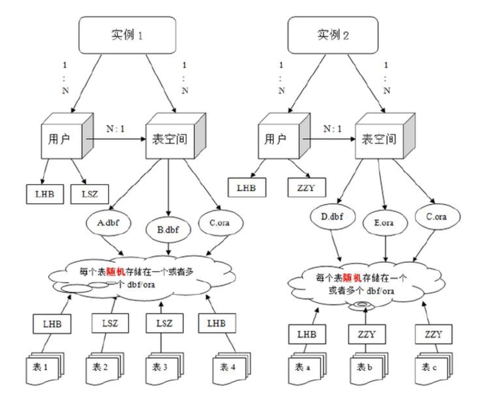
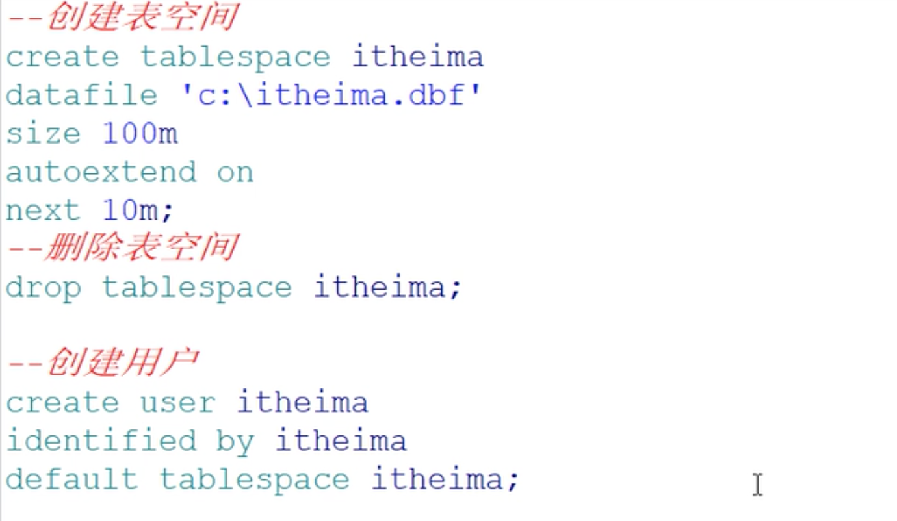
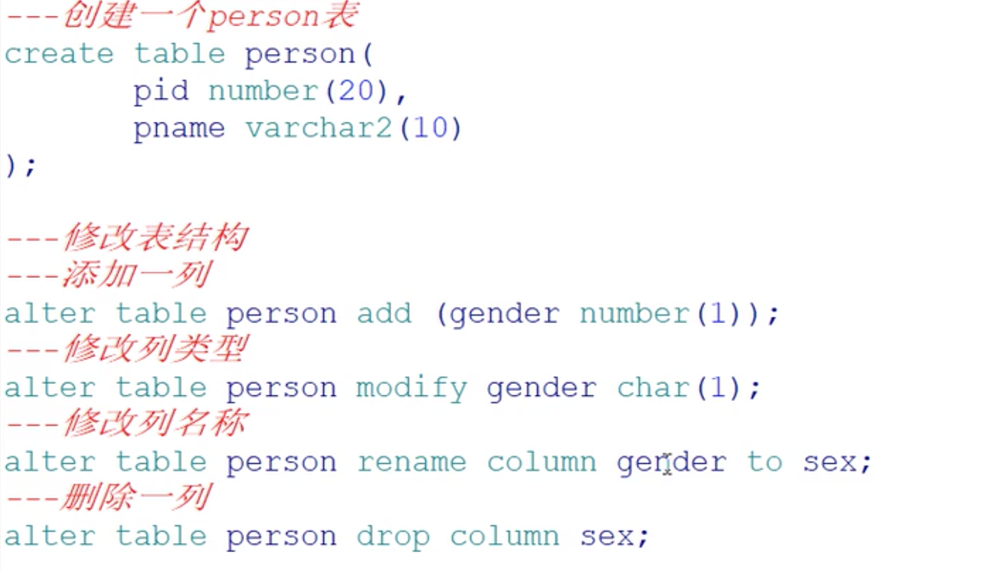
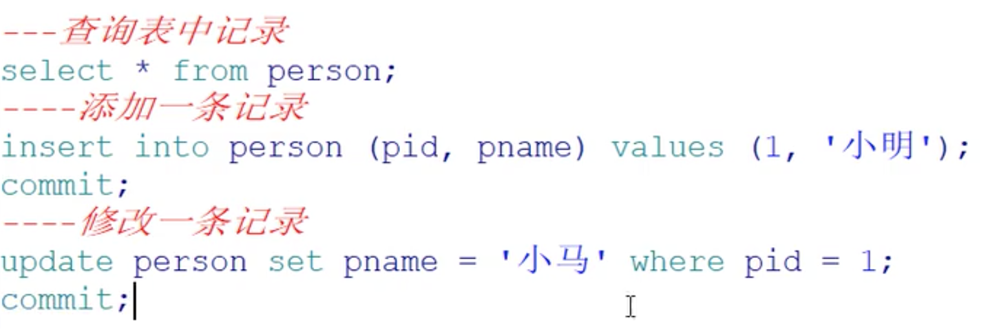
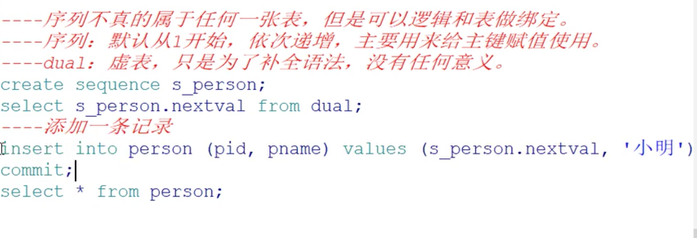

# 1.oracle结构

## 1.1数据库

## 1.2实例

## 1.3用户

## 1.4表空间

## 1.5数据文件






> 软件操作，log off
>
> 登陆dba账户 log on






> 重写了上面的添加记录的语句，用上了序列



```plsql
CREATE SEQUENCE 序列名
INCREMENT BY n;//这个最常用
```

