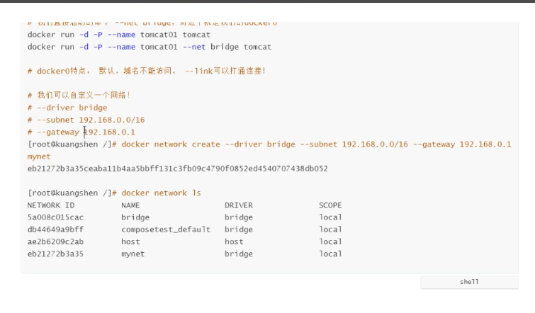

# 0 概念

| 特性       | 容器               | 虚拟机     |
| ---------- | ------------------ | ---------- |
| 启动       | 秒级               | 分钟级     |
| 硬盘使用   | 一般为MB           | 一般为GB   |
| 性能       | 接近原生           | 弱于       |
| 系统支持量 | 单机支持上千个容器 | 一般几十个 |

**容器**：在镜像层之上增加了可写层，出现Running和Exited状态。

**镜像**：linux内核0层，镜像在1层，在内核之上， 不能被修改或不能保存状态。镜像可以构建在另一个镜像之上

**仓库**：装镜像的


```shell
#https://x9k2w806.mirror.aliyuncs.com
#阿里的容器镜像服务
sudo mkdir -p /etc/docker
sudo tee /etc/docker/daemon.json <<-'EOF'
{
  "registry-mirrors": ["https://x9k2w806.mirror.aliyuncs.com"]
}
EOF
sudo systemctl daemon-reload
sudo systemctl restart docker
```

```shell
systemctl daemon-reload
systemctl restart docker
docker start registry
```

# 1 docker安装

[docker安装教程](https://www.jianshu.com/p/9b1fddbf0dad)

[国内镜像](https://blog.csdn.net/whatday/article/details/86770609)

```shell
#容器端口映射到linux上
docker run -di --name=tensquare_mysql -p 3306:3306 -e MYSQL_ROOT_PASSWORD=admin centos/mysql-57-centos7
```
```shell
docker -v
docker images
docker rm [容器ID]
docker rmi [镜像ID]
docker ps -a
docker ps
docker rm [容器ID]
docker 
```

```shell
#虚拟机重启需要强行关掉，mysql服务 否则docker容器启动不起来
netstat -tanlp
ps -ef | grep mysql
systemctl stop mysqld.service
```

```shell
systemctl start docker #启动
systemctl restart  docker #重启docker服务
sudo service docker restart #重启docker服务
service docker stop #关闭docker
systemctl stop docker #关闭docker
```

```sh
sudo systemctl start docker
docker pull registry
docker run -di
docker images
docker run -it --name=myjdk openjdk:11 /bin/bash
docker pull registry
vi /etc/docker/daemon.json
curl https://www.baidu.com
#列出所有容器端口
docker inspect --format='{{.Name}} - {{range .NetworkSettings.Networks}}{{.IPAddress}}{{end}}' $(docker ps -aq)
#删除命令
docker rm 容器id
docker rmi 镜像id
#切记添加端口允许，运营端
```

```shell
vi /etc/systemd/system/docker.service
#修改docker文件
ExecStart=/usr/bin/dockerd -H unix:///var/run/docker.sock -H tcp://0.0.0.0:2375
```

```shell
docker run -it --name=myjdk openjdk:11 /bin/bash
```

```sh
#复制镜像和复制容器都是通过保存为新镜像而进行的。
#保存镜像
docker save ID > xxx.tar
docker load < xxx.tar
#保存容器
docker export ID >xxx.tar
docker import xxx.tar containr:v1
#然后再
docker run -it containr:v1 bash
```

**删除容器**

```shell
docker rm 容器id
docker rm -f $(docker ps -aq)
docker ps -a -q | xargs docker rm
```


# 容器数据卷

## 什么是容器数据卷

## 使用数据卷

> 方式1：直接使用命令来挂载 -v

```shell
docker run -it -v 主机目录:容器目录
```

两个互相挂载，即是同一个文件

## *实战：安装MySQL

```shell
#同步两个mysql数据
docker pull mysql:5.7
#链接数据库 配置文件卷映射 端口映射 设置密码 hub.docker.com查 名字设置和镜像版本
docker run -d -p 3310:3306 -v /home/mysql/conf:/etc/mysql/conf.d -v /home/mysql/data:/var/lib/mysql -e MYSQL_ROOT_PASSWORD=admin --name mysql01 mysql:5.7
```

操作数据库，同时在两个文件夹下产生影响

## 具名挂载和匿名挂载

```shell
# 匿名挂载
-v 容器内路径
docker run -d -P --name nginx01 -v /etc/nginx nginx
# 查看所有volume情况
docker volume ls

#具名挂载
docker run -d -P --name nginx02 -v juming_guazai:/etc/nginx nginx

```

所有docker容器内的卷，没有指定目录的情况下都是在 **/var/lib/docker/volumes/xxxxx/_data**

我们通过具名挂载可以方便找到我们的一个大卷，大多数情况在使用**具名挂载**

```shell
#如何分辨何种挂载
-v 容器内路径 #匿名挂载
-v 卷名:容器内路径 #具名挂载
-v 主机目录:容器目录 #指定路径挂载
```

扩展

```shell
#
ro #只读
rw #可读可写

docker run -d -P --name nginx02 -v juming_guazai:/etc/nginx:rw nginx
```

## 使用dockerfile挂载

- 见初识Dockerfile

其他容器挂载到父容器，docker01 是父容器，docker02子容器，两个卷映射起来
--volumes-form

```shell
docker run -it --name docker01
docker run -it --name docker02 --volumes-from docker01 hawkii/centos:1.0
```

```shell
#多个mysql实现数据共享
docker run -d -p 3310:3306 -v /etc/mysql/conf.d -v /var/lib/mysql -e MYSQL_ROOT_PASSWORD=admin --name mysql01 mysql:5.7
docker run -d -p 3310:3306 -e MYSQL_ROOT_PASSWORD=admin --name mysql02 --volumes-from mysql01 mysql:5.7
#这个时候 可以实现两个容器的数据同步
```

# Dockerfile

dockerfile是用来构建docker镜像的文件

## 步骤和概念

1. 编写一个dockerfile文件
2. docker build构建一个镜像
3. docker run运行镜像
4. docker push 发布镜像 （DockerHub 阿里云镜像仓库）

---


## 初识Dockerfile

```dockfile
FROM centos

VOLUME ["volume01","volume02"]

CMD echo "---end---"
CMD /bin/bash
```

```shell
#镜像名字没有斜杠
[root@localhost ceshi]# docker build -f df0 -t hawkii/centos .
```

增加两个匿名挂载目录


## 自己制作centos镜像

添加 not-tools 和 vim 功能，设置工作目录


```shell
#得到docker如何做的，都是增量添加
docker history 镜像ID
```

**CMD**和**ENTRYPOINT**


## 发布自己镜像


推送自己镜像到docker仓库
创建自己阿里云镜像仓库


# Docker网络

Docker使用的是Linux桥接，Docker0是公共路由器

evth-pair


清掉所有docker镜像

```shell
#删掉所有镜像
docker rm -f $(docker ps -aq)
```




## redis集群


开启高可用

## springboot部署docker


```dockerfile
FROM java:8
WORKDIR /usr/local/web
ADD springboot.jar /usr/local/web
EXPOSE 8092
CMD ["java","-jar","springboot.jar"]
```


```shell
docker build -f Dockerfile -t hawkii/springboot .

docker run -di -p 8092:8080  --name=springboot hawkii/springboot
```

