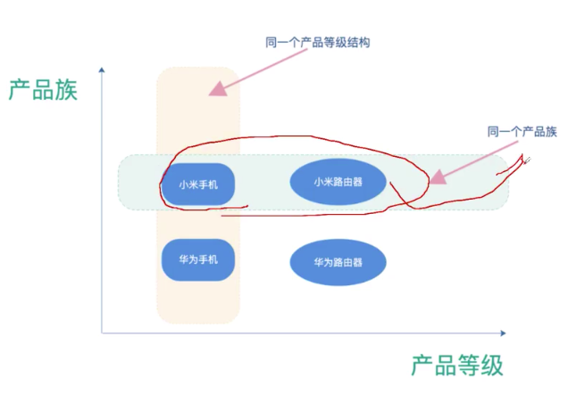
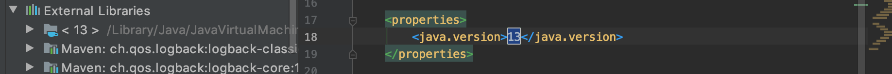

# 线程/锁/并发编程

## 创建线程方式

四种

1. 继承Thread类，重写run，单继承，多线程多任务
2. 实现Runnable接口，重写run，比上一个好，避免单继承，多线程单一任务
3. 实现Callable接口，FutureTask返回值
4. 开一个线程池ThreadPool，优点：复用，创建使用销毁，最常用。

## 谈谈同步代码块中同步监视器和共享数据的理解及各自要求？

- 同步监视器——锁
  - 多个线程公用一把锁，任何对象可以做锁，类也可以做锁
  - 共享数据，多个线程共同操作数据，即为共享数据。需要使用同步方法/同步代码块将操作共享数据代码包起来，不能包多了，也不能包少了。

## 解决线程安全问题三种：

- 同步代码块 synchronized 程序执行完释放锁，异常自动释放锁处理异常
- 同步方法
- lock（ReentrantLock） 调用sleep或者等IO仍持有锁

## 线程池四种拒绝策略？默认哪种？

1. AbortPolicy 队列满了，不处理抛出异常，**默认处理机制**
2. CallerRunsPolicy 哪来的去哪里，抛回原线程
3. DiscardPolicy 队列满丢掉，不会抛出异常
4. DiscardOldestPolicy 队列满了，和第一个线程竞争，失败丢掉

## 线程池参数几个？

ThreadPoolExecutor 不要用 Executors创建，容易OOM

1. 核心线程数
2. 最大线程数 非核心+核心
3. keepAliveTime
4. 时间单位 TimeUnit.SECONDS
5. 阻塞队列 ABQ<Runnable>(capacity: 5)
   有界无界 
   满了只能出队 空了只能入队 否则阻塞状态
6. 线程工厂 这个没用过
7. 拒绝策略


## 线程池计算问题

30个任务，核心线程数5个，非核心线程数5个，队列10个，拒绝线程数10个。


## 线程池实现机制？

JVM进程，创造若干个线程，每个有库调度器，得到内核线程，获得一段CPU使用时间，过于频繁切换上下文。


## 多线程程序的优点：

- 提高应用程序响应

- 提高计算机系统CPU利用率

- 改善程序结构，将既长又复杂进程分为多个线程，独立运行，方便理解修改

## 线程池的优点？

线程池最常用实际开发中

适用：
要任务数量大
单个任务处理时间短

提前创造好多个线程，放到线程池中，用时获取，用完放回，避免浪费

优点：
提高响应速度
降低资源消耗
便于线程管理

## 定时线程池

Executors类下方法，定制好定时线程池。
ScheduledExecutorService 方法

```java
ScheduledExecutorService pool = Executors.newScheduledThreadPool(10);
MyRunnable myRunnable = new MyRunnable("thread-" + i);
pool.schedule(myRunnable,5, TimeUnit.SECONDS);//延时5秒执行
//pool.scheduleWithFixedDelay(myRunnable,5,5,TimeUnit.SECONDS);
```

## Future和FutureTask区别

| 任务描述（接口） | 执行器            | 任务       |
| ---------------- | ----------------- | ---------- |
| Future           | Executor          | Runnable   |
|                  | ExecutorService   | Callable   |
|                  | TreadPoolExecutor | FutureTask |

Future接口，五个方法
cancel()	isCancelled()	isDone()	
get（）方法可以当任务结束后返回一个结果，如果调用时，工作还没有结束，则会阻塞线程，直到任务执行完毕get（long timeout,TimeUnit unit）等待timeout的时间就会返回结果

无论是Runnable还是Callable对象，当提交到线程池后，均是被封装成一个FutureTask对象后执行FutureTask类，应用了Runnable和Future接口。
.execute方法调用Worker线程，线程启动，调用线程的runWorker()方法，在runWorker()方法中最终会调用到task.run()方法

## 线程池异常


## ArrayBlockingQueue 和 LinkedBlockingQueue

ArrayBlockingQueue：一个由数组构成有界阻塞队列

LinkedBlockingQueue：一个由链表构成有界阻塞队列

阻塞队列不可用时，提供以下四种处理方式：（抛返阻退）


## Thread下的方法和优先级：

**Thread的方法**

1. start() 启动当前线程，调用当前线程的run();
2. run() 通常需要重写Thread类中此方法，将创建的线程要执行的操作写在此方法中
3. currentThread() 静态方法，返回执行当前代码的线程
4. yield() 释放当前cpu执行权
5. join() 在线程a中调用b的join()方法，此时线程a进入阻塞状态，知道b执行完结束
6. sleep(long millitime) 当前线程睡眠指定毫秒，在此之前线程处于阻塞状态
7. isAlive() 判断当前进程是否存活

**Thread的优先级**
优先级：
MAX_PRIORITY = 10	//优先级高，优先运行权高，高概率被执行
MIN_PRIORITY = 1
NORM_PRIORITY = 5
方法：
getPrioirty();
setPrioirty(int p);

## 线程的生命周期

新建 就绪 运行 阻塞 死亡

新建 + start() = 就绪
就绪 + 获得锁 = 运行
运行 + 执行完run()/调用stop()/出现Error/不处理Exception = 死亡
运行 + sleep(long time)/join()/等待同步锁/wait()/suspend() = 阻塞
阻塞 + sleep()时间到/join()结束/获取同步锁/notify()、notifyAll()/resume() = 就绪

## synchronized 和 lock/unlock区别

lock需要手动启动同步，解锁也要手动实现

synchronized机制执行完相应同步代码块，自动释放锁

lock要写try/catch/finally，unlock

建议首选 lock -> 同步代码块 -> 同步方法

ReentrantLock优点：

1. 更多功能，时间锁等候，可中断锁等候，锁投票，条件Condition，可轮训锁（不死锁）

4. 更加灵活，ReentrantLock的锁释要在finally中处理

5. ReentrantLock中断处理，性能较synchronized好

## 线程通信三种：

wait() :一旦执行此方法，当前线程就进入阻塞状态，并释放同步监视器

notify():一旦执行此方法，就会唤醒wait()的另一个进程，如果有多个，就唤醒优先级高的；

notifyAll():一旦执行此方法，唤醒所有线程，有些线程wait()，没有锁

说明：

1. 只能用在同步代码块或者同步方法中，不能是lock
2. wait, notify, notifyAll 三个方法调用者必须是同步代码块或同步方法中的同步监视器，否则会出现异常
3. wait, notify, notifyAll 不是定义在Thread类里面，而是Object里面

notify点兵点将，notifyAll天女散花

## sleep和wait方法异同

相同点：都可以让当前线程进入阻塞状态

不同点：lock不能用wait

|              |   sleep    |       wait       |
| :----------: | :--------: | :--------------: |
| 对象方法调用 | Thread调用 |    Object调用    |
|   调用位置   |  任何位置  | 同步代码块或方法 |
|   锁的释放   |   不释放   |       释放       |


## start和run区别

1. start、run层次不同
2. 用start方法来启动线程，并没有运行，一旦得到cpu时间片，就开始执行run()方法
3. 这里方法run()执行线程体，它包含了要执行的这个线程的内容，run方法运行结束，此线程随即终止

start方法可启动多线程
run方法只是thread的一个普通方法调用执行，是不会开启多线程的

调用start() 真多线程

## i++是线程安全的吗？

局部变量肯定是线程安全的
成员变量多个线程共享时，就线程不安全的。

## CompletableFuture，这个是JDK1.8里的新特性，通过它怎么实现多线程并发控制？Future 和 FutureTask

```java
//ExecutorService新建线程池，新建一个操作（类，如果要返回值Callable否则Runnable）
ExecutorService executor = Executors.newFixedThreadPool(3);
//T是上面操作给的泛型
Future<String> future = executor.submit(task); 
String html = future.get();
executor.shutdown(); 
```

Future异步操作方案：.get()会造成阻塞，while + .isDone()来判断是否释放。

[素材源头，廖雪峰Future](https://www.bilibili.com/video/av54953654?p=16)

## callable为什么runnable多线程强大

1. call可以返回值

2. callable是支持泛型的

3. call可以抛出异常，被外面的操作捕获，获取异常的信息

## fail-fast和CopyOnWriteArrayList

**fail-fast** 机制是java集合(Collection)中的一种错误机制。当多个线程对同一个集合的内容进行操作时，就可能会产生fail-fast事件

以List为例，多个线程同时操作一个List报ConcurrentModification异常。

可以使用CopyOnWriteArrayList，多个线程获取同一个资源，只在修改时复制副本，并将地址返回。
用到ReentrantLock重入锁（可以递归），可重写COWMap。

适用场景，读多写少场景，比如白名单、黑名单、产品目录。

**fail-safe**：出现同时修改异常，备份数据，继续执行，所以叫safe。


## 悲观锁

每次拿数据认为别人会修改，所以每次拿数据都上锁，**共享资源每次只给一个线程使用，其它线程阻塞，用完后再把资源转让给其它线程**。传统的关系型数据库里边就用到了很多这种锁机制，比如行锁，表锁等，读锁，写锁等，都是在做操作之前先上锁。Java中`synchronized`和ReentrantLock都是悲观锁

适用多写

## 乐观锁

每次拿数据认为别人不修改，所以不上锁，但更新的时会判断在此期间别人是否更新该数据，可以使用**版本号机制**和**CAS算法**实现。**乐观锁适用于多读的应用类型，这样可以提高吞吐量**，像数据库提供的类似于**write_condition机制**，其实都是提供的乐观锁。原子变量类**AtomicStampedReference**就是使用了乐观锁的一种实现方式**CAS**实现的。

适用多读

乐观锁实现方法：
1. 版本号机制，加一个ver字段+时间戳
2. CAS算法

```
需要读写的内存值 V
进行比较的值 A
拟写入的新值 B
当且仅当 V 的值等于 A时，CAS通过原子方式用新值B来更新V的值，否则不会执行任何操作（比较和替换是一个原子操作）。一般情况下是一个自旋操作，即不断的重试。
```

乐观锁的缺点：
1 ABA问题，用AtomicStampedReference类可以解决
2 循环时间开销大，CAS一直不成功影响CPU性能
3 只能保证一个变量原子操作，适合多读场景，多写用synchronized

**总结**：

1. 线程冲突轻，自旋容易成功，用CAS（CPU硬件实现，不用切线程）
2. 线程冲突重，用synchronized，用CAS大概率失败

## ConcurrentHashMap：

**jdk1.7** 分段锁技术，Segment+HashEntry（volatile修饰value和next）

Put方法：自旋获得锁，如果超过最大次数，改为阻塞锁获取。

Get方法：直接定位Segment和HashEntry

**jdk1.8** 采用了 `CAS + synchronized` 来保证并发安全性

HashEntry变成Node。
上锁前，操作都是基于volatile和CAS之上无锁且线程安全。

**读取** **判断是否改变** **执行操作**，这是用了CAS思想。

## synchronized锁升级

4种状态：**无锁**、**偏向锁**、**轻量级锁**、**重量级锁（悲观锁）**

没有任何线程访问时，它是可偏向的，只能有一个线程来访问它，当第一个线程来访时，它会偏向这个线程，此时，对象持有偏向锁偏向第一个线程。第二个线程访问，如果第一个线程结束，回到无锁和偏向状态，否则进入轻量级锁。

轻量级锁，一个持有线程，一个自旋，又有第三个来访，则变成重量级锁。或者自旋超过某个次数，重量级锁

## 线程死锁

不同线程分别占用对方需要同步资源不放弃，都在等自己需要的同步资源

出现死锁后，不会报异常，不会出现提示，只是所有进程在阻塞状态

jstack调试工具可以解决

## 你对锁和共享数据的理解及各自要求

锁：任何一个类的对象可以充当锁，多个线程公用一把锁

共享数据：多个线程共同操作数据，即为共享数据。需要使用同步机制将操作共享数据代码包起来，不能包多了，也不能包少了。

## volatile

保证了不同线程对这个变量进行操作时的可见性，即一个线程修改了某个变量的值，这新值对其他线程来说是立即可见的。（**可见性**）
禁止进行指令重排序。（**有序性**）
volatile 只能保证对单次读/写的原子性。i++ 这种操作不能保证**原子性**。

原子性：程序中操作要么全部完成,要么全部不完成,不可能停滞在中间某个环节，volatile 修饰的变量读写都有原子性

可见性，有序性：两个一起说，happens-before关系来保障可见性描述有序性。java内存模型的动作包括读/写，锁的申请与释放，线程的启动等待释放。这些动作就是用来保障h-b特性。假设A和B之间存在happen-before 关系，A先于B线程执行，保证A的操作结果对B可见。？因为A，B线程中 ，B能看到A的执行过程的结果，就默认 线程A的执行时具有有序性的，不管线程A中他的执行顺序是如何。

## AQS

**AbstractQueuedSynchronizer，抽象队列同步器**

JUC一个核心组件，有state变量、加锁线程、等待队列等核心，维护了加锁状态。


## 现在有 T1、T2、T3 三个线程，你怎样保证 T2 在 T1 执行完后执行，T3 在 T2 执行完后执 行？

```java
T1.start();
T1.join();
T2.start();
T2.join();
T3.start();
T3.join();
```

## 用 Java 写代码来解决生产者——消费者问题?

线程池+ABQ，生产者和消费者共享一个缓存区，生产者put进队列，消费者处理掉了。

## 在 Java 中 CycliBarriar 和 CountdownLatch 有什么区别？

CyclicBarrier可以重复使用已经通过的障碍，而 CountdownLatch不能重复使用。

## 什么是不可变对象，它对写并发应用有什么帮助？

不可变对象，比如String，比如final修饰的对象。
天生线程安全的，阅读代码锚点不变，易于缓存。

## 你在多线程环境中遇到的常见的问题是什么？

多线程和并发程序中常遇到的有竞争条件、死锁、饥饿。

饥饿：线程因无法访问所需资源而无法执行下去的情况

竞争条件：当两个或以上的线程对同一个数据进行操作的时候,可能会产生“竞争条件”的现象

# SpringMVC

解释下SpringMVC


request-->DispatcherServlet -->HandlerMapping记录Controller与路径关系

> ViewResolver 根据视图名称确定视图组件
>
> ModelAndView 1 返回到指定页面setName()+字符串 2 返回参数 addObject()方法到请求作用域中
>
> Controller	页面控制器，着力编写**业务层** service层 **数据访问层**dao层 前者new一个dao对象 操作它。

最后通过视图组件jsp或者html返回response。

**SpringMVC：**

1.客户端发送请求到DispacherServlet（分发器）

2.由DispacherServlet控制器查询HandlerMapping，找到处理请求的Controller

3.Controller调用业务逻辑处理后，返回ModelAndView

4.DispacherServlet查询视图解析器，找到ModelAndView指定的视图

5.视图负责将结果显示到客户端


## MVC的四种返回类型

1. ModelAndView

viewName、mapModel用setName和addObject，前者页面名字后者，解析对象是个Map<String, ?>类型

2. String

"redirect" "hello" "forward:/"

3. void

具有参数HttpServletResponse，类似于字符串，但是调用resp的方法，可以返回名字、重定向、单纯字符串

4. json

返回实体类，但是自动解析成json，适用于前后端分离项目

## SSM

SSM的配置：
1 Spring+jdbc/webmvc/AOP/Aspect
2 Mybatis 	Mybatis-Spring
3 Mysql-connector 	c3p0
4 lombok 	servlet-api

1 web.xml			spring 静态资源 Servlet 字符编码过滤器
2 spring.xml		mybatis 和 mapper接口
3 springmvc.xml	注解驱动 扫描业务代码
4 config.xml		打印sql配置 包名前缀

# Mybatis

## 什么是Mybatis？

1、Mybatis 是一个**半ORM框架**，它内部**封装JDBC**，开发时**只关注 SQL** 语句本身（PO 到 MySQL 的映射，开发者可以以⾯向对象的思想来管理数据库。）不用去加载驱动、创建连接、创建statement 等繁杂的过程，sqlSession那套。程序员直接**编写原生态 sql**，严格**控制执行性能**

2、使用 **XML** 或**注解**来配置和映射， 将 **PO** 映射成**数据库记录**
避免了 JDBC 代码和手动设置参数。

3、通过 **XML** 或**注解**的方式配置**statement** ， 并通过**java 对象**和 **statement 中 sql 的动态参数**进行映射成 **sql 语句**，最后由 mybatis 框架执行 sql 并将结果映射为 java 对象并返回。

## Mybaits 的优点：

1、SQL 编程，相当灵活，不会对程序或者数据库的设计造成任何影响，SQL 写在 XML 里，解除 sql 与程序的耦合，便于管理；提供 XML 标签， 编写动态 SQL 语句， 并可重用。

2、消除了 JDBC 大量冗余的代码，不用手动开关连接；

3、与多种数据库兼容，MyBatis 使用 JDBC 来连接数据库，所以只要JDBC 支持的数据库 MyBatis 都支持。

4、Spring 很好集成；

## MyBatis 框架的缺点：

1、SQL 编写量大， 当字段多、关联表多时， 编写SQL 要求高

2、SQL 语句依赖于数据库， 导致数据库移植性差， 不能随意更换数据库。

## MyBatis 框架适用场合：

1、MyBatis 专注于 SQL 本身， 是一个足够灵活的 DAO 层解决方案。

2、对性能的要求很高，或者需求变化较多的项目，如互联网项目， MyBatis 将是不错的选择。

## #{}和${}的区别是什么？

**#{}是预编译处理， ${}是占位符替换。**

Mybatis 在处理 #{} 时，就是把 {} 中 替换为字符串（加双引号），或者数字int/long；

Mybatis 在处理 ${} 时，就是把 {} 中替换成变量的值。占位符

使用 #{} 可以有效的防止 SQL 注入， 提高系统安全性。

动态SQL中的字段名，如：ORDER BY ${columnName}

## 当实体类中的属性名和表中的字段名不一样 ，怎么办 ？

第 1 种：通过在查询的 sql 语句中定义字段名的别名， 让字段名的别名和实体类的属性名一致。**sql 别名**

```xml
<select id=”selectorder”  parametertype=”int”  resulttype=” me.gacl.domain.order”>
		select order_id id, order_no orderno ,order_price price form orders where order_id=#{id};
</select>
```

第 2 种：通过来映射字段名和实体类属性名的一一对应的关系。 **resultMap property 和 column**

```xml
<select id="getOrder" parameterType="int" resultMap="orderresultmap">
		select * from orders where order_id=#{id}
</select>
<resultMap type=”me.gacl.domain.order”  id=”orderresultmap”>
    <!–用 id 属性来映射主键字段–>
    <id property=”id”  column=”order_id”>
    <!–用 result 属性来映射非主键字段，property 为实体类属性名，column 为数据表中的属性–>
    <result property =  “orderno”  column =”order_no”/>
    <result property=”price”  column=”order_price”  />
</reslutMap>
```

## Mybatis 的一级、二级缓存:

1）  一级缓存: 基于 PerpetualCache 的 HashMap 本地缓存， 其存储作用域为Session， 当 Session flush  或  close  之后， Cache  就将清空， 默认打开一级缓存。

2） 二级缓存与一级缓存其机制相同，默认也是采用 PerpetualCache，HashMap 存储， 不同在于其存储作用域为 namespace， 并且可自定义存储源， 如 Ehcache。

setting cacheEnabled 值设为true
在sql语句中用flushCache或者useCache避免脏读

默认不打开二级缓存， 要开启二级缓存， 使用二级缓存属性类需要实现 Serializable 序列化接口(可用来保存对象的状态),可在它的映射文件中配置

3）  对于缓存数据更新机制， 当某一个作用域(一级缓存 Session/二级缓存 Namespaces)的进行了 C/U/D 操作后，默认该作用域下所有 select 中的缓存将被 clear 。

## Mapper 配置有哪几种方式？

第一种：接口实现类继承 SqlSessionDaoSupport：使用此种方法需要编写mapper 接口， mapper 接口实现类、mapper.xml 文件。

1、在 sqlMapConfig.xml 中配置 mapper.xml 的位置

```xml
<mappers>
<mapper resource="mapper.xml 文件的地址" />
<mapper resource="mapper.xml 文件的地址" />
</mappers>
```

2、定义 mapper 接口

3、实现类集成 SqlSessionDaoSupport

mapper 方法中可以  this.getSqlSession()进行数据增删改查。

4、spring 配置

```xml
<bean id=" " class="mapper 接口的实现">
<property name="sqlSessionFactory" ref="sqlSessionFactory"></property>
</bean>
```

第二种：使用 org.mybatis.spring.mapper.MapperFactoryBean：

1、在 sqlMapConfig.xml 中配置 mapper.xml 的位置， 如果 mapper.xml 和mapper接口的名称相同且在同一个目录， 这里可以不用配置

```xml
<mappers>
<mapper resource="mapper.xml 文件的地址" />
<mapper resource="mapper.xml 文件的地址" />
</mappers>
```

2、定义 mapper 接口：

- mapper.xml 中的 namespace 为 mapper 接口的地址

- mapper 接口中的方法名和 mapper.xml 中的定义的 statement 的 id 保持一致

- Spring 中定义

```xml
<bean id="" class="org.mybatis.spring.mapper.MapperFactoryBean">
<property name="mapperInterface" value="mapper 接口地址" />
<property name="sqlSessionFactory" ref="sqlSessionFactory" />
</bean>
```

第三种：使用 mapper 扫描器：

1、mapper.xml 文件编写：

mapper.xml 中的 namespace 为 mapper 接口的地址；

mapper 接口中的方法名和 mapper.xml 中的定义的 statement 的 id 保持一致；

如果将 mapper.xml 和 mapper 接口的名称保持一致则不用在 sqlMapConfig.xml 中进行配置。

2、定义 mapper 接口：

注意 mapper.xml 的文件名和 mapper 的接口名称保持一致， 且放在同一个目录

3、配置 mapper 扫描器：

```xml
<bean class="org.mybatis.spring.mapper.MapperScannerConfigurer">
<property name="basePackage" value="mapper 接口包地址"></property>
<property name="sqlSessionFactoryBeanName" value="sqlSessionFactory"/>
</bean>
```

4、使用扫描器后从 spring 容器中获取 mapper 的实现对象。

## 什么是 MyBatis 的接口绑定？有哪些实现方式？

MyBatis 接口的方法和 SQL 语句绑定, 我们直接调用接口方法就可以执行sql，这样比起原来了 SqlSession 提供的方法灵活。

接口绑定有两种实现方式,
一种是通过注解绑定， @Select、@Update 等注解， 注解包含 Sql 语句；
另外一种就是通过 xml 里面写 SQL 来绑定, 在这种情况下,要指定 xml 映射文件里面的 namespace 必须为接口的全路径名，id值是方法名。xml 绑定的比较多，把java和sql语句解耦

## 使用 MyBatis 的mapper 接口调用时有哪些要求？

四大相同

|  Mapper接口  |      mapper.xml       |
| :----------: | :-------------------: |
|    方法名    |        sql的id        |
| 输入参数类型 | parameterType类型相同 |
| 输出参数类型 |  resultType类型相同   |
|   文件路径   | mapper标签的namespace |

## 通常一个Xml 映射文件，都会写一个Dao 接口与之对应，请问，这个Dao 接口的工作原理是什么？Dao 接口里的方法， 参数不同时，方法能重载吗？

Dao 接口即 Mapper 接口。xml中id对应方法名，工程中文件路径对应namespace，接口方法内的参数， 就是传递给 sql 的参数.

Mapper 接口**没有实现类**的，当调用接口方法时，接口全限名+方法名拼接字符串作为 key 值， 可唯一定位一个 **MapperStatement**。在 Mybatis 中， 每一个select、insert 、update、delete标签，  都会被解析为一个MapperStatement 对象.
举例：com.mybatis3.mappers.StudentDao.findStudentById， 可以唯一 找 到 namespace 为 com.mybatis3.mappers.StudentDao 下 面 id 为findStudentById 的 MapperStatement 。
Mapper 接口的工作原理是 **JDK 动态代理**， Mybatis 运行时会使用 JDK 动态代理为 Mapper 接口生成代理对象 proxy， 代理对象会拦截接口方法， 转而执行 MapperStatement 所代表的 sql， 然后将 sql 执行结果返回。

## MyBatis 实现一对一、一对多、多对多？

## 多对多

需要一个中间表，主键id，字段映射角色和用户关系


有联合查询和嵌套查询

联合查询是几个表联合查询,只查询一次, 通过在resultMap 里面配置 association 节点配置一对一的类就可以完成；

```xml
<!--	建立表和实体类之间映射-->                                                           
	<resultMap id="menuMap" type="Menu">                                         
		<id column="id" property="id"></id>                                      
		<result column="name" property="name"></result>                          
		<result column="price" property="price"></result>                        
		<result column="flavor" property="flavor"></result>                      
		<association property="type"                                             
			select="com.southwind.repository.TypeRepository.findById"            
			column="tid">                                                        
		</association>                                                           
	</resultMap>                                                                     
```

嵌套查询是先查一个表，根据这个表里面的结果的 外键 id，去再另外一个表里面查询数据,也是通过 association 配置，但另外一个表的查询通过 select 属性配置。

此外，如果多个表关联查询，比如同时查学号和班级。需要用resultMap间接映射，此时不能直接映射。

```xml
<resultMap id="studentMap" type="com.southwind.entity.Student">
  <id column="id" property="id"></id>
  <result column="name" property="name"></result>
  <association property="classes" javaType="com.southwind.entity.Classes">
    <id column="cid" property="id"></id>
    <result column="cname" property="name"></result>
  </association>
</resultMap>
<select id="findById" parameterType="long" resultMap="studentMap">
  select s.id,s.name,c.id as cid,c.name as cname from student s,classes c where s.id = #{id} and s.cid = c.id
</select>
```

**多对多关系**：两张主表 一张从表 （包含被两个主表约束的外键）

|  id  | cid  | gid  |
| :--: | :--: | :--: |
|  1   |  1   |  1   |
|  2   |  1   |  3   |
|  2   |  2   |  2   |

```xml
<select id="findById" parameterType="long" resultMap="customerMap">
	select c.id cid,c.name cname,g.id gid,g.name gname from customer c,goods g,customer_goods cg           		where c.id = #{id} and cg.cid = c.id and cg.gid = g.id
</select>
```

[mybatis 一对一 一对多 多对多](https://zhuanlan.zhihu.com/p/37259714)

## Mybatis 是否支持延迟加载？如果支持，它的实现原理是什么？

答：Mybatis 仅支持 association 和 collection的延迟加载， association 是一对一， collection 是一对多查询。在 Mybatis 配置文件中， 可以配置是否启用延迟加载  lazyLoadingEnabled=true|false。

原理：使用 CGLIB 创建目标的代理对象， 调用目标方法时， 进入拦截器方法， 比如调用 a.getB().getName()， 拦截器 invoke()方法发现 a.getB()是null 值， 单独发送事先保存好的查询关联B对象的 sql， 把 B 查询上来， 然后调用a.setB(b)，于是 a 的对象 b 属性就有值了，接着完成 a.getB().getName()方法的调用。这就是延迟加载的基本原理。

当然了， 不光是 Mybatis， 几乎所有的包括 Hibernate， 延迟加载的原理都是一样的。

## Mybatis 动态sql 有什么用？有哪些动态sql？Xml 映射文件中，除了常见的 select|insert|updae|delete 标签之外，还有哪些标签？

Mybatis 动态 sql 可以在 Xml 映射文件内，以标签的形式编写动态 sql，执行原理是根据表达式的值 完成逻辑判断并动态拼接 sql 的功能。

Mybatis 提供了 9 种动态 sql 标签：trim | where | set | foreach | if | choose | when | otherwise | bind 

<sql> 重用sql片段

## Mybatis 的 Xml 映射文件中， 不同的 Xml 映射文件， id 是否可以重复？

不同的 Xml 映射文件， 如果配置了 namespace， 那么 id 可以重复；如果没有配置 namespace， 那么 id 不能重复；原因就是 namespace+id 是作为 Map的 key 使用的， 如果没有 namespace， 就剩下 id， 那么， id 重复会导致数据互相覆盖。有了 namespace，自然 id 就可以重复，namespace 不同，namespace+id 自然也就不同。

## Mybatis 是如何将sql 执行结果封装为目标对象并返回的？都有哪些映射形式？

第一种是使用标签， 逐一定义数据库列名和对象属性名之间的映射关系。

第二种是使用 sql 列的别名功能， 将列的别名书写为对象属性名。

有了列名与属性名的映射关系后， Mybatis 通过反射创建对象， 同时使用反射给对象的属性逐一赋值并返回

## 如何获取自动生成的(主)键值?

1. 数据库设置id为 primary、Auto Inc、Not Null
2. 不写id

```xml
    <insert id="insert" parameterType="com.hawkii.springbootbook.entity.Book"
             keyProperty="id" useGeneratedKeys="true" >
        insert into book ('name','author') values (#{name}, #{author})
    </insert>
```

insert 方法总是返回一个 int 值 ， 这个值代表的是插入的行数。

如果采用自增长策略，自动生成的键值在 insert 方法执行完后可以被设置到传入的参数对象中。

示例：

```xml
<insert id=”insertname”  usegeneratedkeys=”true”  keyproperty=” id”> 
	insert into names (name) values (#{name})
</insert>
```

```java
name name = new name(); name.setname(“fred”);
int rows = mapper.insertname(name);
// 完成后,id 已经被设置到对象中system.out.println(“rows inserted =  ”  + rows);
system.out.println(“generated key value =  ”  + name.getid());
```

## 在 mapper 中如何传递多个参数?

1、第一种：DAO 层的函数

public UserselectUser(String name,String area);

对应的 xml,#{0}代表接收的是 dao 层中的第一个参数，#{1}代表 dao 层中第二参数，更多参数一致往后加即可。

```xml
<select id="selectUser"resultMap="BaseResultMap"> select * fromuser_user_t whereuser_name = #{0} and user_area=#{1}
</select>
```

2、第二种：使用 @param 注解:

```java
public interface usermapper {
user selectuser(@param(“username”) string username,@param(“hashedpassword”) string hashedpassword);
}
```

然后,就可以在 xml 像下面这样使用(推荐封装为一个 map,作为单个参数传递给mapper

```xml
<select id=”selectuser”  resulttype=”user”> select id, username, hashedpassword from some_table
where username = #{username}
and hashedpassword = #{hashedpassword}
</select>
```

3、第三种：JavaBean传递参数

JavaBean

```java
public class StudentQuery extends PageQuery {
    private List<Long> ids;
    private String name;
    private Byte sex;
    private Long selfcardNo;
    // get set 方法
}
```

**StudentDao**

```java
List<StudentDO> listByConditions(StudentQuery studentQuery);
```

**StudentMapper.xml**

```xml
<!-- 根据条件获取学生信息-->
<select id="listByConditions" parameterType="studentQuery" resultMap="BaseResultMap">
    select
    <include refid="Base_Column_List" />
    from t_student
    <where>
        <if test="ids != null and ids.size() > 0">
            AND id IN
            <foreach collection="ids" item="item" open="(" close=")" separator=",">
                #{item}
            </foreach>
        </if>
        <if test="name != null and name != ''">
            AND name LIKE CONCAT('%', #{name}, '%')
        </if>
        <if test="sex != null">
            AND sex = #{sex}
        </if>
        <if test="selfcardNo != null">
            AND selfcard_no = #{selfcardNo}
        </if>
    </where>
</select>
```

## MyBatis延迟加载

**减少 Java 应⽤与数据库的交互次数**延迟加载也叫懒加载、惰性加载，使⽤延迟加载可以提⾼高程序的运行效率，针对于数据持久层的操作， 在某些情况下可以不访问某些表，一定程度上减少了 Java 应⽤与数据库的交互次数。

>查询学⽣生和班级的时，学⽣生和班级是两张不不同的表，如果当前需求只需要获取学⽣生的信息，那么查询学
>⽣生单表即可，如果需要通过学⽣获取对应的班级信息，则必须查询两张表。
>不同的业务需求，需要查询不同的表，根据具体的业务需求来动态减少数据表查询的⼯工作就是延迟加载。

在 config.xml 中开启延迟加载

将级联查询sql语句拆分成两个不同sql语句，对应两个不同方法。

## Mybatis动态SQL语句

使用动态sql语句可以减少代码开发，程序自动通过业务逻辑

1. where和if标签

```xml
<select id="findByAccount" parameterType="com.southwind.entity.Account" resultType="com.southwind.entity.Account">
  select * from t_account
  <where>
    <if test="id!=0">
      id = #{id}
    </if>
    <if test="username!=null">
      and username = #{username}
    </if>
    <if test="password!=null">
      and password = #{password}
    </if>
    <if test="age!=0">
      and age = #{age}
    </if>
  </where>
</select>
```

2. choose和when标签
3. trim标签中的prefix和suffix都会被用于标签内部的拼接
4. foreach标签可以生成一系列值，主要用于生成sql的in语句

## config.xml解读

配置Mybatis综合信息。

environments对应一个schema，可以配置多个schema

DataSource标签配置数据连接池，包括账户密码、驱动包和url等。

Mappers配置其他sql语句关联的xml文件，几个类或者接口，几个xml。

**通过 Mapper 代理理实现⾃定义接⼝**业务中最为常用的创造实体类方法。sqlSession.getMapper

```java
AccountRepository accountRepository = sqlSession.getMapper(AccountRepository.class);
```

增删改查分别对应接口不同方法。尤其是查，往往存在多个方法，按id，按名字，按学号等等。
同时int类型往往还需要复写Integer包装类。

# Mybatis-Plus

## 优点

- 对mybatis的二次封装扩展，继承它所有优点
- 像JPA，面向对象而不是面向SQL
- delete、update智能阻断，自动生成sql，防止不成熟代码被sql注入攻击

## 实施步骤

yml文件配置：

1. 路径设置
2. 设置id 自增还是分布式ID生成器（雪花）
3. 配置全局缓存，配置延时开关

dao层接口继承BaseMaper

## entity/pojo层加如下注解

| `@TableName`  | 实体类的类名和数据库表名不一致         |
| ------------- | -------------------------------------- |
| `@TableId`    | 实体类的主键名称和表中主键名称不一致   |
| `@TableField` | 实体类中的成员名称和表中字段名称不一致 |

# SpringData JPA

将POJO与数据库表建立映射关系，是一个全自动的ORM框架

##SpringData JPA和Mybatis区别

JPA优化SQL比较难，SQL语句大多数自动生成，也有HQL。自用SQL不方便
Mybatis是一个半自动ORM框架，可以直接写sql语句，方便sql优化，但是如果表换了，工作量比较大，迁移性难度大

```java
//将POJOid标记为主键
@Id
//设置主键生成模式
@GeneratedValue(strategy = GenerationType.IDENTITY)

```

## JPA使用方法

1. yml文件四连定义，链接数据库、账户、密码、驱动包
2. @Entity和@Data在POJO类，Repository接口继承JpaRepository<T, ID>
3. Handler与Mybatis类似，就有了增删改查方法，findAll、findById、updata、save、delete等，findAll的入参可以是**request**，也可以空参。

```java
PageRequest request = PageRequest.of(page,size);
return bookRepository.findAll(request);
```

# JVM

## 内存模型以及分区，需要详细到每个区放什么。

JVM 分为堆区和栈区，还有方法区，初始化的对象放在堆里面，引用放在栈里面，

class 类信息常量池（static 常量和 static 变量）等放在方法区:

方法区：主要是存储类信息，常量池（static 常量和 static 变量），编译后的代码（字节码）等数据

堆：初始化的对象，成员变量 （那种非 static 的变量），所有的对象实例和数组都要在堆上分配

栈：栈的结构是栈帧组成的，调用一个方法就压入一帧，帧上面存储局部变量表，操作数栈，方法出口等信息，局部变量表存放的是 8 大基础类型加上一个应用类型，所以还是一个指向地址的指针

本地方法栈：主要为 Native 方法服务

程序计数器：记录当前线程执行的行号

每个线程有自己独立程序计数器和运行栈，但是一个进程中不同线程共同使用一套堆和方法区，多线程操作公共系统资源是线程安全

## 堆里面的分区：Eden，survival （from+ to），老年代，各自的特点。

堆里面分为新生代和老生代（java8 取消了永久代，采用了 Metaspace），新生代包

含 Eden+Survivor 区，survivor 区里面分为 from 和 to 区，内存回收时，如果用的是复制算法，从 from 复制到 to，当经过一次或者多次 GC 之后，存活下来的对象会被移动到老年区，当 JVM 内存不够用的时候，会触发 Full GC，清理 JVM 老年区当新生区满了之后会触发 YGC,先把存活的对象放到其中一个 Survice区，然后进行垃圾清理。因为如果仅仅清理需要删除的对象，这样会导致内存碎片，因此一般会把 Eden 进行完全的清理，然后整理内存。那么下次 GC 的时候就会使用下一个 Survive，这样循环使用。如果有特别大的对象，新生代放不下，

就会使用老年代的担保，直接放到老年代里面。因为 JVM 认为，一般大对象的存活时间一般比较久远。

## XMS、XMX、XSS分别是什么


-Xms 为jvm启动时分配的内存，比如-Xms200m，表示分配200M

-Xmx 为jvm运行过程中分配的最大内存，比如-Xms500m，表示jvm进程最多只能够占用500M内存

-Xss 为jvm启动的每个线程分配的内存大小，默认JDK1.4中是256K，JDK1.5+中是1M

## GC 的两种判定方法：

引用计数法：某处引用该对象就+1，如果失效-1，当为 0 就会回收但是 JVM 没有用这种方式，因为无法判定相互循环引用（A 引用 B,B 引用 A）的情况

引用链法：通过一种 **GC ROOT 的对象**（方法区静态变量引用的对象等、static 变量）来判断，如果有一条链能够到达 GC ROOT 就说明，不能到达 GC ROOT 就说明可以回收，类似DFS

## SafePoint 是什么

比如 GC 的时候必须要等到 Java 线程都进入到 safepoint 的时候 VMThread 才能开始执行 GC

1. 循环的末尾 (防止大循环的时候一直不进入 safepoint，而其他线程在等待它进入safepoint)
2. 方法返回前
3. 调用方法的 call 之后
4. 抛出异常的位置

## GC 收集器有哪些？CMS 收集器与 G1 收集器的特点。

**并行收集器**：次要回收中使用多线程来执行

**串行收集器**：串行收集器使用一个单独的线程进行收集，GC 时服务有停顿时间

**CMS 收集器**是基于**标记—清除**算法实现的，经过多次标记才会被清除

**G1收集器** 从整体来看是基于**标记-整理**算法实现的收集器，从局部（两个 Region 之间）上来看是基于复制算法实现的

## Minor GC 与 Full GC 分别在什么时候发生？

新生代内存不够用时候发生 Minor GC，JVM 内存不够的时候发生 Full GC

## 几种常用的内存调试工具：jmap、jstack、jconsole、jhat

开发电脑上这个jconsole 查看虚拟机信息，cpu使用情况，内存情况，load dump的信息，处理OOM问题

虚拟机上看这个，jstack 可以看当前栈的情况解决死锁，jmap 查看内存，jhat 进行 dump 堆的信息

mat（eclipse 的也要了解一下）

memery analyzer 分析内存泄漏
jstat 查看性能
javap 反解析出汇编指令、本地变量表、异常表、映射表、常量池
javac 当前字节码反编译生成汇编代码

## JVM 内存分哪几个区，每个区的作用是什么?

java 虚拟机主要分为以下一个区:

**方法区：**

1. 有时候也成为**永久代**，在该区内很少发生垃圾回收，但是并不代表不发生 GC，在这里

进行的 GC 主要是对方法区里的常量池和对类型的卸载

2、方法区主要用来存储已被虚拟机加载的类的信息、常量、静态变量和即时编译器编译后

的代码等数据。该区域是被线程共享的。

3、方法区里有一个运行时常量池，用于存放静态编译产生的字面量和符号引用。该常量池

具有动态性，也就是说常量并不一定是编译时确定，运行时生成的常量也会存在这个常量池中。

**虚拟机栈:**

1、虚拟机栈也就是我们平常所称的**栈内存**,它为 java 方法服务，每个方法在执行的时候都会创建一个栈帧，用于存储局部变量表、操作数栈、动态链接和方法出口等信息。

虚拟机栈是线程私有的，它的生命周期与线程相同。

2、局部变量表里存储的是基本数据类型、returnAddress 类型（指向一条字节码指令的地

址）和对象引用，这个对象引用有可能是指向对象起始地址的一个指针，也有可能是代表对象的句柄或者与对象相关联的位置。局部变量所需的内存空间在编译器间确定

4.操作数栈的作用主要用来存储运算结果以及运算的操作数，它不同于局部变量表通过索引来访问，而是压栈和出栈的方式

5.每个栈帧都包含一个指向运行时常量池中该栈帧所属方法的引用，持有这个引用是为了支持方法调用过程中的动态连接.动态链接就是将常量池中的符号引用在运行期转化为直接引用。

**本地方法栈**本地方法栈和虚拟机栈类似，只不过本地方法栈为 Native 方法服务。

**堆**java 堆是所有线程所共享的一块内存，在虚拟机启动时创建，几乎所有的对象实例都在这里创建，因此该区域经常发生垃圾回收操作。

**程序计数器**

内存空间小，字节码解释器工作时通过改变这个计数值可以选取下一条需要执行的字节码指令，分支、循环、跳转、异常处理和线程恢复等功能都需要依赖这个计数器完成。该内

存区域是唯一一个 java 虚拟机规范没有规定任何 OOM 情况的区域。

**12.如和判断一个对象是否存活?(或者 GC 对象的判定方法**

判断一个对象是否存活有两种方法:

1. 

 虚拟机栈中引用的对象

 方法区类静态属性引用的对象

 方法区常量池引用的对象

 本地方法栈 JNI 引用的对象

虽然这些算法可以判定一个对象是否能被回收，但是当满足上述条件时，一个对象比不一 

**定会被回收**。当一个对象不可达 GC Root 时，这个对象并

**不会立马被回收**，而是出于一个死缓的阶段，若要被真正的回收需要经历两次标记

如果对象在可达性分析中没有与 GC Root 的引用链，那么此时就会被第一次标记并且进行一次筛选，筛选的条件是是否有必要执行 finalize()方法。当对象没有覆盖 finalize()方法或者已被虚拟机调用过，那么就认为是没必要的。

如果该对象有必要执行 finalize()方法，那么这个对象将会放在一个称为 F-Queue 的对队列中，虚拟机会触发一个 Finalize()线程去执行，此线程是低优先级的，并且虚拟机不会承

诺一直等待它运行完，这是因为如果 finalize()执行缓慢或者发生了死锁，那么就会造成 FQueue 队列一直等待，造成了内存回收系统的崩溃。GC 对处于 F-Queue 中的对象进行

第二次被标记，这时，该对象将被移除”即将回收”集合，等待回收。

## 13.简述 java 垃圾回收机制?

在 java 中，程序员是不需要显示的去释放一个对象的内存的，而是由虚拟机自行执行。在JVM 中，有一个垃圾回收线程，它是低优先级的，在正常情况下是不会执行的，只有在虚拟机空闲或者当前堆内存不足时，才会触发执行，扫面那些没有被任何引用的对象，并将它们添加到要回收的集合中，进行回收。

Java内存溢出

|  8   |  1   |  1   | 20   |
| :--: | :--: | :--: | ---- |
| Eden | Old  |      |      |

​						youngGC								15 次survive ====>

## java 中垃圾收集的方法有哪些?

1. 标记-清除：大量内存碎片

2. 复制算法

为了解决效率问题，复制算法将可用内存按容量划分为相等的两部分，然后每次只使用其中的一块，当一块内存用完时，就将还存活的对象复制到第二块内存上，然后一次性清楚完第一块内存，再将第二块上的对象复制到第一块。但是这种方式，内存的代价太高，每次基本上都要浪费一般的内存。

将算法进行了改进，内存区域不再是按照 1：1 去划分，而是将内存划分为

8:1:1 三部分，较大那份内存交 Eden 区，其余是两块较小的内存区叫 Survior 区。每次都会优先使用 Eden 区，若 Eden 区满，就将对象复制到第二块内存区上，然后清除 Eden 区，如果此时存活的对象太多，以至于 Survivor 不够时，会将这些对象通过分配担保机制复制到老年代中。(java 堆又分为新生代和老年代)

3. 标记-整理

解决内存碎片的问题；当对象存活率较高时，也解决了复制算法的效率问题。它的不同之处就是在清除对象的时候现将可回收对象移动到一端，清除掉端边界以外的对象，这样就不会产生内存碎片

4. 分代收集

## 15.java 内存模型

java 内存模型(JMM)是线程间通信的控制机制.JMM 定义了主内存和线程之间抽象关系。线程之间的共享变量存储在主内存（main memory）中，每个线程都有一个私有的本地内存（local memory），本地内存中存储了该线程以读/写共享变量的副本。本地内存是JMM 的一个抽象概念，并不真实存在。它涵盖了缓存，写缓冲区，寄存器以及其他的硬件和编译器优化。Java 内存模型的抽象示意图如下：从上图来看，线程 A 与线程 B 之间如要通信的话，必须要经历下面 2 个步骤：

1. 首先，线程 A 把本地内存 A 中更新过的共享变量刷新到主内存中去。

   

2. 然后，线程 B 到主内存中去读取线程 A 之前已更新过的共享变量。

## java 类加载过程?

加载、验证、准备、解析、初始化，然后是使用和卸载了

通过全限定名来加载生成 class 对象到内存中，然后进行验证这个 class 文件，包括文件格式校验、元数据验证，字节码校验等。准备是对这个对象分配内存。解析是将符号引用转化为直接引用（指针引用），初始化就是开始执行构造器的代码

---

java 类加载需要经历以下 7 个过程：

**加载**

加载时类加载的第一个过程，在这个阶段，将完成以下三件事情：

1. 通过一个类的全限定名获取该类的二进制流。

   

2. 将该二进制流中的静态存储结构转化为方法去运行时数据结构。

   

3. 在内存中生成该类的 Class 对象，作为该类的数据访问入口。

**验证**

验证的目的是为了确保 Class 文件的字节流中的信息危害到虚拟机.在该阶段主要完成

以下四种验证:

1. 文件格式验证：验证字节流是否符合 Class 文件的规范，如主次版本号是否在当前虚拟

机范围内，常量池中的常量是否有不被支持的类型.

  2、数据验证:对字节码描述的信息进行语义分析，如这个类是否有父类，是否集成了不

被继承的类等。

  3、字节码验证：是整个验证过程中最复杂的一个阶段，通过验证数据流和控制流的分析，

确定程序语义是否正确，主要针对方法体的验证。如：方法中的类型转换是否正确，跳转

指令是否正确等。4. 符号引用验证：这个动作在后面的解析过程中发生，主要是为了确保解析动作能正确执行。

**准备**

准备阶段是为类的静态变量分配内存并将其初始化为默认值，这些内存都将在方法区中进行分配。准备阶段不分配类中的实例变量的内存，实例变量将会在对象实例化时随着对象一起分配在 Java 堆中。

public static int value=123;*//在准备阶段 value 初始值为 0 。在初始化阶段才会变 为 123 。**解析**该阶段主要完成符号引用到直接引用的转换动作。解析动作并不一定在初始化动作完成之前，也有可能在初始化之后。

**初始化**

初始化时类加载的最后一步，前面的类加载过程，除了在加载阶段用户应用程序可以通过自定义类加载器参与之外，其余动作完全由虚拟机主导和控制。到了初始化阶段，才真正开始执行类中定义的 Java 程序代码。

## 17. 简述 java 类加载机制?

虚拟机把描述类的数据从 Class 文件加载到内存，并对数据进行校验，解析和初始化，最终形成可以被虚拟机直接使用的 java 类型。

## 什么是类加载器，类加载器有哪些?

实现通过类的权限定名获取该类的二进制字节流的代码块叫做类加载器。

主要有以下四种类加载器:

1. 启动类加载器（Bootstrap ClassLoader）：用来加载 java 核心类库，无法被 java 程序直接

引用，c++，java.****

2. 扩展类加载器（extensions class loader）：加载 Java 的扩展库。Java 虚拟机的

实现会提供一个扩展库目录。该类加载器在此目录里面查找并加载 Java 类。javax.****

3. 系统类加载器（system class loader）：根据 Java 应用的类路径（CLASSPATH）

来加载 Java 类

4. 用户自定义类加载器，通过继承 java.lang.ClassLoader 类的方式实现。

## 什么是双亲委派加载，有什么用处

收到类加载请求，双亲委派机制，加载.class文件，委派给上一级类加载器，递归这个操作，别人不处理自己处理

- 防止重复加载
- 保证核心.class不能被篡改

## 简述 java 内存分配与回收策率以及 Minor GC 和 Major GC

1. 对象优先在堆的 Eden 区分配

2. 大对象直接进入老年代

3. 长期存活的对象将直接进入老年代.

   当 Eden 区没有足够的空间进行分配时，虚拟机会执行一次 Minor GC.Minor Gc 通

常发生在新生代的 Eden 区，在这个区的对象生存期短，往往发生 Gc 的频率较高，回收速度比较快;Full Gc/Major GC 发生在老年代，一般情况下，触发老年代 GC的时候不会触发 Minor GC,但是通过配置，可以在 Full GC 之前进行一次 MinorGC 这样可以加快老年代的回收速度。

## 类初始化顺序

1 静态变量 静态初始化块
2 变量 初始化块
3 构造器

先父后子 2和3一起

堆和栈

1. 内存结构：栈（局部变量）、堆（new 出来的结构 对象（成员变量）数组等）

2. 变量：成员变量 vs 局部变量 (方法内、方法形参、构造器内、构造器形参、代码块内)

JVM里，new出来的对象是在哪个区？再深入一下，问下如何查看和优化JVM虚拟机内存。

堆中

## java对象的四种引用

强引用 new一个object，无论如何不会被jvm的gc回收
软引用 内存满才回收
弱引用 扫描到弱引用，内存够也回收
虚引用 没有真实引用，不存在对象整个生命周期 不被清除

ThreadLocal绑在一个线程里面，获取线程持有的threadLocalMap，然后传入ThreadLocal当做key获取到对象的，这时候就有个问题，如果你在使用完ThreadLocal之后，将其置为null，这时候这个对象并不能被回收，因为他还有 ThreadLocalMap->entry->key的引用，直到该线程被销毁，但是这个线程很可能会被放到线程池中不会被销毁，这就产生了内存泄露，jdk是通过弱引用来解决的这个问题的，entry中对key的引用是弱引用，当你取消了ThreadLocal的强引用之后，他就只剩下一个弱引用了，所以也会被回收。

# 相似名词

## 精度和粒度

精度就是double里面精确程度，定点小数+指数部分，没有办法精确表示一个数

粒度，锁的粒度，控制到那一句话 而不到那一部分

## 抽象类和接口

抽象类不能实例化自身，接口也不能实例化，只能实现。

抽象类和接口区别：
抽象类：对一类事物的抽象，规定属性和行为(可以写方法)，目的是复用
接口：对某一行为抽象，只有声明，仅仅约束行为

开发者继承抽象类是为了使用抽象类的属性和行为; 开发者实现接口只是为了使用接口的行为.

“抽象级别（从高到低）：接口>抽象类>实现类”
类都是单继承，但可以实现多个接口。

抽象类里面的抽象方法必须全部被子类实现,如果子类不能全部实现,那么子类必须也是抽象类。接口里面的方法也必须全部被子类实现，如果子类不能实现那么子类必须是抽象类。

抽象类里面可以没有抽象方法。

- 接口和抽象类的概念不一样。接口是对动作的抽象，抽象类是对根源的抽象。

抽象类表示的是，这个对象是什么。接口表示的是，这个对象能做什么。比如，男人，女人，这两个类（如果是类的话……），他们的抽象类是人。说明，他们都是人。

人可以吃东西，狗也可以吃东西，你可以把“吃东西”定义成一个接口，然后让这些类去实现它.当你关注一个事物的本质的时候，用抽象类；当你关注一个操作的时候，用接口。


程序是静态代码，进程是运行中的程序，线程是进程里面一条独立执行路径


**execute**与**executeUpdate**的相同点：都可以执行增加，删除，修改

statement 对象的方法 传入sql的命令构成字符串 就能远程操作数据库

不同点：

1：
execute**可以执行查询语句**
然后通过getResultSet，把结果集取出来
executeUpdate**不能执行查询语句**
2:
execute**返回boolean类型**，true表示执行的是查询语句，false表示执行的是insert,delete,update等等
executeUpdate**返回的是int**，表示有多少条数据受到了影响

try with resource ——可以自动关闭链接资源
try(){

}catch(){

}

1. ConnectionPool() 构造方法约定了这个连接池一共有多少连接

2. 在init() 初始化方法中，创建了size条连接。 注意，这里不能使用try-with-resource这种自动关闭连接的方式，因为连接恰恰需要保持不关闭状态，供后续循环使用

3. getConnection， 判断是否为空，如果是空的就wait等待，否则就借用一条连接出去

4. returnConnection， 在使用完毕后，归还这个连接到连接池，并且在归还完毕后，调用notifyAll，通知那些等待的线程，有新的连接可以借用了。

注：连接池设计用到了多线程的wait和notifyAll

**并行：**多个cpu干多件事
**并发：**一个cpu同时执行多个任务，秒杀等

**方法重写：**子继承父	子重写覆盖父亲
**方法重载：**相同方法名，有不同参数列表

**Collection：**单列集合接口，有List和Set，定义一些规范
**Collections：**是针对集合操作的工具类，操作Collection和Map的工具类，其中包含对集合进行排序和二分查找的方法

**int与Integer 的区别？**
int是Java语言提供的八种原始数据类型之一，当作为对象的属性的时候，默认值为0

Integer是Java为int提供的包装类，默认值为null。

int是基本类型,在使用的时候采用的是值传递。

Integer采用的是引用传递。

当往容器里存放整数的时候，无法直接存放int 而是将int类型转换为Integer存放。


**URL和URI区别？**

URI，是uniform resource identifier，统一资源标识符，用来唯一的标识一个资源。
Web上可用的每种资源如HTML文档、图像、视频片段、程序等都是一个来URI来定位的

URL是uniform resource locator，统一资源定位器，它是一种具体的URI，即URL可以用来标识一个资源，而且还指明了如何locate这个资源。
URL是Internet上用来描述信息资源的字符串，主要用在各种客户程序和服务器程序上。采用URL可以用一种统一的格式来描述各种信息资源，包括文件、服务器的地址和目录等。回到Web上，假设所有的Html文档都有唯一的编号，记作html:xxxxx，xxxxx是一串数字，即Html文档的身份证号码，这个能唯一标识一个Html文档，那么这个号码就是一个URI。
 而URL则通过描述是哪个主机上哪个路径上的文件来唯一确定一个资源，也就是定位的方式来实现的URI。
URL一般由三部组成：①协议(或称为服务方式)②存有该资源的主机IP地址(有时也包括端口号)③主机资源的具体地址。如目录和文件名等

**throw和throws区别**
1、throw代表动作，表示抛出一个异常的动作；throws代表一种状态，代表方法可能有异常抛出
2、throw用在方法实现中，而throws用在方法声明中
3、throw只能用于抛出一种异常，而throws可以抛出多个异常

throws声明异常
throw抛出异常
try/catch/finally

- 比较throw和throws区别

- - throw：生成一个异常对象，并抛出。方法内部<-->自动抛出异常对象
  - throws：处理异常方式，<--> try - catch - finally
  - "上游排污，下游治污"

**final  finally  finalize 的区别？**
final：类 不能继承，方法 不能重写，变量 不能修改
特：反射可以改变final性质

finally try/catch语句块，无论如何被执行，除了几种特殊情况
关闭资源，释放锁

finalize()定义在java.lang.object中方法
垃圾回收前调用，对象回收前释放资源
每个finalize()只会被GC调用一次

**Override 和Overload的区别是什么？Overload的方法是否可以改变返回值的类型？**
Overload（重载）和Override（覆盖）是java多态性的不同表现，其中，重载是在一个类中多态性的一宗表现，是指在一个类中定义了多个同名的方法，它们或有不同的参数个数或有不同的参数类型。在使用重载时，需要注意:

1重载时通过不同的方法参数来区分的，

2 不能通过方法的访问权限，返回值类型和抛出的异常来进行重载。

3对于继承类来说，如果基类方法的访问权限是private，那么就不能在派生类中对其进行重载，如果派生类也定义了一个同名函数，这只是一个新的方法，不会达到重载的作用。

Override 是指派生类函数覆盖基类函数，覆盖一个方法并对其进行重写，以达到不同的作用。

在使用覆盖的时候需要注意。

派生类的覆盖方法必须和基类中的覆盖方法有相同的函数名和参数。

派生类中的覆盖方法的返回值必须和基类中的被覆盖方法的返回值相同。

派生类的覆盖方法所抛出的异常，必须和基类中被覆盖方法所抛出的异常一致或者是他的子类。

重载与覆盖之间的区别主要有以下几个方面：

1覆盖是子类和父类之间的关系，是垂直关系。重载时同一个类中方法之间的关系。是水平关系。

覆盖只能由一个方法或只能由一对方法产生关系；方法的重载是多个方法之间的关系。

覆盖要求参数类表相同，重载要求参数列表不同。

覆盖关系中，调用方法体是根据对象的类型（对象对应的存储空间类型）来决定的；而重载关系是根据调用时的实际参数与形参列表来选择方法体的。

如果一个类中定义的多个同名的方法，它们或有不同的参数个数或有不同的参数类型，则称为重载方法。Overload的方法是可以改变返回值的类型，但是Override 的方法不能改变返回值的类型。

**Comparable与 Comparator的区别？**
上面提到了Comparator排序，很多面试题里都问到 Comparable 与Comparator的区别。

个人总结这两个接口之间的区别：  

Comparable 是自然排序。让元素自身具备“比较性”。覆盖int compareTo(T o)方法。

Comparator  是定制排序。提供一个比较器，一些集合调用比较器来比较集合中俩个元素。要覆盖int compare(T o1,T o2)方法。

Comparable之所以称之“自然排序”是因为很多java.lang的常用类都实现了这个接口。

基础数据类型包装类  排序规则 ：按他们对应数值的大小进行排序

Character 按字符转换的Unicode数值进行排序。

Boolean 中 true 对应的数值大于false对应的。

String  按字符串转化成的Unicode数值进行排序。

Date  Time 后面的时间比前面的时间大。

TreeSet中两者的区别明显。

**forward和redirect的区别是什么？**
Forward是服务器内部的重定向，服务器直接访问目标地址的URL，把那个URL的响应内容读取过来，而客户端并不知道，因此，在客户端浏览器的地址栏里不会显示转向后的地址，还是原来的地址。由于整个定向的过程中用的是同一个Request，因此，forward会将Request的信息带到被定向的JSP或者是Servelet中使用。

Redirect则是客户端重新定向，是完全的跳转，即客户端浏览器会获取跳转后的地址，然后重新发送请求，因此，浏览器中会显示跳转后的地址。同时由于这种方式比forward方式多了一次网络请求，所以，forward效率更高。

**Synchronized和lock的区别？**
Synchronized关键字，每个对象都有一个对象锁与之相关，该锁表明对象在任何时候只允许被一个线程拥有，当一个线程调用对象的一段synchronized代码时，首先需要获得这个锁，然后去执行相应的代码，执行结束后，释放锁。

Synchronized关键字主要有两种用法， synchronized方法和synchronized块 此外关键字还可以作用于静态方法、类或某个实例，但这都对程序的效率有很大的影响。

只要把多个线程访问资源的操作放在一个标记Synchronized的方法中，就能够保证这个方法在同一时间只能被一个线程来访问，从而保证了多线程访问的安全性。然而，当一个方法的方法体规模非常大的时候，把该方法声明为synchronized会大大影响程序的执行效率。为了提高程序的执行效率，java语言提供了synchronized块

可以把任意代码段声明为synchronized，也可以指定上锁的对象，有非常高的灵活性。

Jdk5新增加了lock接口以及它的一个实现类ReentranLock（重入锁）lock也可以用来实现多线程的同步，具体而言，它提供了如下的一些方法

Lock()以阻塞的方式来获取锁，也就是说，如果获取了锁，则立即返回，如果其他线程持有锁，当前线程等待，直到获取锁后返回。

Trylock()以非阻塞的方式来获取锁，只是尝试地去获取一下锁，如果获取到锁，则立即返回true，否则，立即返回false；

Trylock（long timeout，timeunit unit）如果获取了锁，立即返回true 否则，会等待参数给定的时间单元，在等待的过程中，如果获取了锁，就返回true，如果等待超时，则返回false。

Lockinterrupttibly()、如果获取了锁，则立即返回，如果没有获取锁，则当前线程处于休眠状态，直到获取锁，或者当前线程被其他线程中断。


# Java基础

三种遍历
1 Iterator 迭代器方式
2 增强for循环
3 普通循环

- iterator() 三个方法 指向Collection第一个元素前面的元素

- - .hasNext()
  - .next()
  - .remove()

- .super关键字作用

- - 主要存在于子类方法中，用于指向子类对象中父类对象。
  - 访问父类的属性
  - 访问父类的函数
  - 访问父类的构造函数

- 什么是枚举类，枚举类对象声明修饰符有哪些？

- - 枚举类：类中对象个数是有限的，不能再增加，
  - 当用常量时候，建议用枚举类
  - 如果枚举类只有一个对象，则可用单例模式实现方式
  - 
  - private final(no 错的)
  - private static final(yes 是的）

- 什么是元注解？说说Retention 和 Target 元注解作用

- - 元注解：对现有注解进行解释说明的注解

  - Retention： 指明所修饰的注解的生命周期，SOURCE CLASS（默认） RUNTIME

    前提：要求此注解的元注解Retention中声明的生命周期状态为Runtime

- dataType[] arr; 建议这么写

- arr = new dataType[size];

- str.toUpperCase(); 这个方法不改变str，返回值变大写

- 克隆会产生多个对象的拷贝，类克隆一定要实现Cloneable接口

- str1==str2 是在判断两个字符串内存地址是否相等

- str.delete(1,3) 删除1到2（不包括3）字符

- str.split(";");  用；分割字符串

- java 不准参数设置默认值

- java不会传递对象，只对传递对象引用，按引用传递对象，数组也是引用传递，值才会传递

- 静态函数不能调用非静态函数

- public static void main（String[] args)

- if(x=y)编译不过

- 子类可以访问所有（子类和超类）的public和protected方法

- private 修饰方法与属性只能在同一个类访问

- java变量一定要初始化

- java类只能单继承，或者伪多继承

- 线程是一次性消耗品，执行run()方法后，线程结束后销毁。不能再次start，只能重新建立新的线程对象。

- runnable接口必须重写run()

- Java.Lang.throwable 所有异常的基类

- bool值不可与任何其他类型转化 或 比较

- 类和对象只是同一个东西不同名称，类是对象的模板，对象是类的具体实例

- list常用方法

```java
增 add(Object obj)

删 remove(Index value/Object obj)

改 set(int index, Object obj)

查 get(int index)

插 add(int index, Object obj)

长度 size()
```

- static随类加载而加载，可以修饰：属性，方法，代码块，内部类
- - final static 修饰全局常量和属性
- private 私有的new不了，也不能重写
- 抽象的父类，以至于他没有具体的实例，这样类叫做抽象类。
- 方法可以重写，构造器不能重写，只能重载
- 类是单继承的，接口实现多继承效果
- 接口只能定义全局常量和抽象方法，接口中不能定义构造器，意味着不可以实例化
- 接口只能通过类+implements方式使用
- 实现类实现了接口中的抽象方法

99 封装性

实际问题中，我们要给属性赋值加入额外的限制条件，这个条件不能在属性声明时体现，只能通过方法进行限制条件添加，我们要避免用户用对象给属性赋值。则我们需要将属性声明为私有的(private)，体现了封装性

  - 我们将xxx属性私有化，同时提供公共的方法来获取（getxxx）和设置（setxxx）

  - 扩展：封装性体现在，1如上 2不对外暴露私有的方法 3 单例模式

  - 封装性体现通过修饰符实现，四种权限(从小到大)：private < 缺省 < protected < public

  - 四种权限来修饰类及类内部结构：属性，方法，构造器，内部类

  - 修饰类只能用： 缺省 public

  - 使用范围
    **private**：entity属性都是private（按规定都是私有属性），repository、controller、service层的对象继承接口对象，enum的属性
    **public**：所有类PO、DTO、VO，util方法，service层、Handler的方法，
    repository和service接口的方法
    **static**：util中方法用，因为不会创建更多对象，都用这一个

    

- 可变参数的方法

```java
public void show(String ... strs){ //可变形参，只能有一个，写在列表最后面
	把strs当字符串数组处理即可
}
```

- 同时保留public void show(String strs){}

65 final修饰类，属性可修改吗？
基础数据类型，final修饰肯定不变		
引用数据类型，final修饰引用地址不变，内容不变——String、StringBuffer、ArrayList、HashSet、HashMap等。

final最终的

- 1 final 可以用来修饰结构：类，方法，变量
- 2final用来修饰一个类，不能被其他类继承
  - - 比如：String、System、StringBuffer类

  - 3final用来修饰方法，表明此方法不可以被重写

  - - 比如：Object中的getClass()

  - 4final变量

  - - 修饰属性，可以显示初始化/代码块初始化/构造器初始化赋值一次，且只可赋值一次
    - 修饰局部变量，尤其是修饰形参时，表明此形参是一个常量，当我们调用方法时，给常量形参赋一个实参

​    一旦赋值以后，就只能使用不能修改


八种基本类型：[int short long] bool byte double


70 String类为什么是final类型

答：

- 为了实现常量池(只有当字符是不可变的，字符串池才有可能实现)
- 为了线程安全(字符串自己便是线程安全的)
- 为了实现String可以创建HashCode不可变性
- 为了安全性和效率，地址不变值可变


String相关内容

>String创建不变对象，被多线程访问保持一致性
>创建后，常量池缓存，有新的相同字符串返回缓存引用
>final：不可被继承，提升安全性

> == 		判断两个String是不是相同地址
> equals   判断两者是否相等值


>系统内存分为四个：
>heap 堆 放 对象 也就是new 出来的东西
>stack 栈 放局部变量
>static segment 静态区 用来放 **静态变量** 和**字符串常量**
>data segement 代码区 用来放代码的
>
>如果 一个字符串是 String s = "abc";它放在栈里
>如果一个字符串 用创建对象的方式 String s = new String("abc");
>那它是放在了 堆里 而如果单纯的 一个 "abc" 这个输入[字符串常量](https://www.baidu.com/s?wd=字符串常量&tn=SE_PcZhidaonwhc_ngpagmjz&rsv_dl=gh_pc_zhidao) 是放在static segement里

1) 讨论字符串相等与否

String a = "123"; String b = "123"; a==b的结果是什么？ 这包含了内存，String存储方式等诸多知识点。

> a和b指向同一个对象，地址相同数据相同 --> **true**

String a=new String("Hello");String b=new String("Hello");

> a和b指向不同对象，地址不同数据相同-->**false**

> 以上两个都a.equals(b)都是-->**ture**

> StringBuilder:		不安全	 高		可变								单线程大数据
> StringBuffer:		  安全		中		可变								多线程大数据
> String:				   安全 	    低	   不变（不同的生成新的）少量数据

hashMap怎么解决hash碰撞

1. 开放地址法，+di序列，再去探测没有用的槽
2. 再hash法，准备多个hash函数
3. 链地址法，每个节点存一个链表，同key的链表，1.8后就是用链表+红黑树来解决

42 HashMap里的hashcode方法和equal方法什么时候需要重写？如果不重写会有什么后果？对此大家可以进一步了解HashMap（甚至ConcurrentHashMap）的底层实现。

> equal指向地址是否相同(内部==比较运算符)，如果判断值是否相同需要重写
>
> hashcode返回地址的散列hash，如果散列不同
> hashcode在HashMap和HashSet必须重写，因为插入、删除不能是散列的值
>
> 如果hash值相同放到同一个bucket里面，

>hashcode和equals必须同时重写，
>自定义对象作为Map键，必须重写以上的两项

> 散列哈希+链表/红黑树（超过阈值）
> concurrentHashMap 加了**synchronized**，保证put/get方法

>hashCode作用
>
>返回对象的哈希代码值，散列码，支持哈希表
>提高哈希表性能

HashMap:

>存储结构：数组+链表+红黑树
>容量：16
>装载因子：0.75
>Key/Value：泛型	key可为null -> table[0]
>hashCode：计算键的hashCode查找对象存储位置
>equals：hashMap判断键与表中键是否相等

71 HashMap底层数据结构及原理

- 数组+链表+(1.8增加了 红黑树)
- 搞懂hashCode作用
- put和get的过程
- hash冲突是什么

  1. 利用key的hashCode重新hash计算出当前对象的元素在数组中的下标
  2. put存时，如果出现hash值相同的key，此时有两种情况。
     a :如果key相同，则覆盖原始值；b: 如果key不同（hash冲突啦），则将当前的key-value放到链表中
  3. get获取时，直接找到hash值对应的下标，在进一步判断key是否相同，从而找到对应值。
  4. HashMap是如何解决hash冲突问题（数组+链表），核心就是使用了数组的存储方式，然后将冲突的key的对象放入链表中，一旦发现冲突就在链表中做进一步的对比。

84Map种类及区别

HashMap 非线程安全
ConcurrentHashMap 线程安全

并发情况：
ConcurrentHashMap和HashTable
两者hash计算公式不同，后者不用红黑树
前者用CAS算法保证，后者用synchronized+代码块

顺序Map实现类：LinkedHashMap(进入顺序)和TreeMap（数据大小顺序）

---

HashMap和Vector静态集合类持续添加使用；
释放对象时候要删除监听器；
数据库 网络连接没有关闭；
单例模式，单例对象持有外部对象引用，不能GC。

43 ArrayList和LinkedList底层实现有什么差别？它们各自适用于哪些场合？对此大家也可以了解下相关底层代码。

> 都是线程不安全的，继承了Cloneable List Serializable接口
> ArrayList是数组，查找快
> LinkedList是循环双向链表，删除增加快

89 ArrayList的SubList方法返回值不是ArrayList，是内部类SubList。

99 linkedlist用iterator
arraylist用for，可以随机存储，可索引访问

58 安全删除遍历ArrayList一个元素？
快速失败机制，不要用foreach 删/增 （remove/add）
用iterator模式的remove，若并发还要加对象锁

56 Object常见方法
toString()	hashCode()	equals()	wait()	notify()

59 迭代器：不同集合提供统一的遍历操作接口

44 volatile关键字有什么作用？由此展开，大家可以了解下线程内存和堆内存的差别。

> 是一个类型修饰符。volatile修饰的变量具有可见性，即保证线程读取到的是最新更新的值。线程不拷贝内存变量而是直接读取内存中的变量，当内存中变量被其他线程修改后线程能立马知道。同步是锁定变量，只允许一个线程对其进行操作，是原子性动作。volatile修饰不一定是线程安全的。
>
> 某共享变量，每个线程都缓存一个该变量的副本。当一个线程更新其副本(高速缓存区)时，其他的操作单元可能没有及时发现，进而产生缓存一致性问题。
>
> JMM内存模型，堆内存上面叠放线程内存，每次都打到底，改了也会去更新别的线程内存的副本。

94 HashMap实现

 jdk7 底层 数组+链表；

jdk8 底层 数组+链表（装树的根）+红黑树（左小右大）


51 枚举使用场景，某个字段有几个不同取值，在写foreach用。

---

- 通过一个对象的引用访问静态成员属性或者方法时 ，访问操作只与所声明的引用类型相关 ；与引用对象是否为 null 无关 ，因为访问静态成员不需要实例化对象 ；即便引用不为 null ，也与运行时多态无关 ，因为静态成员是类相关的 。

---

## 注解

jdk 8 注解新特性
注解就是类中的特殊标记，反射中读标记，在编译，类加载，运行时读取

```java
@Target({ElementType.METHOD, ElementType.TYPE})
@Retention(RetentionPolicy.RUNTIME)
public @interface SlaveDatasource {
}
```

**类初始化顺序**
静态变量 静态初始化块
变量 初始化块
构造器
先父后子

## POJO和Bean

它可以把POJO持久化为PO，用PO组装出来VO、DTO；用于表示一个数据访问对象。使用 DAO 访问数据库，包括插入、更新、删除、查询等操作，与 PO 一起使用。DAO 一般在持久层，完全封装数据库操作，对外暴露的方法使得上层应用不需要关注数据库相关的任何信息。

98 java bean 是一种Java写成的可重用组件

所谓javabean，是指符合如下标准的java类

- 类是公共的，
- 有一个无参构造器（由于需要通过反射造对象）
- 有属性，且有对应get set方法

## 反射

原理运行状态下能获取类所有方法和属性，运行状态能调用对象任意方法和属性，反射可以改变final性质

反射三种方式：
通过类名
通过建立对象，getClass
通过路径和相对路径


# Tomcat

|                 nginx                 |       apache httpd       |
| :-----------------------------------: | :----------------------: |
|    支持异步功能，不过是阻塞性异步     |       非阻塞性异步       |
|               体量很小                |          体量大          |
| 消耗资源少，抗并发能力强，3倍于apache | 消耗资源多，抗并发能力弱 |
|      反向代理负载均衡，静态服务       |        静态+动态         |
|              HTTP Server              |       HTTP Server        |

|            nginx             |                    tomcat                     |
| :--------------------------: | :-------------------------------------------: |
|         HTTP Server          |        Application Server/Servlet 容器        |
| 反向代理(负载均衡)，静态服务 | 动态内容转静态内容，通过HTTP Server转发客户端 |


## Tomcat有几种部署方式？

1. 直接把web项目war包放在**webapps**下，Tomcat会自动将其部署；

   ```xml
   <Host xmlBase="/home/app/context" name="localhost" appBase = "webapps" …></Host>
   ```

2. 在server.xml文件上配置节点，设置相关的属性即可，放在**WebContent**下

   ```xml
   <Context Path="/jstore"Docbase="C:\work\jstore\WebContent" Debug="0" Privileged="True" Reloadable="True"></Context>
   ```

3. 通过Catalina来进行配置:进入到conf\Catalina\localhost文件下，创建一个xml文件，新建一个xml文件，名字不可以随意取，要和path后 的名字一致，我这里就应该是jstore.xml文件，它的具体内容为：

   ```xml
   <Context docBase="C:\work\jstore\web" path="/jstore" reloadable="true"/>
   ```

## Tomcat的默认端口是多少，怎么修改？

默认端口8080，修改server.xml标签

1. Tomcat目录下conf文件夹，打开server.xml

2. 在server.xml文件里面找到下列信息
  
  ```xml
  <Service name="Catalina">
  <Connector port="8080" protocol="HTTP/1.1"
  connectionTimeout="20000"
  redirectPort="8443" />
  ```
  
3. 把port=”8080″改成port=”8888″，并且保存

4. 启动Tomcat，并且在IE浏览器里面的地址栏输入[http://127.0.0.1:8888/](http://127.0.0.1:8888/)

## Servlet

tomcat是一个Servlet容器

Servlet生命周期五个：
1 加载Servlet
2 初始化
3 处理服务
4 销毁
5 卸载

几个方法：
service( ) : Servlet访问时调用
init( )：第一次访问Servlet时调用
destroy( )：在tomcat关闭调用

相关API：doGet和doPost参数
1.HttpServletRequest：封装了与请求相关的信息
2.HttpServletResponse：封装了与响应相关的信息

获取页面元素方法：
request.getParameter() 
request.getParameterNames() 
request.getParameterValues() 

**Servlet安全性问题**

Servlet是单例的，多用户访问Servlet，**服务器会为每个用户创建一个线程**。**多用户并发访问共享资源出现线程安全问题**。

原则：

1. 如果一个**变量需要多个用户共享**，则应当在访问该变量的时候，**加同步机制synchronized (对象){}**

2. 如果一个变量**不需要共享**，则**直接在 doGet() 或者 doPost()定义**.这样不会存在线程安全问题

# Nginx

是一个高性能的HTTPweb服务器，可用作反向代理，部署静态资源。

## Nginx有哪些用途？

1. 反向代理：负载均衡，故障转移，解决跨域
2. 静态资源缓存
3. 服务器限流(Nginx+lua+openresty)、漏桶算法/令牌桶算法
4. 防止ddos攻击、黑白名单等，因为Nginx是我们服务器入口。

## 基于nginx解决网站动静分离
1. 基于nginx实现动静分离，nginx放置img、css、js和html等静态资源
2. 使用第三方静态资源服务器 oss、七牛云收费的服务器
3. 互联网公司项目中很少采用nginx实现动静分离，因为不支持CDN

## 怎么设置work数量或work_process?

每个worker一个独立进程,worker数量和服务器cpu数量匹配最为适宜

## nginx的worker_connection的设置?

2（静态，对client）或者4（对client和tomcat），因为需要client来回，tomcat来回。

## nginx一个master和四个worker，每个worker支持最大连接数是1024，支持最大并发数是多少？

- 静态连接：work_connection * work_process /2
- 反向代理：work_connection * work_process /4

## 补

1. 反向代理方面，nginx的基本配置，比如如何通过lua语言设置规则，如何设置session粘滞。如果可以，再看些nginx的底层，比如协议，集群设置，失效转移等。
2. 使用nginx静态资源压缩实现原理
3. 使用nginx缓存静态页面设计思想
4. openresty+lua：开源，国人，可伸缩强大web应用服务器，支持多种第三方模块，使用C以及lua模块，性能强

# 网络编程和http

## HTTP

基于客户端/服务端，通信协议，请求/响应协议


URI 统一资源标识符
URL 统一资源定位符


- 200 - 请求成功

- 301 - 资源（网页等）被永久转移到其它URL

- 404 - 请求的资源（网页等）不存在

- 500 - 内部服务器错误

## dns域名解析的整个过程？

先查找本地的host文件是否有配置域名解析，本地没有的就去运营商查询。dns解析成ip+端口号

## http和https的区别

http是HTTP协议运行在TCP之上。所有传输的内容都是明文，客户端和服务器端都无法验证对方的身份。
默认80端口。

https是HTTP运行在SSL/TLS之上，SSL/TLS运行在TCP之上。
默认443端口。

## https特殊说明

1） 完成TCP三次同步握手
2） 客户端验证服务器数字证书，通过，进入步骤3
3） DH算法协商对称加密算法的密钥、hash算法的密钥
4） SSL安全加密隧道协商完成
5）网页以加密的方式传输，用协商的对称加密算法和密钥加密，保证数据机密性；用协商的hash算法进行数据完整性保护，保证数据不被篡改

所有传输的内容都经过加密，加密采用对称加密，但对称加密的密钥用服务器方的证书进行了非对称加密。

## 网络编程两个主要问题：

1 如何准确定位网络上一台主机，定位主机上特定应用

2 找到主机后如何可靠高效进行数据传输

## 网络编程中的两个要素：

1 对应问题一：IP和端口号

2 对应问题二：提供网络通信协议：TCP/IP参考模型（应传网数物）


## CDN(内容分发网络)内容分发基本的概念 或者 底层原理

将我们的静态资源缓存到全国各地节点，再遵循就近原则访问，从而减少访问距离延迟 服务器带宽传输

## 一个网站访问卡慢真正原因

​	如果是访问网站比较卡的情况下，分析请求时间，如果是很少人访问还是比较慢的情况下，大多数的原因是因为自己购买云服务器带宽不足

## 如何实现对静态资源压缩??

## TCP的三次握手和四次挥手？ 

三次握手

SYN：synchronize	同步
SEQ：sequence  序列
ACK：acknowledge 应答


四次挥手

FIN：结束 finish


## 什么是2MSL以及TCP的TIME_WAIT作用

MSL是Maximum Segment Lifetime英文的缩写，“报文最大生存时间”

ip头中有一个TTL域，TTL是time to live的缩写，“生存时间”

当TCP的一端发起主动关闭，在发出最后一个ACK包后，即第3次握手完成后发送了第四次握手的ACK包后就进入了TIME_WAIT状态，必须在此状态上停留两倍的MSL时间，等待2MSL时间主要目的是怕最后一个ACK包对方没收到，那么对方在超时后将重发第三次握手的FIN包，主动关闭端接到重发的FIN包后可以再发一个ACK应答包。在TIME_WAIT状态时两端的端口不能使用，要等到2MSL时间结束才可继续使用。当连接处于2MSL等待阶段时任何迟到的报文段都将被丢弃。

# Restful API

## 什么是Restful

就是用URL定位资源，用HTTP描述操作

restful
https://www.jianshu.com/p/ee92c9accedd

五种http请求：

get	安全且幂等 

put 	不安全且幂等

post 	不安全且不幂等

delete  不安全且幂等

option

## get方式和post方式有何区别

数据携带上:

- GET方式：在URL地址后附带的参数是有限制的，其数据容量通常不能超过1K。
- POST方式：可以在请求的实体内容中向服务器发送数据

请求参数的位置上:

- GET方式：请求参数放在URL地址后面，以?的方式来进行拼接
- POST方式:请求参数放在HTTP请求包中

用途上:

- GET方式一般用来获取数据，数据量小
- POST方式一般用来提交数据，数据量大
  GET方式比POST方式要快，

**GET方式提交数据的格式:**

格式:index.php?userName=jack&password=123 （注意：index.php？key=value&key=value。 userName=jack&password=123 叫做查询字符串）

**GET方式提交数据特点：**

1、get方式在url后面拼接参数，只能以文本的形式传递参数。

2、传递的数据量小，4kb左右（不同浏览器会有差异）。

3、安全性低，会将信息显示在地址栏。

4、速度快，通常用于对安全性要求不高的请求。

**POST请求：**

表单方式进行提交，表单的method必须设置为POST。

**post方式提交的特点：**

1、post提交数据相对于get的安全性高一些。（注意：抓包软件也会抓到post的内容，安全性要求高可以进行加密）

2、传递数据量大，请求对数据长度没有要求。

3、请求不会被缓存，也不会保留在浏览器的历史记录中。

4、用于密码等安全性要求高的场合，提交数据量较大的场合，如上传文件，发布文章等。

5、POST方式提交数据上限默认为8M（可以在PHP的配置文件post_max_size选项中修改）

# 所有注解

> 自定义注解，查看SuppressWarnings定义
> 注解里面（）其实是属性 不是方法
> 如何获取注解信息，通过反射来进行获取，调用

## 1. VO

```java
//返回到前端的信息
@NotNull(message = "数值不能为空")	//表单Integer 不为空
@NotEmpty(message = "字符串不能为空")//表单String 不为空
@Min(value = 0, message = "")
@Max(value = 100, message = "")
@Length(min = 11, max = 11 , message = "电话号码长度11位")
@JsonProperty //序列化成另一个名称，常用在VO上
```

## 2. Entity PO DAO

```java
@Entity							//实体类注解
@AllArgsConstructor	//全参构造函数
@NoArgsConstructor	//无参构造函数
@Data								//可以省略所有的set/get方法
@DynamicInsert			//creatTime
@DynamicUpdate			//updateTime
@Getter
@Setter

//jpa
@Id 								//JPA
@GeneratedValue(strategy = GenerationType.IDENTITY)//JPA 自增
//mybatis-plus
@TableName("tb_article")
@TableId(type = IdType.INPUT)


@Mapper
@Param
@Select/@Delete/@Update/@Insert //见下面实例
```

```java
@Mapper
public interface UserDAO {
 
    @Select("select * from user where name = #{name}")
    public User find(String name);
 
    @Select("select * from user where name = #{name} and pwd = #{pwd}")
    /**
      * 对于多个参数来说，每个参数之前都要加上@Param注解，
      * 要不然会找不到对应的参数进而报错
      */
    public User login(@Param("name")String name, @Param("pwd")String pwd);
}
```


## 3. Controller

```java
@Value		//注解得到微服务的端口信息
@RequestMapping	//handler类外面
@GetMapping			//对应四种操作
@PutMapping			//全部更新
@PatchMapping		//局部更新
@DeleteMapping
@PostMapping
@Controller			//一个Spring类是Spring MVC controller处理器
@RestController	//json
@RequestBody		//json转成对象
@PathVariable		//地址字符串转参数
@RequestParam(value="name",required=true,defaultValue="hi")		//请求参数绑定到你控制器的方法参数上
```

@GetMapping快捷方式组合注释 @RequestMapping(method = RequestMethod.GET)

@PostMapping快捷方式组合注释 @RequestMapping(method = RequestMethod.POST)

**其他类似**

@RequestMapping参数：
—>value：指定请求的实际地址，指定的地址可以是URI Template 模式
—>method：指定请求的method类型， GET、POST、PUT、DELETE等
—>consumes：定处理请求的提交内容类型（Content-Type），例如application/json, text/html;
—>produces：指定返回的内容类型，仅当request请求头中的(Accept)类型中包含该指定类型才返回
—>params：指定request中必须包含某些参数值时，才让该方法处理。
—>headers：指定request中必须包含某些指定的header值，才能让该方法处理请求。

```text
@RequestMapping(value = "/{commentid}", method = RequestMethod.DELETE,
   consumes = "application/json",produces = "application/json",
   params = "myParam=myValue",headers = "Refer=12345678")
```


## 4. Service

```java
@Service
```

## 5. XXXApplication

```java
@SpringBootApplication
@EnableEureka		//打开eureka服务器
@MapperScan			//扫描哪个地址包
@EnableFeignClients		//启用feign客户端
@ServletComponentScan	//此注解让拦截器生效
```

## 6. 所有地方

```java
@Autowired								//按类型注入
@Resource(name="adGroup")	//按名字注入，不能缺省
@Override
@Slf4j			//可以用log函数
```

## 7. 异常相关注解

```java
@ControllerAdvice
@ExceptionHandler(Exception.class)
```

```java
@ExceptionHandler(Exception.class)
@ResponseBody
public Result handler(Exception e) {
    System.out.println("处理异常");
    return new Result(false, StatusCode.ERROR, e.getMessage());
}
```

## 8. 其他注解

```java
@WebFilter(urlPatterns = {"/index.html"},filterName = "userFilter")//拦截
@FeignClient	//定义feign客户端，映射一个服务，端口代理它
@Configuration	//注解conf，Cors
@EnableSwagger2	
@Component		//不好归类组件，组件就是类
@CookieValue	//获取Cookie信息
```

# 前后端分离

怎么理解前后端分离，如何实施？
老的技术jsp：js语言套html模板，不适合现在移动互联网开发，太多页面不适用，前端没有模板。
前后端分离，需要解耦，高内聚、低耦合。面向CV编程，收集代码片段。
vue.js和react.js才出来的，前端开发工程框架，更好复用了。
有现成按钮、表格、菜单和布局。element和ant design等ui组件。

## 如何实施？
前后端都得满足工程化：演进迭代、可复用。
设计：**后**——后端架构、中间件、数据库、缓存。前后端接口约定，请求方式、数据类型、数据格式。
开发：按照约定，互相独立开发，mock模拟数据。一套后端供不同前端使用，web、app、小程序等等。
测试：前后端可独立测试，**后**——接口提供、格式、校验、异常情况、数据一致性问题、权限分配。
部署：前后端可独立部署。版本也可以独立发布。Jenkins持续发布。

# 动静分离

32 动静分离**1.准备工作。**

结合本文场景，需要安装Nginx和Java环境（运行SpringBoot项目）。

1.1 关于Linux系统安装Nginx可以参考我的文章—([传送门](https://link.zhihu.com/?target=https%3A//www.dalaoyang.cn/article/55))。

1.2 本文SpringBoot使用了Thymeleaf模板，项目端口号为8888。

1.3 在本地/Users/dalaoyang/Downloads/static文件内存放了jquery.js

**2.什么是动静分离？**

在弄清动静分离之前，我们要先明白什么是动，什么是静。

在Web开发中，通常来说，动态资源其实就是指那些后台资源，而静态资源就是指HTML，JavaScript，CSS，img等文件。

一般来说，都需要将动态资源和静态资源分开，将静态资源部署在Nginx上，当一个请求来的时候，如果是静态资源的请求，就直接到nginx配置的静态资源目录下面获取资源，如果是动态资源的请求，nginx利用反向代理的原理，把请求转发给后台应用去处理，从而实现动静分离。

在使用前后端分离之后，可以很大程度的提升静态资源的访问速度，同时在开过程中也可以让前后端开发并行可以有效的提高开发时间，也可以有些的减少联调时间 。

## 什么是网站动静分离架构模式？

​	动静分离架构模式就是将静态资源和动态资源分开到不同的服务器部署。
​	静态资源包含：css、img、html的等。
​	动态资源包含：api的接口 后端代码等。
​	动静分离的架构模式在高并发系统调优中运用非常广泛

# OOP七大原则

迪米特单开一盒里脊

1. 单一职责：一个模块、类、方法不要承担过多任务

2. 开闭原则：对扩展开放，对修改关闭，添加一个功能应该是在基础上扩展，例如添加类或方法，而不是修改原有代码

   例如：策略设计模式+HashMap/SpringBoot容器

3. 里氏替换：子类对象能够替换程序中父类对象出现的任何地方，并且保证原来程序逻辑行为不变、不被破坏

4. 接口隔离：不要让接口承担与其无关的定义，违反了接口隔离原则，对于功能点，细分功能点，按需添加，不要定义大而全的接口

5. 依赖倒置原则

   - 针对接口编程，不要针对实现编程
   - 依赖于抽象接口

6. 迪米特法则 
   只与你朋友通信，避免同陌生人通信（高内聚，低耦合，同时保证系统结构清晰）

7. 合成复用原则：
   关联关系优于继承关系。尽量使用合成/聚合、尽量不使用继承。在一个新的对象里面使用一些已有的对象，使之成为新对象的一部分，以整合其功能。

# 设计模式

## 单例模式

**定义** 一个类只有一个应用实例，并且提供一个全局访问点。

1 单例模式生成一个实例，减少系统性能开销
2 在系统设置全局访问点，优化资源共享

**创建方法** 私有化构造器，**getInstance** 返回对象。

**五种常见单例模式** 

饿汉式 		线程安全，调用效率高，不能延迟加载 （类加载时，初始化实例）
懒汉式		线程安全，调用效率不高，能延时加载	（类加载时，定义实例，不初始化，get方法中判null）
DCL懒汉式 双重检查锁模式（判断两次null，再初始化实例，用同步代码块+.class锁，volatile保证原子性）
饿汉改进式 静态内部类，线程安全，调用效率高，可以延时加载（静态内部类创建，外部方法调用，但是反射可以破坏单例，使private失效）
枚举单例	线程安全，调用效率高，不能延迟加载（枚举是天生单例）

## 工厂模式

**定义** 创建者和调用者分离
**核心** 实例化对象不用new，用工厂方法代替（Factory）
		将选择实现类，创建对象统一管理和控制
		将调用者跟我们实现类解耦

**两种模式**
简单工厂模式	用来生产同一级结构中任意产品 （对于新增加产品，求已有代码）
虽然不符合设计原则，实际用的最多

>又叫静态工厂模式，不同类实现同一个接口，无法做到开闭原则

工厂方法模式	用来生产同一级结构中固定产品 （支持增加任意产品）

> 工厂和产品各做一个接口，各应用之

## 抽象工厂模式

**定义** 围绕一个超级工厂，创建其他工厂，该超级工厂称为其他工厂的工厂。提供了一个创建一系列相关或者相互依赖对象接口，无需指定他们的类




超级工厂 生产工厂 小米和华为
华为 生产 路由器 手机
小米 生产 路由器 手机 

get

两个接口，品牌 产品；一个抽象类，抽象（超级工厂）

Factory getBrand 小米/华为
			 getProduct 手机/路由器

**适用场景** 当需要创建的对象是一系列相互关联或相互依赖的产品族时，便可以使用抽象工厂模式。说的更明白一点，就是一个继承体系中，如果存在着多个等级结构（即存在着多个抽象类），并且分属各个等级结构中的实现类之间存在着一定的关联或者约束，就可以使用抽象工厂模式。

**优点** 可以在类的内部对产品族进行约束。所谓的产品族，一般或多或少的都存在一定的关联，抽象工厂模式低耦合

**缺点** 产品族的扩展将是一件十分费力的事情，增加新的产品，所有的工厂类都要修改，对产品等级结构的划分是非常重要的。增加系统抽象性和理解难度。

## 观察者模式


定义一个对象接口，每个观察者注册到对象ArrayList中，此外添加3方法，增加、删除、查询。当外界信息发生改变时，通过遍历ArrayList通知每一个观察者。

天气和公告牌：左边是若干个地方天气，右边是若干个观察者。
dataChange()则通知多个地方观察者。
update更新到观察者类内部变量，display打印

## 门面模式

两种不同餐厅
第一种，就是自助的，你要和收银，服务员，甚至你要和后厨打交道。

第二种，就是一般餐厅，你点菜、买单、要卫生纸，这些都只和服务员打交道。

不用知道子系统中，各个岗位具体细节，只用和facade类交互就好了。

可以有多个门面类。

选择性暴露方法，松散了用户和子系统的耦合。
门面集中了简化了客户交互。

## 代理模式


**代理模式：**创建一个具有对象接口的对象，向外界提供接口，

**解决问题**：某些操作需要安全控制，或者需要进程外访问，增加代理访问层

**静态代理** 
角色分析

抽象角色：一般会用接口实现
真实角色：被代理角色
代理角色：代理真实角色，代理后我们会做一些附属操作
客户：访问代理对象的人

优点：
可以使真实角色的操作更加纯粹，不用关注一些公共事务
公共业务分工给代理
公共业务拓展时，方便集中管理

缺点：
一个真实角色对应一个代理角色，代码量翻倍，开发效率低

**动态代理**

动态代理和静态代理角色一样
动态代理的代理类是动态生成的，不是我们直接写好的
动态代理分两大类：基于接口的动态代理，基于类的动态代理
	接口：jdk动态代理
	类：cglib
	字节码：javasist

proxy提供了创建了动态代理类的实例静态方法，也是由这些方法创建所有动态代理类的超类
动态代理类要实现InvokationHandler的接口

- 被代理接口
- 生成代理类
- 调用代理程序的执行方法

[代理模式讲解](https://www.cnblogs.com/lwbqqyumidi/p/11991730.html)
[类的相关方法](https://www.cnblogs.com/wangenxian/p/10936640.html)

# 异常

error：程序无法处理系统错误，编译器不检查
exception：程序可以做处理，补货后处理


生成字节码中，方法都带有字节码表
from to 字节码行号范围 异常跳入target行

异常设计方案
	1 利用模板模式
	2 利用Spring拦截器

核心	 1 异常码
			2 异常描述
			3 执行结果

Error和Exception的区别
两者都是继承Throwable类
Error：系统错误，jvm的问题，应用程序中断，程序无法恢复
Exception：尽可能处理异常，使程序恢复
处理好：try/catch/finally+rerun的先后顺序

# Maven

## maven几个常用命令

clean ：清除由项目编译创建的target
install ：安装jar包到本地仓库。
deploy：命令完成了项目编译、单元测试、打包功能，同时把打好的可执行jar包（war包或其它形式的包）布署到本地maven仓库和远程maven私服仓库

## pom包含三类信息

1 当前模块自身信息
2 依赖第三方jar包
3 插件

## Maven冲突依赖

打印依赖树 mvndependency:tree  > tree.txt
Maven helper 查看冲突依赖，用exclusion排除依赖

## 多种流

**缓冲流** 复制文件速度更快

**对象流** 存储和读取基本数据类型数据或对象的处理流，把java对象写入数据源中，或者把对象从数据源中还原

**转换流** 字符流通向字节流的桥梁：可使用指定的字符编码表，将要写入流中的字符编码成字节，将字符串按照指定的编码表转成字节，在使用字节流将这些字节写出去

## 序列化机制

客户端/浏览器端 -> 后台(java, GO, Python, Node.js，php) -> 数据库
（一般要求统一 UTF-8）

序列化机制，内存中java对象转换成二进制流，使二进制流持久存在磁盘 ，网络将二进制流存到某节点，其他程序获得这个二进制流，就可以恢复成原来java对象


## close()和flush()的区别?

close() 关闭流对象，但先刷新一次缓冲区

flush() 仅刷新缓冲区，刷新之后，流对象还可以继续使用

## 序列化和反序列化

序列化：对象转字节流
反序列化：字节流转回对象

## 序列化相关设置

实现方法：通过Serializable接口
异常和序列化都需要提供一个序列版本号（全局常量）
public static final long serialVersionUID = 65869324798275L
不能序列化 用static 和 transient修饰

当属性是对象时候，对象也要有实现序列化接口

## json

json：任意类的对象都可以转成字符串，这个字符串叫做json，是特殊格式字符串

json数组：用在多组对象

进程之间通信，通过序列化的json；持久存储，网络传输，通过RMI(远程方法调用)传输对象json

## 对象流，ObjectInputStream 和 ObjectOutputStream

ObjectOutputStream：内存中对象-->存储中的文件、通过网络传输出去。

ObjectInputStream：存储中的文件、通过网络接受文件——内存中的对象。

# 技巧

框架 = 注解(免去xml)+反射机制+设计模式

"::" : 关键字来访问类的构造方法，对象方法，静态方法。

聚合操作：建立在管道概念的基础上包括 -> 管道源（都是集合）-> 中间操作 -> 结束操作

回头再看一下 哈夫曼树 和 哈希散列的代码

## 生产排查定位思路

linux命令 -> 搜关键词 -> 定位日志log -> 看堆栈信息 -> 分析异常原因
排查日志 -> 确认关键字 -> 产品ID

----

88 慎用Object的Clone方法，除了8种基本数据类型+String等不可变类型，否则需要重写Clone方法(当类有复杂数据尤其是其他类)

61 如何防止重复提交
提交按钮后屏蔽提交js
前端生产唯一ID
后端唯一索引

49 避免过多 if else
通常业务需要判断：
1 空值判断
2 业务判断
3 状态判断

1、把接口分为外部和内部接口，所有空值判断放在外部接口完成；而内部接口传入的变量由外部接口保证不为空，从而减少空值判断。
2、利用多态，把业务判断消除，各子类分别关注自己的实现，并实现子类的创建方法，避免用户了解过多的类。预先定义一个抽象类，不同业务继承之。
3、把分支状态信息预先缓存在Map里，直接get获取具体值，消除分支。

----

3 服务器集群可能会存在哪些问题？
	服务器集群的作用：减轻单台服务器访问压力、实现故障转移。
	服务器集群存在问题：
	1 分布式Session一致性问题：Spring-Session框架原理就是将Session的内容缓存到Redis，所以可以直接采用token替代session
	2 分布式Job幂等性问题，重复执行多次，只执行一次或结果相同：XXL-JOB
	3 分布式日志的管理采集：elk-kafka
	4 分布式全局id如何生成，不能单台uuid：雪花算法
	误区：分布式事务属于rpc远程通讯多个数据之间存在分布式事务的问题。

4 软负载与硬负载的区别?
软负载是基于软件形式实现负载军均衡：Nginx、Ribbon
硬负载基于硬件基础设施形式实现负载均衡 F5

23 高并发解决方案的思路你有哪些
	核心思路：看项目是web还是移动app项目
	如果是web项目，因为网页中大多数是静态资源占用整个服务器带宽，所以需要采用动静分离架构模式
	**前端优化方案：**
	1 采用动静分离架构模式，将静态资源存入到第三方的对象存储服务器（对象存储服务器还可以自带CDN加速）
	2 对我们静态资源实现压缩 最好使用.min格式
	3 可以使用nginx+lua+OpenResty对我们静态页面实现布局缓存

​	**后端优化方案：**
​	1 使用微服务网关或者是nginx对我们接口实现api的限流，服务保护、黑名单和白名单等
​	2 使用Redis缓存减轻我们服务器访问的压力，Redis可以采用集群部署或者读写分离，提高吞吐量
​	3 使用多线程或者MQ异步处理我们代码可以快速的响应给客户端，如果项目比较小的情况下可以采用多线程处理，项目如果比较大的情况建议还是采用MQ异步处理，可以保证消息的可用性。
​	4 jvm、tomcat实现参数调优提高吞吐量、代码实现优化
​	5 Mysql服务器实现性能优化，分表分库、采用读写分离模式提高吞吐量

75 高并发优化思路简单总结

1. 添加负载均衡层，将请求均匀分配到系统层。
2. 系统层采用集群化部署多台机器，扛住初步的并发压力。
3. 数据库分库分表 + 读写分离或微服务
4. 缓存集群引入redis
5. 数据库进行优化，sql语句逻辑优化，null值判断，数据库缓存，数据库延迟加载（一个表就不要访问多个表）
6. 比如说消息中间件技术，也就是MQ集群，是非常好的做写请求异步化处理，实现削峰填谷的效果。

37 性能优化
1 前端架构 nginx负载均衡
2 阿里云 分库分表
3 单机变集群
4 Mysql慢查询日志 sql索引
5 前端CDN加速 分布式+页面缓存
6 请求数据加密 代码+数据+加密

36 用Spring MVC里的Controller无法满足跳转的需求。所以我一般还会主动问：你除了依照现有框架写业务代码时，还做了哪些改动？
回答：增加了Redis缓存，以避免频繁调用一些不变的数据。或者，在MyBitas的xml里，select语句where条件有isnull，即这个值有就增加一个where条件，对此，会对任何一个where增加一个不带isnull的查询条件，以免该语句当传入参数都是null时，做全表扫描。或者，干脆说，后端异步返回的数据量很大，时间很长，我在项目里就调大了异步返回的最大时间，或者对返回信息做了压缩处理，以增加网络传输性能。

101 import导入

- import导入源文件中指定包和接口
- import导入在包的声明和类声明之间
- 使用“xxx.*”结构导入xxx包下面所有结构
- 如果是java.lang包下定义的，可以省略
- 如果使用的类或接口是本包下面的，也可以省略

100 this

this 关键字 表明当前对象的属性 而不是形参

this.方法 或者 this.属性

UML图，unified modeling language统一建模语言

47Java的静态代理和动态代理有什么差别？最好结合底层代码来说。

79 jdk proxy动态代理

用反射机制实现，高效的生成类的方法，要求类必须基于统一的接口

cglib是用字节码asm生成的

其他 aspect j字节码拦截织入属性

# 安全框架

## 什么是session、token、cookies

​	1）最早web就是浏览静态文档图片，不用交互
​	2）记住会话，哪些人浏览网站、加了购物车，一个session id字段，服务端能分清楚谁是谁
​			但是多个服务器集群需要session存储记住所有人的id
​	3）token令牌，由服务器发给用户，用户访问时候将令牌和id一起传过来，通过Http header，SHA256算法验证签名和token，避免存储session
​	4）cookie 是浏览器里永久存储的数据，cookie由服务器生成，发送给浏览器，浏览器把cookie以kv形式保存到某个目录下的文本文件内，下一次请求同一网站时会把该cookie发送给服务器。由于cookie是存在客户端上的，所以浏览器加入了一些限制确保cookie不会被恶意使用

## JWT

json web token缩写，用户信息加密到token里，服务器不保存用户信息，服务器通过密钥验证token的正确性

WT包含三个部分： Header头部，Payload负载和Signature签名。由三部分生成token，三部分之间用“.”号做分割

**header**
header 用于描述元信息，例如产生 signature 的算法：

```json
{
    "typ": "JWT",
    "alg": "HS256"
}
```

**payload**
payload 用于携带你希望向服务端传递的信息。你既可以往里添加官方字段（这里的“字段” (field) 也可以被称作“声明” claims），例如iss(Issuer), sub(Subject), exp(Expiration time)，也可以塞入自定义的字段，比如 userId:

```json
{
    "userId": "b08f86af-35da-48f2-8fab-cef3904660bd"
}
```

**signature**

- 你需要从接口服务端拿到密钥，假设为secret
- 将header和payload进行 base64 编码，假设结果为headerStr、payloadStr
- 将headerStr和payloadStr用.字符串拼装起来成为字符data
- 以data和secret作为参数，使用哈希算法计算出签名

代码

```java
// signature algorithm
data = base64urlEncode( header ) + “.” + base64urlEncode( payload )
signature = Hash( data, secret );
```

**应用**
JWT 目的不隐藏或者保密数据，确保数据确实来自被授权的人创建的（不被篡改）。base64编码，可以得到header和payload，通过session机制确认用户是否有权利调用API接口。

## Spring Security

- 配置WebMVCConfigurer，获得访问网址到静态资源的权限

- 写类继承WebSecurityConfigurerAdapter，configure方法给http参数访问资源权限，登入登出权限。


PS：

1. SDK和java version一定要相同，才会生成密码，在前端会被加密Base64




1. 第三方应用请求用户授权。
2. 用户同意授权，并返回一个凭证（code）
3. 第三方应用通过第二步的凭证（code）向授权服务器请求授权
4. 授权服务器验证凭证（code）通过后，同意授权，并返回一个资源访问的凭证（Access Token）。
5. 第三方应用通过第四步的凭证（Access Token）向资源服务器请求相关资源。
6. 资源服务器验证凭证（Access Token）通过后，将第三方应用请求的资源返回。

## Shiro

主要负责：认证（Authentication）、授权（Authorization）

**Shiro**三核心组件：Subject, SecurityManager 和 Realms
Subject：当前用户的安全操作，SecurityManager则管理所有用户的安全操作。
SecurityManager：核心，Shiro通过SecurityManager管理内部组件实例，通过它提供安全管理的各种服务。
Realm：Realm充当了Shiro与应用安全数据间的“桥梁”或者“连接器”。当对用户执行认证（登录）和授权（访问控制）验证时，Shiro会从应用配置的Realm中查找用户及其权限信息。一个安全性相关的DAO，数据访问层负责底层增删改查。

**创建权限表结构 逻辑**
一个用户可以有多种角色（normal,manager,admin等等）
一个角色可以有多个用户（user1,user2,user3等等）
一个角色可以有多个权限（save,update,delete,query等等）
一个权限只属于一个角色（delete只属于manager角色）

## Zuul网关

1. pom添加依赖

2. yml文件配置，网关转发不同模块，path serviceId strip-prefix

3. RSARequestFilter 继承 ZuulFilter ，配置filter ，包括过滤器在什么环境下执行，过滤器执行顺序，是否执行过滤器
   重写run( )方法

   ```
   D2gf/OUyZTX2ENMGpTUQrI16PdsMBsFA4BAkBF9a8sPq6prn80Gbleavt6x7PW3D7rlt85qa9yBqquXxax9mTsP5EexxFl1tMy77D5JGtuLcxwLD7fu00UOeCxWSqQQCXzbvYbNiurzYsfGI3bH+MvolPFeCO/3oU7lj90Ys7+kXIbQODEYOJJb9n0CNlzANzyeDyNCjfm2mILxAdrD6WHcMPu0f7b3GOIngPSCqmS9KcJc0s5PUZPXiYzN1NNIHWayrey4RZ9cF9ZrZTSgsNA1+N301O+8GBerVqdbiQ5ZuwtfFvh7a9PEgoiqFQLY06E9CBI9idaRM72UTTcQqow==
   ```

4. run()方法数据源RequestContext 类似Servlet 得到request和response。转为字符串，字节数组 再转成json，工具类Util哪些方法，拼接一个请求头

# SpringCloud

## Spring Boot的缺点？

Spring Boot作为一个微框架，离微服务的实现还是有距离的。没有提供相应的服务发现和注册的配套功能，自身的acturator所提供的监控功能，也需要与现有的监控对接。没有配套的安全管控方案，对于REST的落地，还需要自行结合实际进行URI的规范化工作。

---

SpringBoot
单独个体微服务能
能单独存在

SpringCloud
全局微服务治理框架，整合Boot。
不能单独存在

为什么用SpringCloud
1 门槛低
2 对周边支持力度大
3 最适合微服务框架，发展迅速
4 天然支持SpringBoot，便于业务落地
5 来源于Spring，质量、稳定性、持续性都可保证

# springboot

## WebMvcConfigurer接口：

重写其中关于Handler，Interceptor，ViewResolver，MessageConverter方法

# Spirng

## IOC

控制翻转，用户操作创造对象，正常模式；降低耦合，由Spring容器控制，创建初始化销毁。侵入式的，spring。
@Autowired @Resource

## AOP

@Aspect 	这是个切面
@Component 这是个bean由Spring管理
@Around 最常用 @Before @After @AfterReturning @AfterThrowing
@PointCut

对某一个切点，判断权限级别，如果级别不够，就用页面跳转，Controller层

## yml

```yml
com.hawkii.blog.name = AAA							#字符串
com.hawkii.blog.num = ${random.long}		#java写法
```

```java
//yml文件常量绑定到对象/类，不能是static
@Value("${com.hawkii.blog.name}")
private String name;
@Value("${com.hawkii.blog.num}")
private Integer num;

```


# log4j2

1 pom引入依赖

2 resource文件夹下些propertie配置文件

3 日志标准：log4j、log4j2、logback

4 日志门面：slf4j

5格式：日期 + 级别 + 权限类名 + 消息内容

6 四种级别：ERROR、WARN、INFO、DEBUG

7 输出：控制台 文件 邮件

添加：log4j-api.jar + log4j-core.jar

```xml
<!--log4j--> 
	<dependencies>
        <dependency>
            <groupId>log4j</groupId>
            <artifactId>log4j</artifactId>
            <version>1.2.17</version>
        </dependency>
        <dependency>
            <groupId>org.slf4j</groupId>
            <artifactId>slf4j-log4j12</artifactId>
            <version>1.7.29</version>
        </dependency>
    </dependencies>
```

```xml
<!--log4j2-->
		<dependencies>
        <dependency>
            <groupId>org.apache.logging.log4j</groupId>
            <artifactId>log4j-core</artifactId>
            <version>2.12.1</version>
        </dependency>
        <dependency>
            <groupId>org.apache.logging.log4j</groupId>
            <artifactId>log4j-slf4j-impl</artifactId>
            <version>2.9.0</version>
        </dependency>
    </dependencies>
```

```xml
<!--logback-->
    <dependencies>
        <dependency>
            <groupId>ch.qos.logback</groupId>
            <artifactId>logback-classic</artifactId>
            <version>1.2.3</version>
        </dependency>
    </dependencies>
```

```xml
<!--slf4j_log4j2-->  
		<dependencies>
        <dependency>
            <groupId>org.apache.logging.log4j</groupId>
            <artifactId>log4j-core</artifactId>
            <version>2.12.1</version>
        </dependency>
        <dependency>
            <groupId>org.apache.logging.log4j</groupId>
            <artifactId>log4j-slf4j-impl</artifactId>
            <version>2.9.0</version>
        </dependency>
    </dependencies>
```

