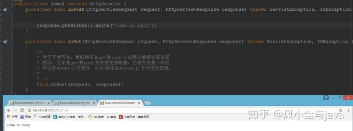

# 序列化及反序列化

**前置信息：**

- 缓冲流 复制文件速度更快

- 客户端/浏览器端 ----- 后台(java, GO, Python, Node.js，php) ----- 数据库，要求前后统一 UTF-8

- 对象流，用于存储和读取基本数据类型数据或对象的处理流，把java对象写入数据源中，或者把对象从数据源中还原

- 序列化机制，允许把内存中java对象转换成和平台无关的二进制流，从而使得二进制流持久存在磁盘上，网络将二进制流存到某节点，其他程序获得这个二进制流，就可以恢复成原来java对象

- - 序列化：ObjectOutputStream 保存
  - 反序列化：ObjectInputStream 读取

- 转换流：OutputStreamWriter 是字符流通向字节流的桥梁：可使用指定的字符编码表，将要写入流中的字符编码成字节，将字符串按照指定的编码表转成字节，在使用字节流将这些字节写出去

- close()和flush()的区别?

- - close()关闭流对象，但是先刷新一次缓冲区。关闭之后，流对象不可以继续再使用。
  - flush()仅仅刷新缓冲区,刷新之后，流对象还可以继续使用。

- 异常和序列化都需要提供一个序列版本号（全局常量）

- - public static final long serialVersionUID = 65869324798275L

- 不能序列化 用static 和 transient修饰

- 不一定真的传输内存中可序列化对象，特殊格式字符串——json

---

83序列化和反序列化
序列化：对象转字节流
反序列化：字节流转回对象

序列化原因：
持久存储，网络传输，通过RMI(远程方法调用)传输对象

实现方法：通过Serializable接口
常见问题：
transient 属性不会序列化
static 属性不序列化
实现Serializable接口时候，一定要给SerialVersionUID
当属性是对象时候，对象也要有实现序列化接口

---

92 json和进程通信

对象的序列化，例如json字符串；

进程之间通信，通过序列化的json。

json：任意一个类的对象都可以转成字符串，这个字符串叫做json

json数组：用在多组对象

流章节，主要是讲对象的可序列化：基本数据类型，字符串(json特殊格式字符串)

json：任意一个类的对象都可以转成字符串，这个字符串叫做json

json数组：用在多组对象


进程之间通信，通过序列化的json。


对象流：ObjectInputStream 和 ObjectOutputStream

作用：  ObjectOutputStream：内存中对象-->存储中的文件、通过网络传输出去。

			ObjectInputStream：存储中的文件、通过网络接受文件——内存中的对象。

# 阻塞

BIO同步阻塞
NIO同步非阻塞
AIO异步非阻塞，适用于数目多，时间长。调用API读写方法(异步)+回调方法

# 消息队列

35 MQ ：订单中台 调用各个微服务 如果吞吐量太大 高 TPS 需要个告诉缓存来将 数据流持久化(json) 通常放在SSD-NAS
Kafka 并发最好 100W TPS(标准消息量)
rocketMQ 50W TPS 优化消息零丢失 但是消息会重复消费
rabbitMQ <=10W TPS 性能差 社区活跃 消息会丢失

# Redis

62 redis的场景数据模型
1 String	2 List	3 Hash	4 Set	5 Sorted Set

用处
1 分布式session+redis中
2 订单记录存在redis的list中

# duddo

类似于spring cloud的一个框架，apache公司，三大核心：面向接口的远程方法调用（RPC），智能容错和负载均衡，以及服务自动注册。


# 跨域问题

29 跨域：前端调用的后端接口不属于同一个域(域名或端口不同)，就会产生跨域问题。
**1、客户端浏览器解除跨域限制**（理论上可以但是不现实）
**2、发送JSONP请求替代XHR请求**（并不能适用所有的请求方式，不推荐）
**3、修改服务器端**（包括HTTP服务器和应用服务器）（**推荐**）

8 JSONNP解决网站跨域的问题存在哪些缺点？
	使用jsonp解决跨域的问题，jsonp最大缺陷只能支持get不能支持post请求，核心底层采用脚本注入的形式

1 网站跨域的问题有了解过么？
	产生的背景：在微服务架构项目中模式采用前后端分离，vue部署的域名和端口号有可能和接口的域名或者端口号不一致造成的。
	跨域的问题属于浏览器的安全策略，从浏览器中访问的域名或者是端口只要与页面中发送json请求如果域名或者端口号一致性的情况下能够成功访问到请求，但是不能够获取到结果。

2 如何解决网站跨域的问题？

- 在响应头中设置允许跨域的，只适合小公司
- 使用HttpClient转发 效率非常低
- 使用jsonp处理，json最大缺陷只支持get请求不支持post请求
- 使用nginx配置浏览器访问的项目与接口项目的域名或者端口号码一致性
  www.mayikt.com/vue 转发到vue项目
  www.mayikt.com/api 转发到接口项目
- 可以直接在nginx中配置允许跨域的问题

```nginx
Access-Control-Allow-Origin, *
```

- 网关中也可与配置类似于nginx允许跨域的代码

```nginx
Access-Control-Allow-Origin, *
```

- 使用springboot注解形式解决跨域问题

```java
@CrossOrigin
```

- 使用微服务网关也可以配置浏览器访问的项目与接口项目的域名或者端口号码一致性。

# 类继承和泛型

- 接口没有构造器 关键词是 interface
- extend 继承，泛型类的子类继承时候可以指定类型
- 泛型类可以有多个参数，逗号隔开
- 异常类不能泛型
- 泛型类中的方法中 不能是静态的
- 泛型方法可以是static的，原因：泛型参数是在调用方法时确定的，并非在实例化类时确定的
- DAO data access object，即操作数据库；ORM object relational mapping，即一个表对应一个类
- 泛型在继承方面体现：
- - 尽管 类A是类B的父类，但是G<A>、G<B>二者不具备子父类关系，二者是并列关系；
  - 补充 类A是类B的父类，A<G>是B<G>的父类
- 通配符：？，可作为别人的父类
- - 类A是类B的父类，G<A>和G<B>是没有关系的，二者共同的父类是G<?>
- 有限制条件的通配符使用
- - ？extends A：G<? extends A> 可以作为G<A> 和 G<B>的父类，其中B是A的子类，类似于小于等于
  - ？super A：G<？super A>可以作为G<A>和G<B>的父类，其中B是A的子类，类似于大于等于

# 运维相关

1 lvs基本的作用？
	lvs作用是linux的虚拟vip技术，注意阿里云购买的linux云服务默认情况下不支持虚拟vip技术
	使用lvs管理我们的nginx的集群

2 keepAlived基本作用？

多机热备份	keepAlived是一个心跳脚本的监测软件，比如可以间隔的发送我们心跳检测我们的tomcat是否有宕机，如果宕机的情况下keepAlived帮助我们自动去重启脚本，如果重启多次还是失败的情况下，会发送邮件告诉给运维人员。

3 请说明nginx + lvs + keepAlived 分别的作用
	nginx+lvs+keepAlived
	nginx作用：核心反向代理 请求的入口
	lvs：虚拟vip技术管理我们的nginx服务器
	KeepAlived：实现心跳检查

4 tomcat如果停止呢？你是如何解决
	注意：千万不要回答手动重启。
	我们可以采用tomcat集群实现故障转移，使用KeepAlived心跳检测我们的tomcat服务器，如果服务器宕机的情况下，自动重启我们的tomcat，如果重启多次还是失败的情况下，发送邮件告诉给运维人员自动重启。

5 项目正在发布时，如何解决用户无法访问的问题？

# Servlet

Servlet生命周期可分为5个步骤

1. **加载Servlet**。当Tomcat第一次访问Servlet的时候，**Tomcat会负责创建Servlet的实例**
2. **初始化**。当Servlet被实例化后，Tomcat会**调用init()方法初始化这个对象**
3. **处理服务**。当浏览器**访问Servlet**的时候，Servlet **会调用service()方法处理请求**
4. **销毁**。当Tomcat关闭时或者检测到Servlet要从Tomcat删除的时候会自动调用destroy()方法，**让该实例释放掉所占的资源**。一个Servlet如果长时间不被使用的话，也会被Tomcat自动销毁
5. **卸载**。当Servlet调用完destroy()方法后，等待垃圾回收。如果**有需要再次使用这个Servlet，会重新调用init()方法进行初始化操作**。

- 简单总结：**只要访问Servlet，service()就会被调用。init()只有第一次访问Servlet的时候才会被调用。destroy()只有在Tomcat关闭的时候才会被调用。**

**Servlet相关 API**

> doGet与doPost方法的两个参数是什么

1. HttpServletRequest：封装了与请求相关的信息
2. HttpServletResponse：封装了与响应相关的信息



> 获取页面的元素的值有几种方式，分别说一下

1. request.getParameter() 返回客户端的请求参数的值
2. request.getParameterNames() 返回所有可用属性名的枚举
3. request.getParameterValues() 返回包含参数的所有值的数组

> request.getAttribute()和request.getParameter()区别

用途上:

- request.getAttribute()， **一般用于获取request域对象的数据**(在跳转之前把数据使用setAttribute来放到request对象上)
- request.getParameter()， **一般用于获取客户端提交的参数**

存储数据上:

- request.getAttribute()可以获取Objcet对象
- request.getParameter()只能获取字符串(这也是为什么它一般用于获取客户端提交的参数)

118
**Servlet安全性问题**

由于Servlet是单例的，当多个用户访问Servlet的时候，**服务器会为每个用户创建一个线程**。**当多个用户并发访问Servlet共享资源的时候就会出现线程安全问题**。

原则：

1. 如果一个**变量需要多个用户共享**，则应当在访问该变量的时候，**加同步机制synchronized (对象){}**

2. 如果一个变量**不需要共享**，则**直接在 doGet() 或者 doPost()定义**.这样不会存在线程安全问题